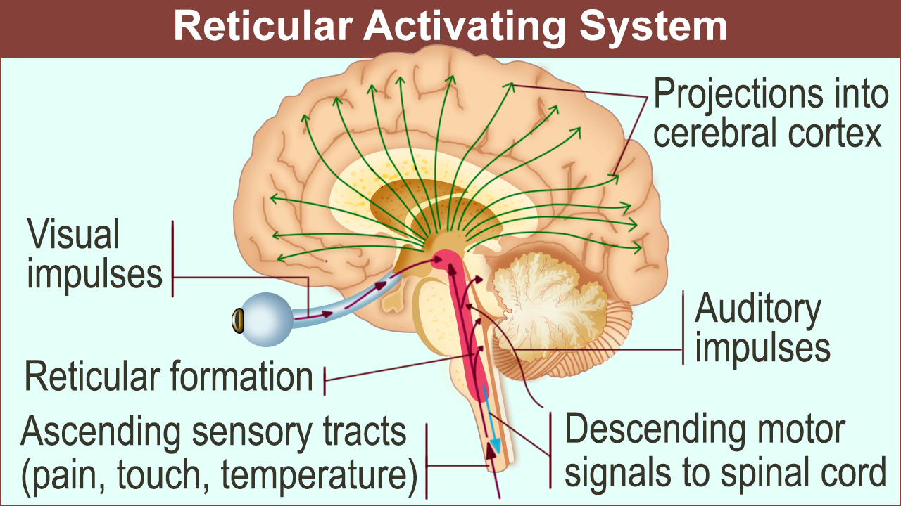
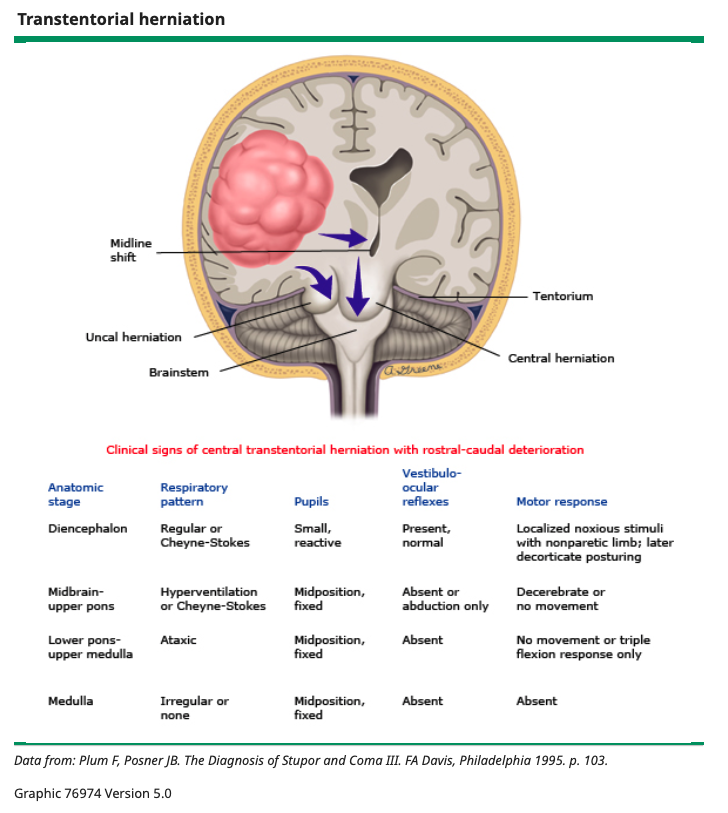

## Stupor and coma are both states of impaired consciousness.

Stupor is a state between alertness and coma.
Coma is a state of unarousable unresponsiveness.
They are emergencies.

## The ascending reticular activating system keep you alert.

This system in the tagmentum of the upper pons and midbrain.

Problem here impairs alertness.
Diffuse damage to the cerebral hemispheres can damage the ascending reticular activating system and impar alertness.
Unilateral cerebral damage can also stress the system and impair alertness.
Poor oxygen or substrate availability in the system can impair alertness.

Technically, a person goes into coma during cardiac arrest and after seizure too.

## Figure out what happened before the loss of alertness.

Ask witness.
Look for medical records.
Figure out if the patient has had this before.
Figure out if the patient takes any medications or uses substances.

Know the time course of the event.
Abrupt loss of consciousness can be from subarachnoid hemorrhage or seizure.
Gradual one can be from brain tumor or mass.
Fluctuating one can be from recurring seizures, subdural hematoma, or metaboolic encephalopathy.

Know the signs before the event.
Focal signs suggest focal structural lesions.
Hemiparesis suggests contralateral structural lesion.
Visual symptoms suggest ischemia in the posterior circulation.
Headache and vomiting suggest intracranial hemorrhage.

## Exam the patient.

Hypertension increases the intracranial pressure and impair alertness.

Hyperthermia suggests infection, which can via mass, inflammation, toxin, or sepsis, impair the alertness.

Hypotension and hypothermia (primary or due to adrenal failure, hypothyroidism, sepsis, drug, or alcohol) decreases brain circulation (and thus substraces) and impars alertness.

Skin exam is helpful.
Bruises suggest head trauma that lead to impared alertness.
Bleeding, petechiae, and ecchymoses suggest hemorrhage, infection, and vasculitis that lead to impaired alertness.
Juandice suggests liver disease.
Pallor suggests uremia or severe anemia.
Cherry red color suggests carbon monoxide poisoning.
Needle tracks suggest substance use.

Meningial exams may be false negative when a patient is in a deep coma.

## Exam level of consciousness, motor responses, and brainstem reflex.

Exam consciousness by rubbing the angle of the jaw and squeezing the trapezius.

Exam muscle tones.
Asymmetry suggests hemiplegia.
Multifocal myoclonus suggests substance or metabolic intoxication.

Exam brain stem by examining eyes.
Papilledema suggests increased intracranial pressure or malignant hypertension.
Missing pupil constriction only in one eye suggests ipsilateral damage in the brainstem.
Missing in both eyes suggests bilateral damage.
Bilateral damage also leads to symmetrically enlarged pupils and outward deviated eyes (because only the superior trochlear and lateral rectus are active).
Medial deviation of eye suggests cranial nerve 6 palsy.

Often a brainstem damage results from direct lesion or transtentorial herniation.

## Manage the patient urgently.

Manage airway, breathing, and circulation.
Intubate to protect the airway if necessary (when there is hypoxemia, recent vomiting, or poor airway).

Treat any hypotension.
If the temperature is above 38.5, give antipyretics and/or cooling blankets to lower the temperature.

Give 25g dextrose and 100mg thiamine.
Start antibiotics and antiviral until they are contraindicated.

Meanwhite, test the patient.
Do head CT, which is faster than MRI.
X-ray the lumber spines and do lumber puncture.
Get:

- Complete blood count
- Chem 7
- Liver enzymes
- Arterial blood gas
- Prothrombin and partial thromboplastin time
- Substances
