## RBCs usually live for 120 days.

But problems can shorten RBC life spans.
When the span is below 100 days, it is hemolysis.

## Let's talk about the normal life cycle of RBCs.

Iron, EPO, and other chemicals stimulate the marrow to make reticulocytes, which mature into RBCs.
In this process, reticulocytes lose their nucleus and increase their membrane to cytoplasm ratio.
Reticulocytes mature 3 days in the marrow and 1 day in the circulation, molding into the biconcave RBC.
Normally, 0.5-2.5% of RBCs are reticulocytes, but when in demaind, marrow can release much more.

RBCs have hemoglobin, which needs Fe++.
Fe++ can be easily oxidized to Fe+++.
Overall, hemoglobin is sensitive to oxidative stress.
So RBC cytoplasm is an reducing environment.
RBCs also rely on glycolysis for ATP making.

The resulting RBC is 8um and flexible.
This is because the they must pass through capillaries which are 5um, smaller than RBCs.

RBCs that cannot pass through capillaries can cause problems.
But these bad RBCs won't live for long because spleen filters them with slits that are 2um in size.
Healthy RBCs can squeeze through these slits.
Poor RBCs are trapped and eaten by macrophages, who then recycles the dead RBCs irons.

Finally, if the marrow can't keep up with hematopoiesis, then extramedullary organs like spleen start to do hematopoiesis.

## RBCs die in many ways.

RBCs can suicide, a process called eryptosis.

Immune cells like macrophages eat RBCs.
Healthy RBCs present CD47, a membrane protein that tells immune cells to not eat them.
But as RBCs age or get with oxidative stress, phosphatidyl serine, a membrane phospholipid that normally faces cytosol, flips and faces outside.
This phosphatidyl serine signals the immune cells to eat the damaged RBC.

Oxidative stress can lead to the eat-me signal and break cytosolic things including hemoglobin and damage RBCs, which will be clear by the spleen.

There is also evidence that RBCs secrete auto antibodies that bind to themselves and tell the immune system to clear the RBC.

Finally, antibodies target RBC antigens.
And the Fc portion of the antibodies attract macrophages to eat the bound RBC.

Any problem that renders RBCs to die sooner results in hemolysis.

## These problems can be caused by something intrinsic to RBC.

Often the problems are in:

- Structure (membrane and cytoplasm)
- Hemoglobin (hemoglobin variants like thalassemia, HbS, ...)
- Enzyme (that maintain reducing RBC cytoplasmic state)

## Things extrinsic to RBCs can damage RBCs and cause hemolysis too.

Often, these sources are:

- Trauma
- Immune

Hemoglobin variants under the umbrella of thalassemia is the most common RBC problem.
Redox enzyme problem especially G6PM is the second common.
Membrane problem is the third.
And immune problem is the 4th cause of hemolysis.

## Thalassemia

Hemoglobin consists of 4 types of globin chains A, B, D and G.
In adults, 95-98% of hemoglobin is AABB, which is hemoglobin A.
2-3% of hemoglobin is AADD, which is hemoglobin A2.
In fetuses, there is AAGG hemoglobin, which is hemoglobin F.
You can check the protein make up of a hemoglobin by electrophoresis or sequencing these the genes for proteins.

Every hemoglobin needs A.
Deleted or mutated protein A gene results in A thalassemia.
No protein A, no hemoglobin.
But lucky human genome has 2 A genes per chromosome (as opposed to usual 1 per chromosome).
And it turns out that having up to 2 broken gene is asymptomatic.
Although your kids may have more borken if your partner also has broken A genes.
Having 3 broken leads to hemolysis.
Having 4 broken is embryologically lethal - a fetus won't survive without hemoglobin F (AAGG).

A must bind to B, D, or G.
Unbound A is toxic to RBCs and stiffens them.
Even with lowered pairing of A, marrow can make RBCs, often microcytic.
These RBCs may not exit the marrow or will be recycled by the spleen and the liver.

The most common partner of A is B.
If B is proben, then it is B thalassemia.
Some broken Bs can still make AABB, but having a lot of lone As can lead to poor RBCs and hemolysis.

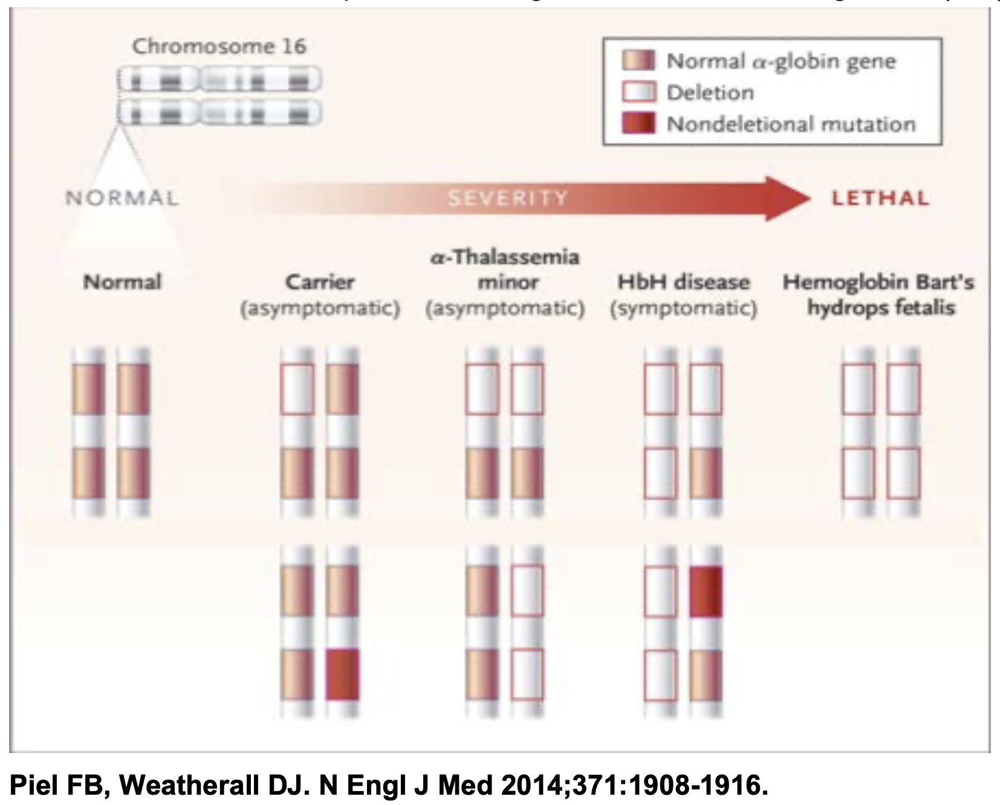

## Globin B point mutations

Hemoglobin A made of AABB makes most RBCs.
A is under high demand.
But so it B.
We have 4 genes for A, so it is rare for all A genes to be broken.
But we have only 2 genes for B, and the B gene can have mutations that results in messed up hemoglobin A.

### Glumamine to valine at codon 6 of gene B results in hemoglobin S.

Having hemoglobin S renders the RBCs to be sickled.
Having one B gene with this mutation is asymptomatic and is protective against malaria.
But having both copies with this mutation leads to severe hemolytic anemia.
The AABsBs RBCs are sickled, sticky, attracts oxygen, activates neutropils, and impede NO secretion resulting in vasoconstriction.
Patients with AABsBs may have various organ damages, notably spleen and bones.
These patients suffer high amount of pain starting early in their life.

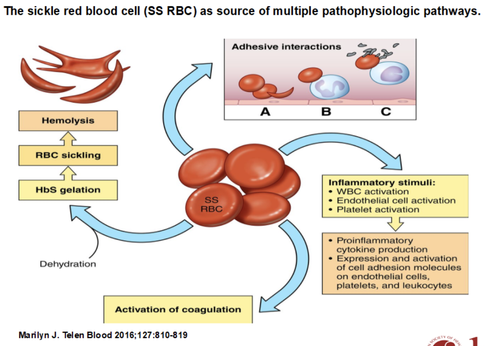

Most sickle cell patients are asymptomatic and don't know that they have it.

The peripheral blood smear of sickle cell patient is telling.
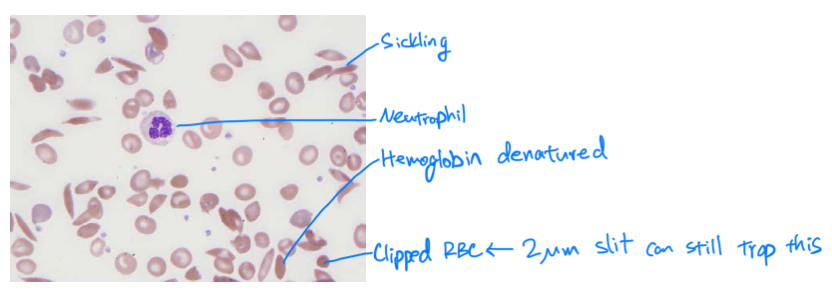

### Glumamine to lysine at codon 6 of gene B results in hemoglobin C.

Like hemoglobin S, hemoglobin C also results in sticky RBCs.
But anemia is less severe with hemoglobin C.

### Glumamine to lysine at codon 26 of gene B results in hemoglobin E.

Hemoglobin E is also protective against malaria.

### Finally, thalassemia or B globin point mutations shorten life span.

## RBC membrane problem rendes RBCs to die earlier.

Hereditary spherocytosis is a inherited condition where RBC membrane are less and thus the cell is less flexible.
These RBCs appear spherical in peripheral blood smear.
They are less fluidic fail to squeeze through the spleen slits.
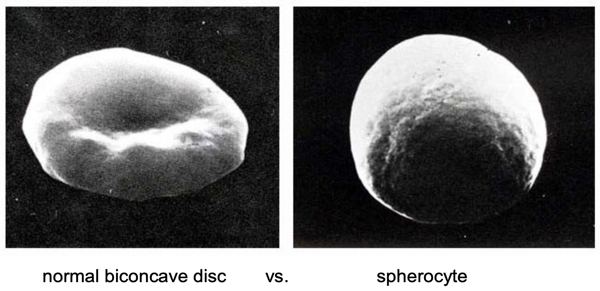

Patients with hereditary spherocytosis may present with mild anemia, reticulocytosis (because the marrow is trying hard all the time to make more RBCs), splenomegaly (because the spleen is constantly recycling RBCs), and gallstone (because liver clears the unconjugated bilirubin from the broken RBCs).
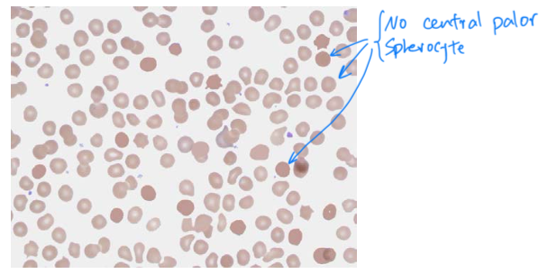
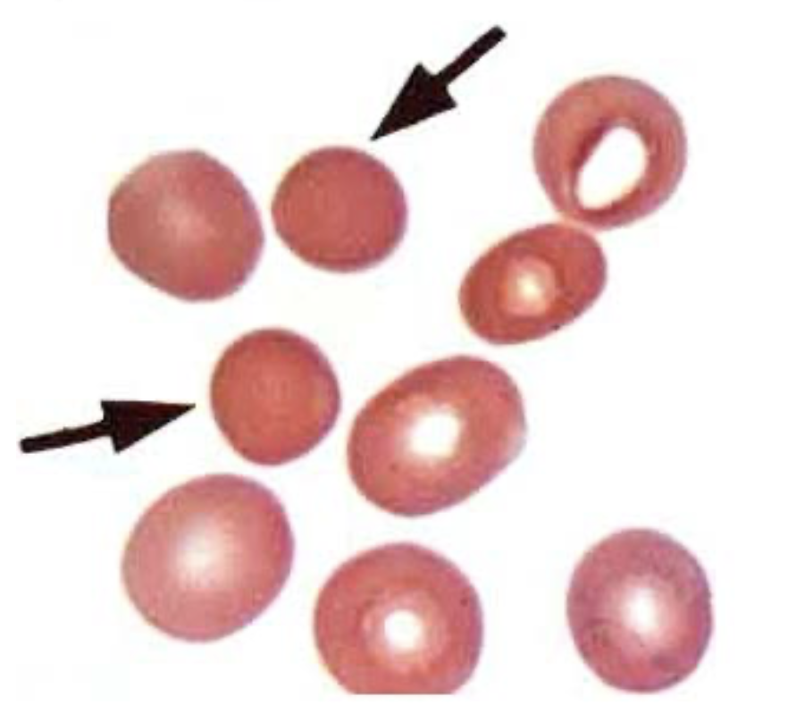

Also, the RBCs of the patients perform weakly with the osmotic fragility test (they have less membranes so they pop earlier than healthy RBCs).
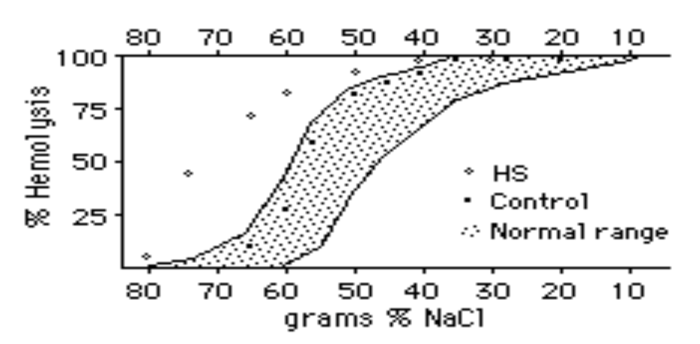

A lot of spherocytes are there with hereditary spherocytosis.
But not as many but noticible spherocytes can also be there in other conditions like autoimmune hemolysis.
This is because spherocytes are immature reticulocytes and the marrow pumps them out when rushing hematopoiesis.
Spherocytes indicate poor quality RBCs made in the marrow.

## RBCs are sensitive to oxidation.

### Hemoglobin with Fe+++ is reduced to Fe++.

Most hemoglobin is bound to Fe++.
But some Fe+++ ones come about.
Fe+++ hemoglobin is less soluble and render a RBC to die early.
RBCs can reduce Fe+++ to Fe++.
This process requires NADPH.
G6PD is an enzyme that regenerates NADPH.
The defective G6PD results in insufficient Fe+++ hemoglobin conversion, and hemolysis.

G6PD gene is on the X-chromosome so the defect is more prevalent in males.
There are many ways for a gene to be messed up.
The African American variant results in damaged RBCs that are older and mild hemolysis.
The Medirerranean variant results in damged RBCs of any age and severe hemolysis.
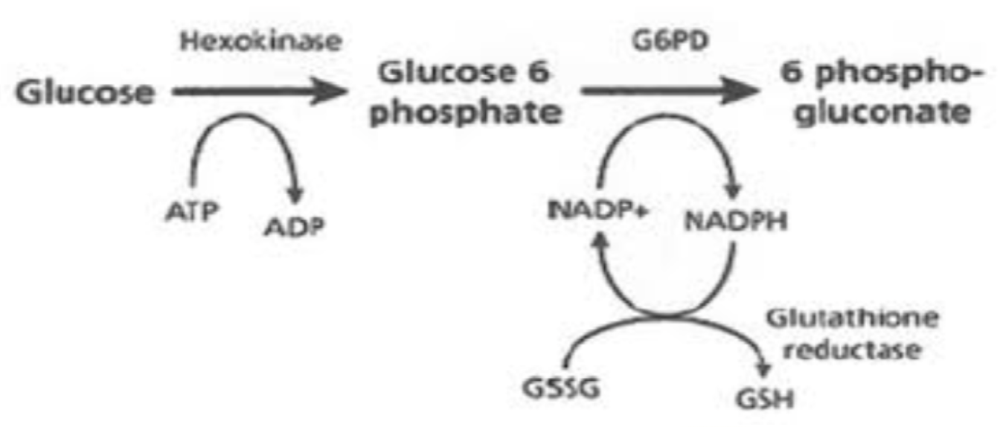

### In addition to converting Fe+++, reducing environment is important also for maintaining hemoglobin struture.

Oxidation denatures hemoglobin into hemichrome and Heinz body.
So, reducing cytoplasm is necessary for healty RBC and lack of it results in hemolysis
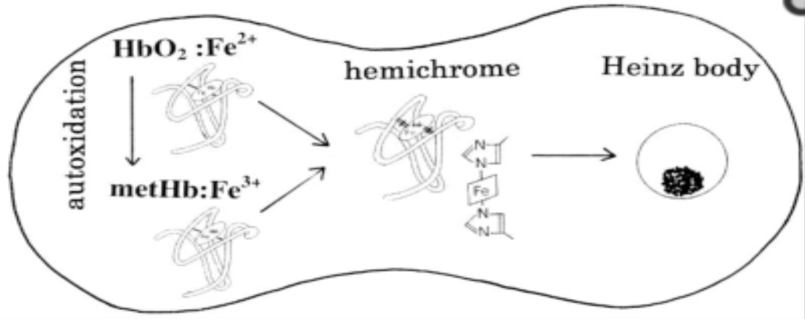

People with reduction problem can have more severe anemia when there is oxidative stress.
Like oxygen, sulfer and pyrimidine are also a oxidating.
So don't use sulfer contaiing antibiotics or pyridium for people with defects in G6PD or other reducing enzymes.

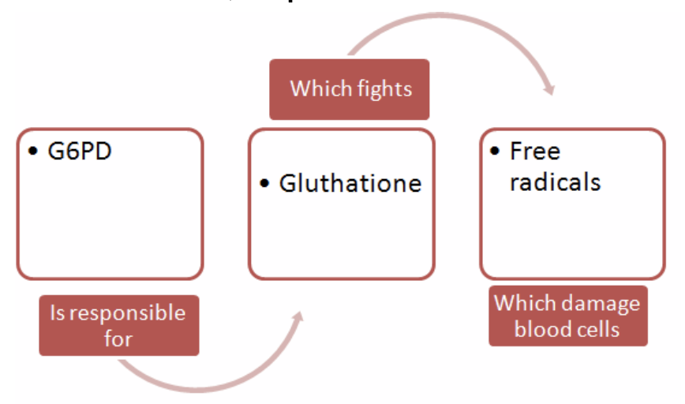

Note that measuring G6PD in acute hemolytic setting is not a good idea.
This is because measuring G6PD happens via 1) taking out RBCs and 2) looking inside them how much G6PD there is.
In an acute setting, RBCs with bad G6PD are dead, hemolyzed.
And the remaining RBCs have better G6PDs.
Measuring G6PD in an acute hemolytic setting is equivalent to measuring good RBCs G6PD.
So you G6PD results will appear normal, but in reality it is not.

## Autoimmunity attacks RBCs.

Most commonly, IgGs can bind to RBCs and link them.
IgM can bind to RBCs and recruite the complement system on RBCs.
The macrophages can bind to the Fc region of the Igs and eat the RBC-immune complex.

This immunity was probably needed for deleting infected RBCs.
But malactivation of this system leads to hemolysis.
This autoimmune hemolysis can also happen days after blood transfusion or other alloimmunization.

Lupus can trigger autoimmune hemolysis too.

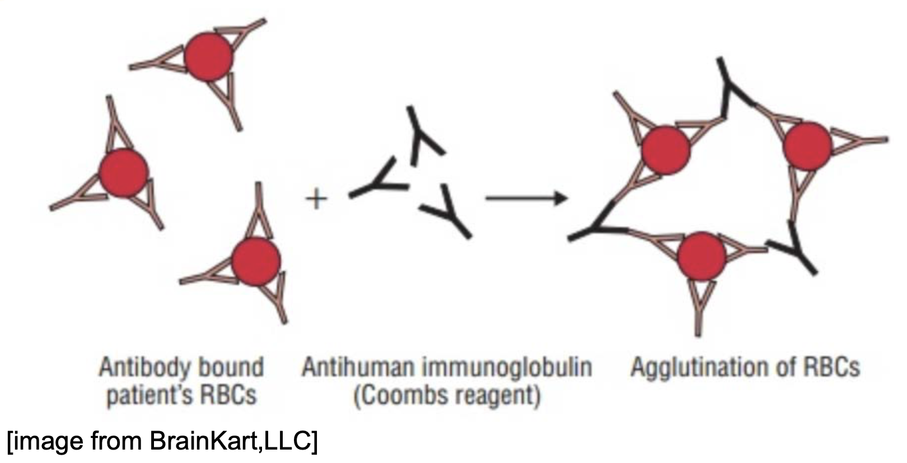

## Some pathogens can break RBC proteins and trigger cell mediated immunity against the RBCs.

Babesia tricks your T cells and macrophages to attack your own RBCs, causing hemolysis.

## Trauma can damage RBCs and cause hemolysis.

Burn, compression, drawing, or other stressors can damage RBCs and cause hemolysis.

## Thrombotic microangiopathies can cause hemolysis.

von Willebrand factor line endothelium and trap platelets and RBCs.
In thrombotic thrombocytopenic purpura, there is defect in ADAMTS13, the protein that cleave the von Willebrand factor.
Accumulation of the factor on endothelium occludes the vessels and results in purpura, thrombocytopenia, and hemolysis.
Patients with this condition has low ADAMTS13 levels.

Pathogens can secrete toxins that damage endothelium and trigger coagulation.
Often, renal endothelia is the victim.
Coagulation can squeeze and damage RBCs and lead to hemolysis.

Malignancies, sepsis, preexlampsia can systemically increase the coagulative state and cause disseminated intravascular coagulation, which can also stress RBCs and result in hemolysis.

## Patients with hemolysis can present with anemia and:

- RBC shape change
- Hepatosplenomegaly
- Serum with increased RBC intracellular things

When hemoglobin leaks, its binding protein haptoglobin binds to it and plasma haptoglobin decreases.

Leaked hemoglobin can get to renal cells.
Renal cells break up the recycle the iron from hemoglobin, oxidize it from Fe++ to Fe+++, and store it as ferritin, the iron bank molecule.
The renal cells then process the hemoglobin without iron into hemosiderin and excrete them into the urine, which will look brown or like tea.

Lactate dehydrogenase leaks too.
But many other cell types can also spill lactate dehydrogenase when they die.

RBCs contain a lot of bilirubin.
Intracellular bilirubin is unconjugated.
So when RBCs die, plasma unconjugated bilirubin increases.
By measuing the total bilirubin and the conjugated bilirubin, you can indirectly measure the amoung of unconjugated bilirubin.

Gilbert's syndrome can increase the plasma unconjugated bilirubin too, but up to only 2.8.
Hemolysis can increase it much beyond that.

Unconjugated bilirubins are insoluble and taken up by the liver, conjugated, and excreted into bile.
Such chronic cleaning up of unconjugated bilirubin as bile can result in pigmented gallstone.
So if you see a young person with gallstone, which develops usually at older age, then the stone may be due to cleaning up of unconjugated bilirubin spilled from hemolysis.

Increased bilirubin makes your eyes yellow, a presentation called scleral icterus.

Usually hemoglobin declines 1mg/week, so faster decline in Hb suggests bleeding or hemolysis.
During hemolysis, marrow makes and releases a lot of reticulocytes.

If a patient does not have spleen, then the quality filter of RBCs is not working.
As a result, various shaped and messed up RBCs can be floting around in the blood.
So expect more funky RBCs in the peripheral blood smear of asplenic patients.

## Treat the underlining cause.

Identify the cauise and treat it if possible.
Often, the curative therapies are:

- Bone marrow transplant
- Gene editing

Other treatment options are:

- RBC transfusion
- Pain management

Patients without spleen cannot train immune system against encapsulated bacteria.
These patients need antibiotics, prophylaxis, and vaccine.

Kidneys, especially their counter current system, are sensitive to hemolysis or anemia.
Patients, especially those with sickle cell anemia, often present with urine specific gravity of ~1.010, which indicates neither concentrate nor dilute urine.
Malfulctioning kidney loses more water.
So hydrate patinets whose kidneys show 1.010 specific gravity.
