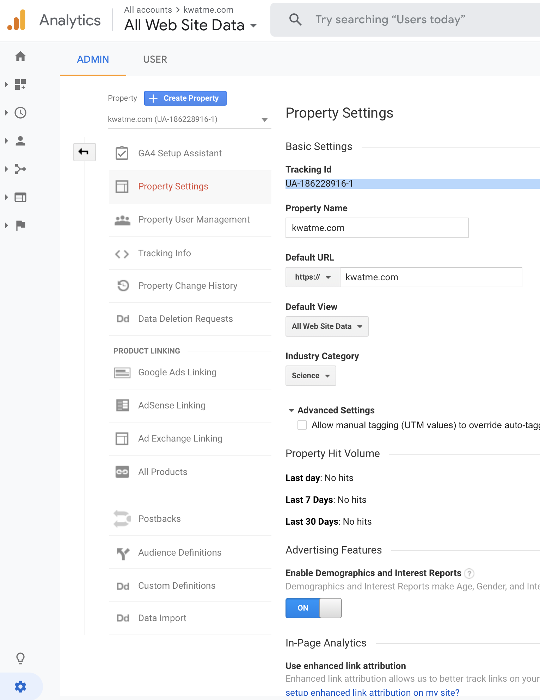

## Step 1: Make Google Analytics account (if you haven't)

Go to Google Analytics.

Enter account name.

(I like to keep things simple so I uncheck all Account Data Sharing Settings.)

The final Account setup page looks like this.

Click Next.

## Step 2: Make Google Analytics property

Enter Property name.
(I just use the domain for this.)

Click Show advanced options.
Few new settings show up.

Enter website URL.

Check Create both a Google Analytics 4 and a Universal Analytics property.
(In the past, each property got one tracking ID, which is the universal ID.
But with the new Google Analytics 4, each traffic source type (iOS, Android, and Web) gets one unique ID.
we are going to use a Gatsby plugin for Google Analytics.
Currently, this plugin supports only the universal ID.
And that's why we are checking this box to make both source specific IDs and the universal ID.)

Keep the check for Enable enhanced measurement for Google Analytics 4 property.

The final advanced options section looks like this.

Click Next.

Answer some questions. (I skip these.)

Click Create.

The final page looks like this.

(I think what's happening is that Google Analytics has connected the Web tracking ID and the universal tracking ID.
So when we use the universal tracking ID for the Gastby website, we end up using the Web tracking system.)

Click Connected Site Tags to see the connected universal tracking ID.

## Step 3: Copy the universal tracking ID

Click Admin.

Select the property with UA.

There is the univeral tracking ID.

Copy the ID.

## Step 3: Set up Gatsby plugin for Google Analytics

Install the plugin.

TODO

Add the plugin's configuration to gatsby-config.js.

Enter the universal tracking ID.
(I set head to true so that the code for tracking goes into the HTML head.)

The final gatsby-config.js looks like this.

## Step 4: Test

The tracking is off when in development mode.
So build and serve the website to turn the tracking on.

Go to the served local host website to be tracked.
Finally, see the live tracking status in the Google Analytics page.

