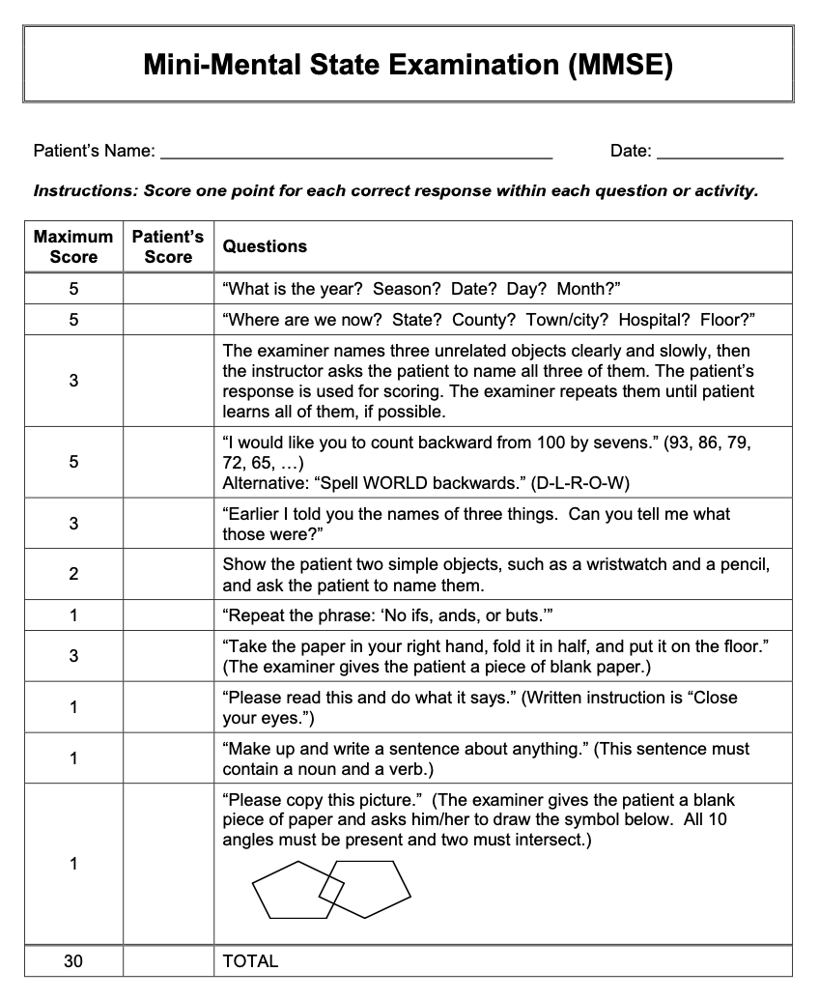
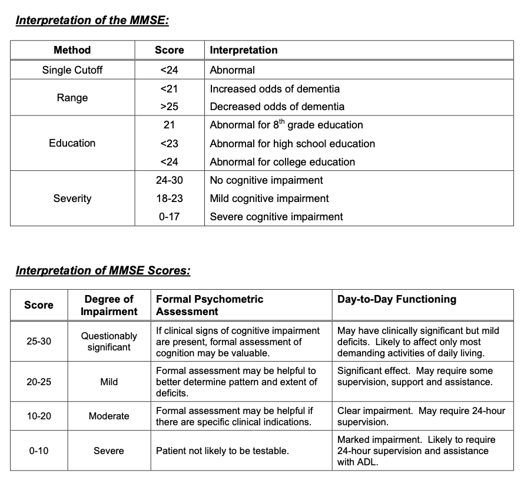
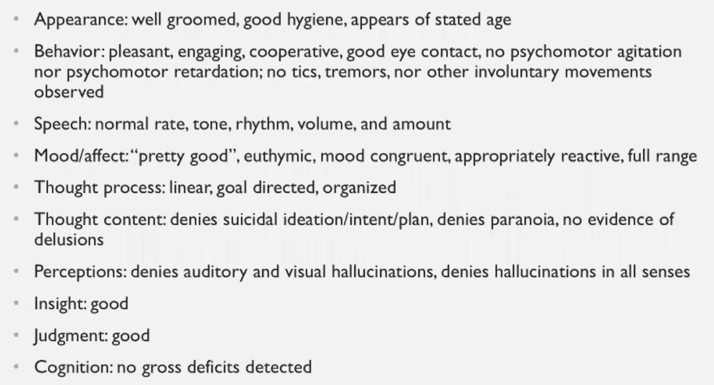
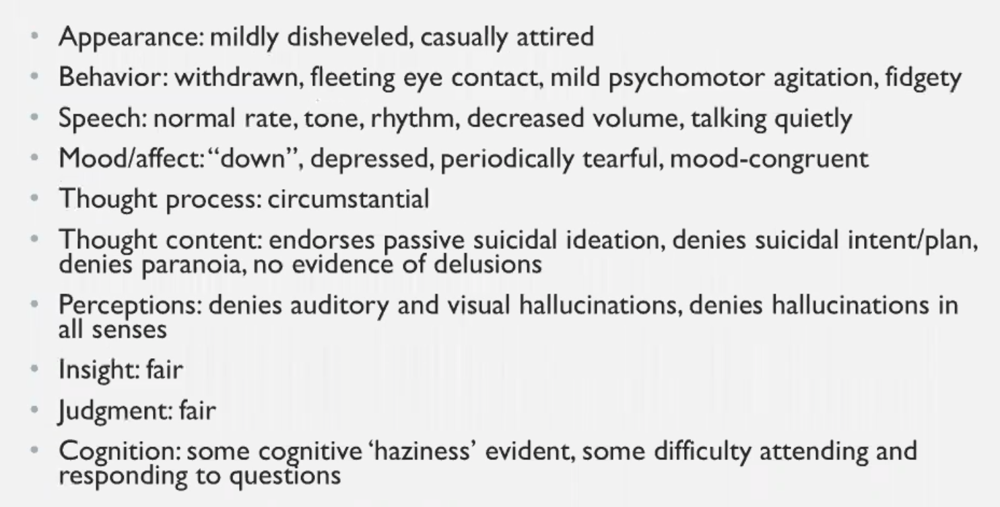
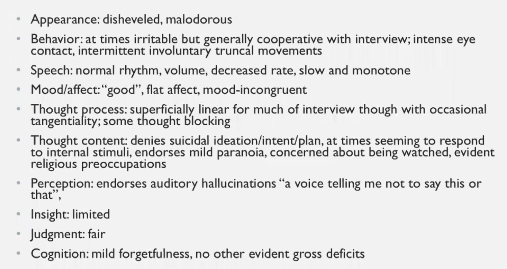

Psychiatric physical exam

Do it at every encounter

## Appearance

## Behavior

## Speech

## Mood (stated emotion)

Quote patient's words

## Affect (observed emotion)

## Thought Process

## Thought Content

## Perception (hallucination)

## Insight (psychiatric problem self awareness)

## Judgement

## Congition

## Examples

Normal

Depressed

Psychotic

