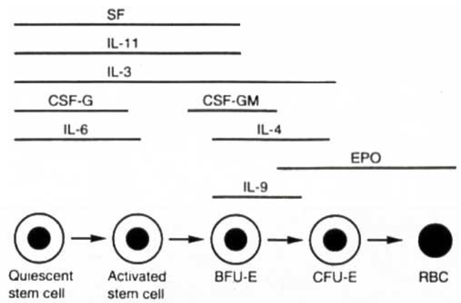
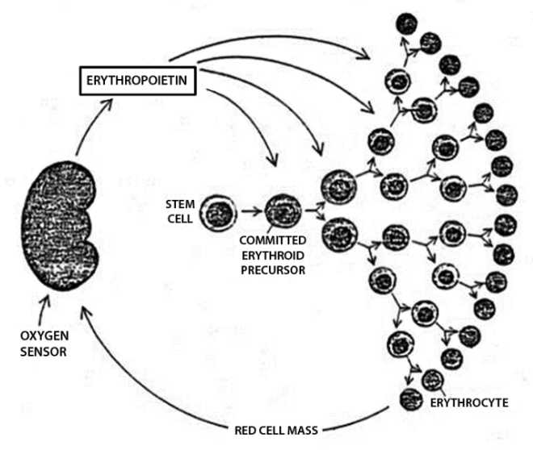
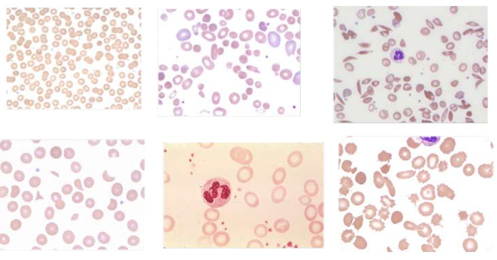

## Anemia is not having enough RBCs to deliver O2.

RBCs come from HSCs.
Many chemicals control HSC to RBC differentiation.
And EPO, made in the kidneys, is an important stimulator of this.

## We make a lof of RBCs in various tissues during fetal stage.

Fetus makes most of its RBC in the yolk sac in the first few months, then liver, then spleen, and finally marrow in the later months.
But after the birth, the newborn starts to breath the air and this results in delivering much more O2 to the body compared to when the newborn was a fetus relying on placenta for O2.
So 10 days after the birth, a newborn's RBC production decreases because there is enough O2 being delivered.
This is the peak of erythroblast concentration in the marrow.
The decrease in erythroblast results in an anemia, whihc we all go through.
This physiologic anemia stimulates the kidneys to increase EPO to stimulate more RBC production.
As we become adult, we make more RBCs.
But we won't be making as much as we were a newborn.
Finally after 65 years, 1/4 won't be able to make a normal amount of RBCs.

## Masuring hemoglobin, RBC count, and MCV are helpful in identifying anemia.

Measuring hemoglobin identifies its concentration.
Measuring RBC count identifies the number of RBCs.
And measuring MCV identifies the size of RBCs.

But the following conditions make it difficult to assess anemia:

- Plasma volume change (can be from dehydration, burn, or pregnancy)
- Increaed O2 demand (can be from decreased O2 loading by the lungs)
- RBC defects
- Hemogrolib defects
- Acute bleeding

For example, hematocrit can go below the normal range during pregnancy but this is because pregnancy increases the RBCs by 30% but plasma volume by 50%.

## History and physical exam can help identify anemia.

Anemic patients may present with:

- Fever
- Bruise
- Weight loss
- Adenopathy
- Juandice
- Hepatomegaly
- Splenomegaly
- Nail abnormality

Anemia can be related with other conditions:

- Cancer
- Blood disease
- Renal disease
- Liver disease
- Infection
- Rheumatoid arthritis
- SLE
- Endocrine disease
- Cardiac disease
- Drugs

## Look at the peripheral blood smear to see RBC abnormality to classify anemia.

Anemia with normal RBC size is normocytic.
Anemia with small RBC is microcytic.
And anemia with large RBC is macrocytic.
