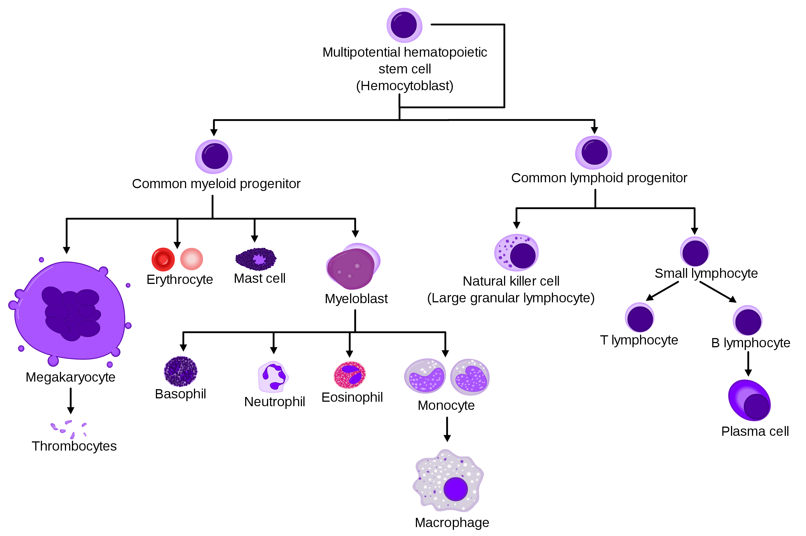
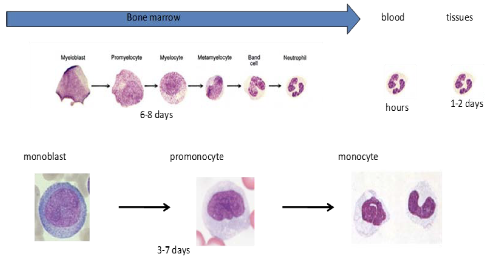
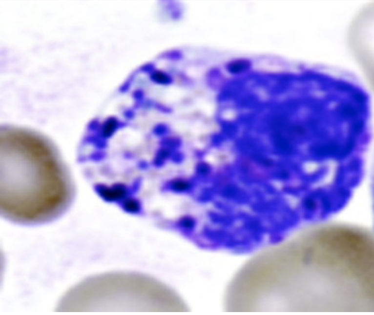
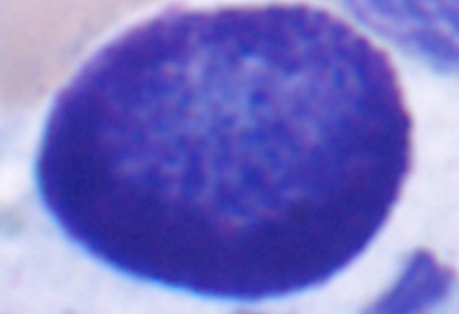
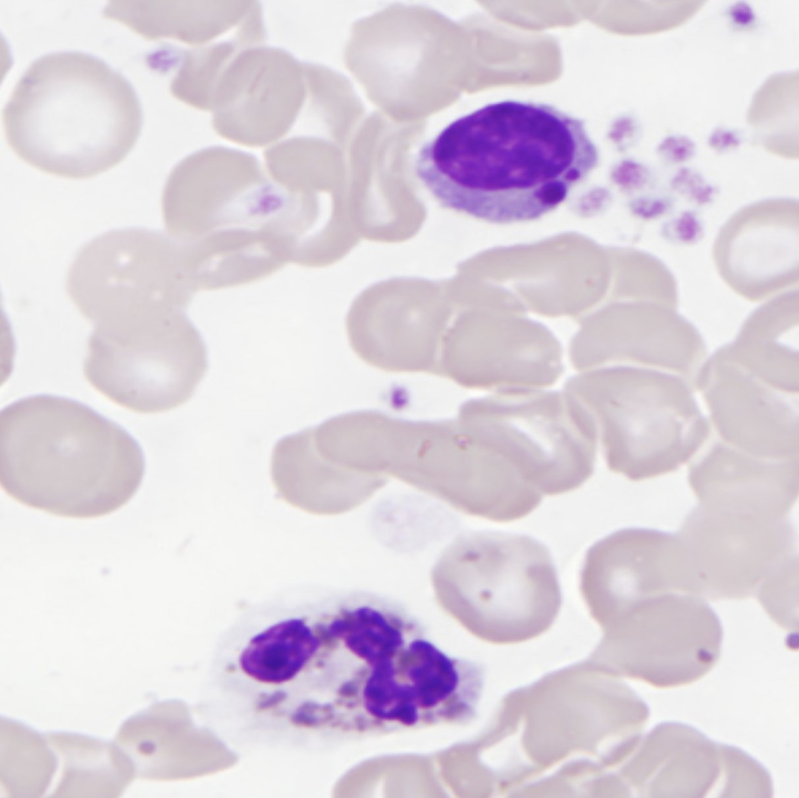
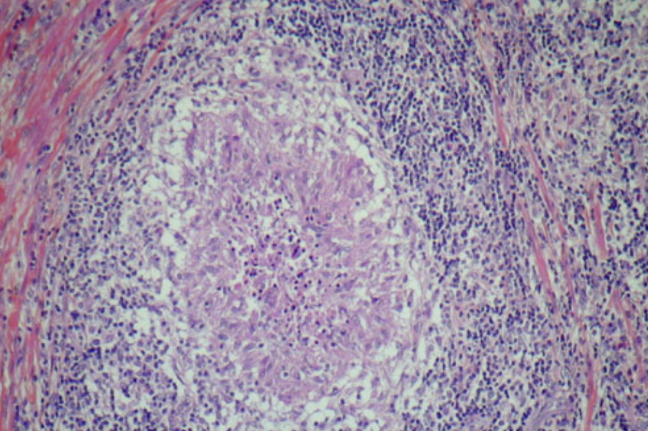
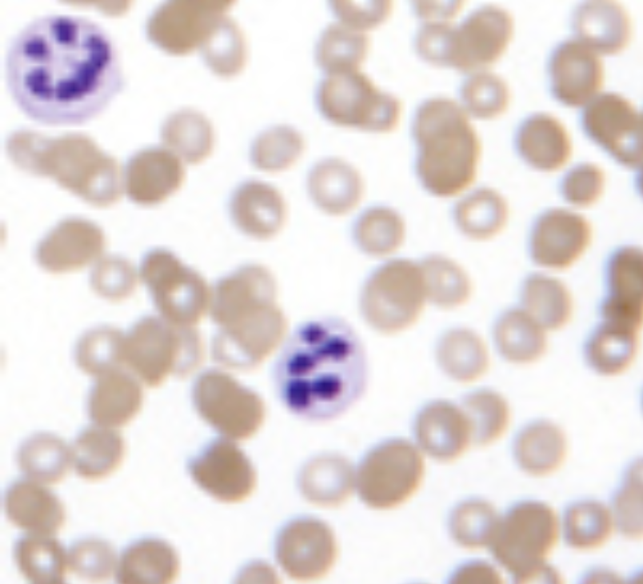
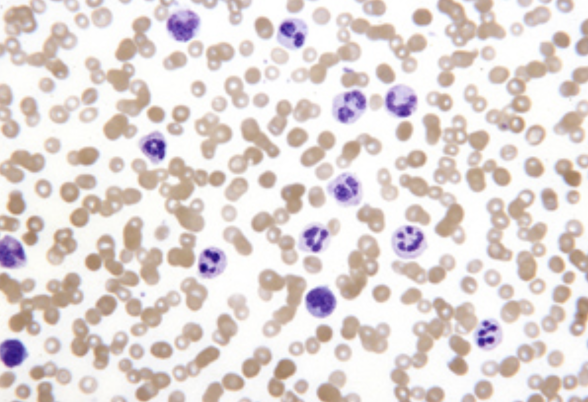

## Myeloid lineage produces granunlocytes and monocyte.

Granulocytes include neutrophil, eosinophil, and basophil.
Monocyte becomes macrophage.

Neutrophils develop in the marrow for 8-10 days.
Then, they circulate in the blood with a half life of 6 hours and enter into a tissue.
They stay in the tissue for 2-3 more days, before they die.

Monocytes develop in the marrow for 3-5 days.
They circulate in the blood with a half life of 8 hours and enter into a tissue, where they differentiate into macrophages.
The macrophages stay in the tissue for as long as they survive.
The tissue resident macrophages in the liver are called Kupffer cells, the ones in the lungs are called pulmonary alveolar macrophages, and the ones in the bone are called osteoclasts.

## In response to a demand, the marrow speed up the granulocyte development process.

Cells secrete hematopoietic growth fasctors to demand more hematopoietic cells.
These factors circulate to the marrow and stimualte hematopoiesis.
Liver cells make erythropoietin to stimulate RBC production.
Liver and kidney cells make thrombopoietin to stimulate platelet production.
Endothelium and various immune cells make myeloid colony stimulating factors to stimulate myeloid cell production.
Myeloid colony stimulating factor GCSF drives granulocyte development and GMCSF drives monocyte development.
Finally, these hematopoietic growth factors suppress apoptosis in their target cells and keep them live longer.

## The cells in the marrow regulate hematopoiesis.

They secrete cytokines to stimnulate their nearby cells to make hematopoietic growth factors.
They secrete TNFa, which promotes myeloid differentiation but demotes myeloid and erythroid precursor proliferation.
They secrete interferons, TGFb, and MIP1 to interfere and suppress hematopoiesis.

## In response to GCSF, the marrow makes granulocytes faster and more.

The granulocytes divide 1 extra time.
The granulocytes that are banked in the marrow also deploy.
The granulocytes circulating in the blood enter tissues sooner.

## Neutrophils phagocytose.

Neutrophils are attracted to inflammation molecules:

- Endotoxin
- Histamine
- Lipid metabolites (prostaglandins, leukotrienes, platelet activating factors)
- Bradykinin
- C5a
- IgG
- Antibody complex

Neutrophils use actin filaments and myosin (like muscle) to move and engulfe a particle.
Complement system (C3b), lysozyme, and IgG Fc enhance phagocytosis (this enhancement is called opsonization).

The phagocytosed particle is contained in the phagosome.
Phagosome fused with lysosome, which contains chemicals to digest the particle.

## Oxidative and non-oxidative microbicidals fuse with phagosome.

When a cell phagocytoses a particle, the cell increases its oxygen use (respiratory consumption) to make oxidizing agents.
These include H2O2.
H2O2 is even more oxidative when there is myeloperoxidase, which catalyzes H2O2 oxidations.
H2O2 and other oxidizing agents can leak and damage normal cell particles.
But a cell can neutralize them with glutathione, NADPH, and other electron rich molecules, which donate their electrons to the oxidizers.

The microbicidals also include non-oxidatives.
Acid digests proteins.
Cation breaks proteins.
Lactoferrin locks iron, which bacteria need for their growth.
Hydrolase digests bacterial wall.

## Monocytes and macrophages phagocytose a particle, digest it with oxidative microbicidals, and trigger immune reasction.

They eat various things including pathogens, host cells, minerals, and lipids.
They secrete various things (complement components, colony stimulating factors, interferons, enzymes, and more) to orchestrate systemic reactions.
They present a part of the phagocytosed particle to the adaptive immune system to trigger immunity against the particle.

## Eosinophils are like neutrophils specialized for parasites.

They are attracted to the chemotactic chemicals.
They phagocytose particles but these particles must be bound to antibody.
They make oxidative microbicidals.

Hematopoiesis of eosinophils need general stimulant GMCSF and specific ones IL3 and IL5.
IL5 is secreted mostly by CD4+ T cells when there is parasitic or allergic response.

## Basophils secrete granules containing histamine, heparin, and slow reacting substances-anaphlaxis.

When they encounter IgE coated particle, they secrete the granules.

## Mast cells also secrete granules containing histamine, heparin, and slow reacting substances-anaphlaxis.

## Functional leukocyte disorders are conditions where available granulocytes fail their jobs.

A patient presents with normal granulocyte count but repeated infections.

### Granulocytes use CD11 and CD18 to bind to an endothelium and enter the tissue behind it.

Mutation in CD11 and CD18 causes leukocyte adhesion deficiency.
This is a lethal disease.
Its onset is infancy or early childhood.
A patient present with delayed umbilical cord separation and neutrophilla because all neutrophils circulate in the blood.

### Some drugs disrupt granulocyte functions:

- Colchicine (microtubule)
- EtOH (production and motility)
- Corticosteroids (adhesion)
- Cytochalasin B (motility)
- Salicylates (adhesion)
  Thermal injury and defect in actin also disrupt granulocyte motility and adhesion.

### Granulocytes phagocytose more effectively particles coated with complement system (opsonization).

Some encapsulated pathogens must be opsonized to be phagocytosed.
So defects in the complement system causes granulocyte insufficiency.

### Granulocytes and many other cell types like cutaneous cells, gland cells, and neurons need lysosome to work with granules.

Loss of function in CHS1 (lysosomal trafficking regulatory protein) disrupts lysosomes and cause Chediak-Higashi syndrome.
A patient presents with severe pyogenic infections, albinism, and peripheral neuropathy.
Ascorbic acid, GCSF, and prophylactic antibiotics improve the condition.

### Degrading phagocytosed particle needs oxidative chemicals and enzymes like NADPH oxidase.

Defect in P47 or GP91 breaks the NADPH oxidase and result in chronic granulomatous disease, where granulocytes phagocytose particles and degrage them with only non-oxidative microbicidals.
A patient is suceptible to pathogens that are resistant to non-oxidative microbicidals.
X-linked mutation in GP91 causes this.
Loss of function in other 3 cytochrome B genes causes milder form of this.

## Cancer and non-cancer intra-marrow abnormalities causes neutropenia.

- Post infection
- Drug
- Immune (neonatal allo-immune neutropenia and chronic benign neutropenia of childhood)
- Metabolic
- Nutritional

Less glycosylation makes RBC resistant to malaria and decreases neutrophil production.
People with African ancestry have this neutropenia which does not increae infection risk.

Mutation (autosomal dominant) in ELA2 (neutrophil elastase) causes 2 neutropenias.
In a cyclic neutropenia, ANC oscillates between from less than 500 to greater than 1500 every 21 days.
In a severe chronic neutropenia, cell endoplasmic reticulum can not tolerate the normal amount of abnormal proteins and triggers apoptosis.
A patient has increased risk of leukemia.

Mutaion (autosomal recessive) in HAX1 causes Kostmann syndrome, where hematopoietic cells die in the marrow.
Colony stimulating factors can not help.

Schwachman-Diamond syndrome is a congenital bone marrow failure syndrome.

## Increased production and decreased adhesion cause neutrophilla.

Infection, inflammation (rheumatologic including exlampsia), and cancer increase neutrophil production.

Primary myeloproliferative neoplasms like chronic myelogenous leukemia, polycythemia vera, essential thrombocythemia make specific hematopoietic lineage more sensitive to colony stimulating factors.

Epinephrine, exercise, stress, and sickle cell anemia shift neutrophils from margin to circulation.
Corticosteroids and smoking make neutrophils less sticky and thus more circulating.

## Treat the cause and cure with transplant.
