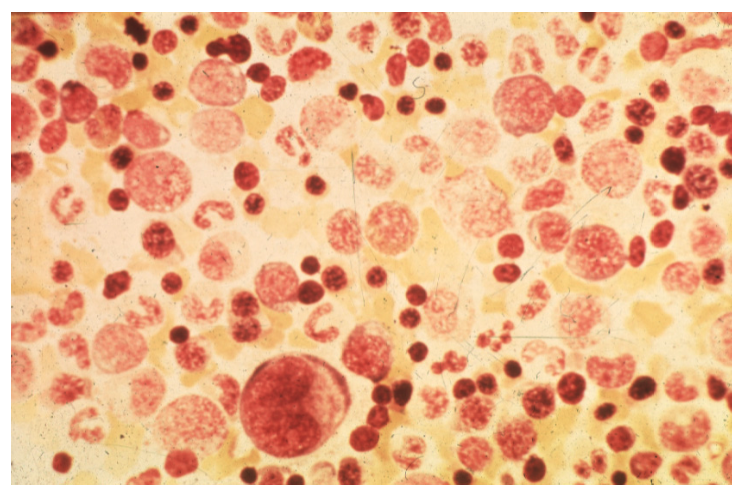
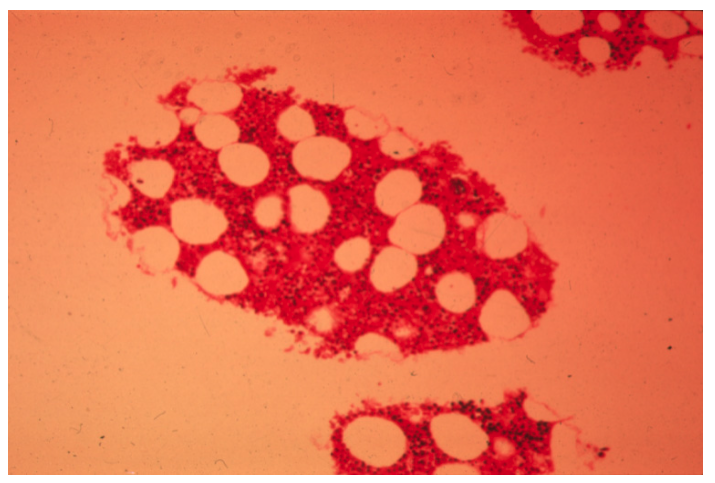
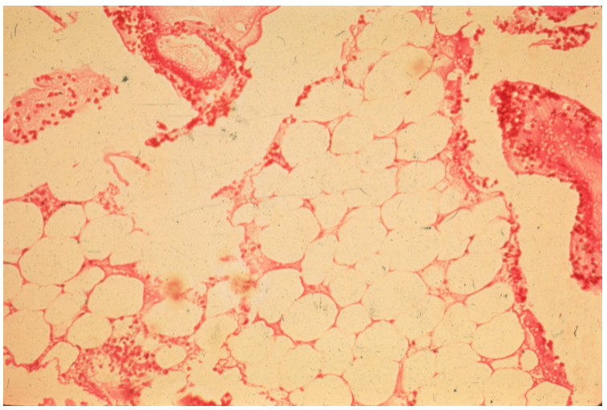
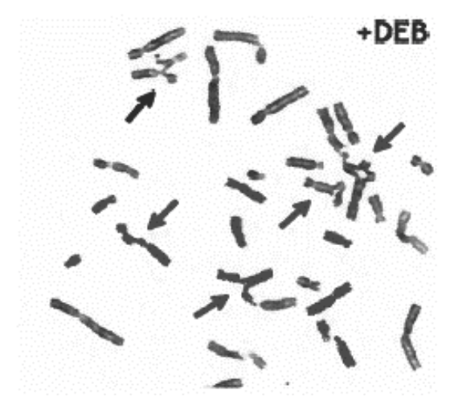
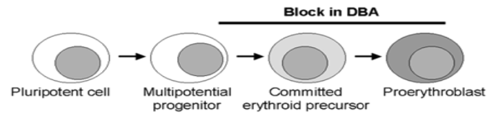
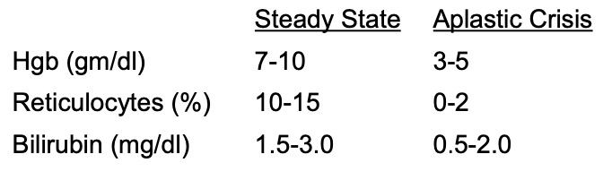

Nromal bone marrow aspirate should have various cell types.

Nromal bone marrow of an adult should have roughly half hematopoietic cells and half adipocytes.

## Aplastic anemia

### Things that can result in aplastic anemia are:

- Substance
- Radiation
- Infection
- Immunity

These insult the hematopoietic stem cells or marrow.
The damages activate T cells who end up destoying hematopoietic stem cells.
The damages also cause hematopoietic stem cells to apoptosis.

Aplastic anemia results in decreased hematopoietic cells and increase in adipocytes in the marrow.

### Peak onset is 10-30 year old.

There is another smaller peak over 60.
Most aplastic anemia is secondary.
Some rare congenital anemia cause primary aplastic anemia.

### Patients with aplastic anemia may present with:

- Pallor due to anemia and reticulocytopenia
- Coagulation problem due to thrombocytopenia
- Bleeding including petechiae and bruise
- Infection due to neutropenia
- No hepatosplenomegaly (because it's not hemolytic)
- No bone pain
- Hypocellular marrow

## Congenital bone marrow failure syndromes

### Fanconi anemia

Loss-of-function (autosomal recessive) in DNA repair causes Fanconi anemia.
Hematopoietic cells are malformed and their chromosomes are more fragile.

Onset is 3-10 year old.
Patients may present with other congenital abnormalities.
15% of patients develop other malignancies.

### Diamond-Blackfan anemia

Ribosomal defects interrupt erythropoiesis.
70% of patients have mutation in ribosomal genes, RPS19 being the most common.
Mutations that are found in living patients are on only one allele, because having broken 2 alleles are embryologically lethal.

Onset is before 1 year old.
Patients may present with other congenital abnormalities.
Patients have anemia with reticulocytopenia (but not neutropenia and thrombocytopenia).
Some RBCs are still made, but they are more fetal, with macrocytic RBCs and hemoglobin Fs.
Irons can also build up and may require chelation.

## Viruses cause aplastic anemia in kids.

### Hypoplastic anemia associated with chronic hemolysis

Parvovirus is cytotoxic to erythroid progenitor cells.
Infected kids who also have chronic hemolytic anemia like HbS anemia and hereditary spherocytosis can rapidly develop hypoplastic anemia.
This is because these kids not only have poor RBC structures but also fail to make RBCs.
This is a aplastic crisis.

During the acute anemic phase, parovirus B19 antigen is present.
After the anemic episode, anti-parvovirus IgM and IgG will be present.

### Hypoplastic anemia with immunodeficiency

Kids with immunodeficiency cannot make IgM or IgG and fail to clear the parvovirus.
The virus then chronically infects the kids.
The kids will have hypoplastic anemia.
Some RBCs are made and they are normal.
Treatment requires immunoglobulins to clear the virus.

### Transient erythroblastopenia of childhood

Some viral infections (not related to parvovirus) combined with temporary immunosupression can lead to anemia with reticulocytopenia.
The made RBCs are normal.

## Many things can result in antibodies that interfere with erythropoiesis, causing adult pure red cell aplasia.

- Thymomas
- Hematologic malignancies
- Solid tumors
- Autoimmune disorders
- Substances

## Treat the cause of an aplastic anemia, if possible.

The patients may need transfusions and antibiotics.

Bone marrow transplant can cure severe aplastic anemia.

Allograft's HLA should match the recipient's.
The prognosis is best in younger patients.
HLA matching allograft from unrelated donor is almost as good as from a relative.

If there is no HLA-maching marrow, then using non-HLA matching marrow plus anti-T globuling is an option.
Without HLA matching, the host's T cells attack the allograft marrow (because the host T cells have not been negatively selected by HLA presentation using the new marrow's HLAs).
So getting rid of the host T cells may alleviate this rejection.
Amazingly, with this optin, the marrow can recover and the recovered marrow is that of recipient and not the donor.

Finally, immunosupressive therapy can help severe aplastic anemia.
This is because autoimmunity is often making the aplastic anemia worse.
However, immunosupressive therapy can't cure a patient and it often used for older patients who are not candidate for transplant.
