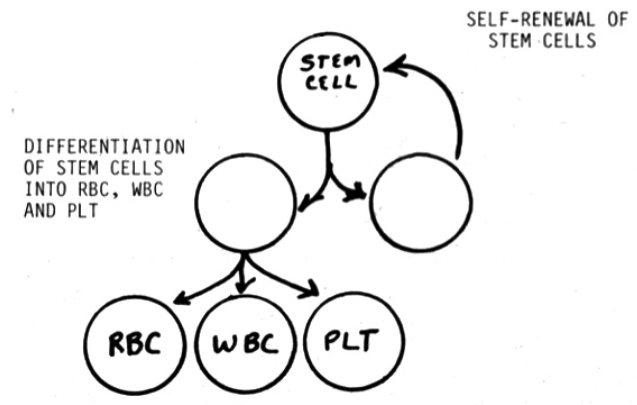
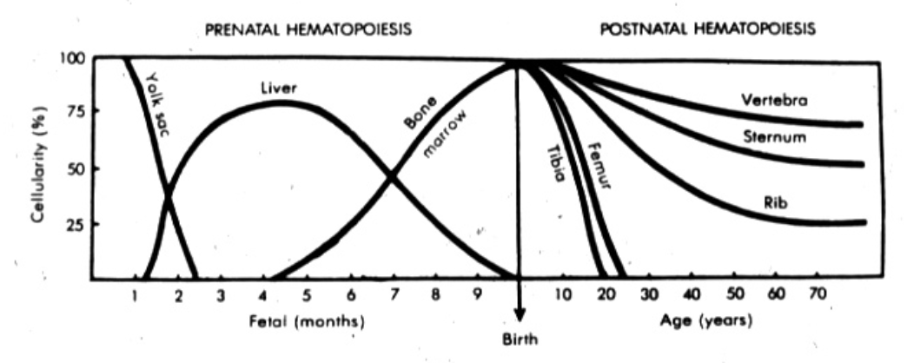
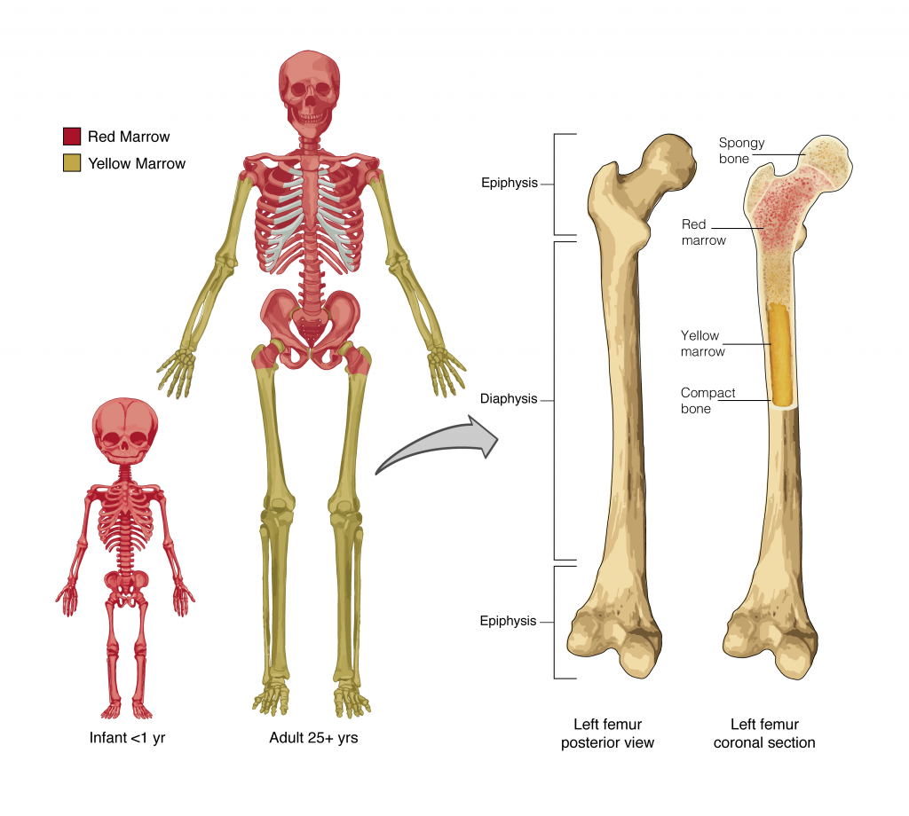
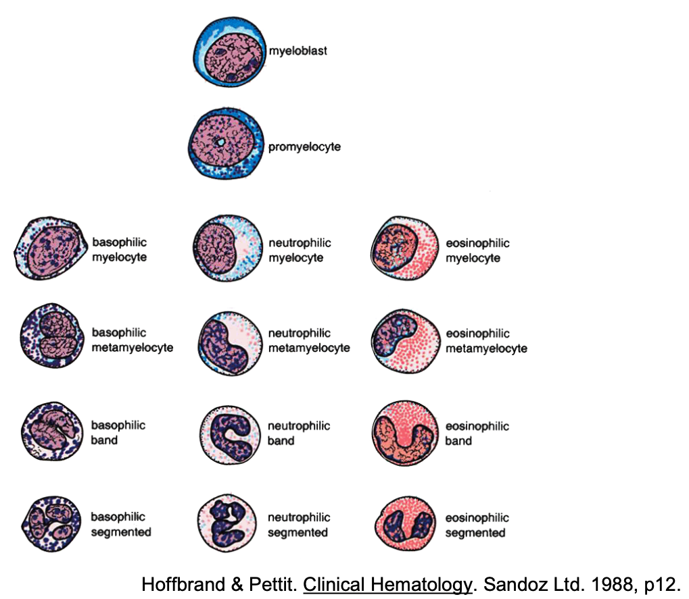
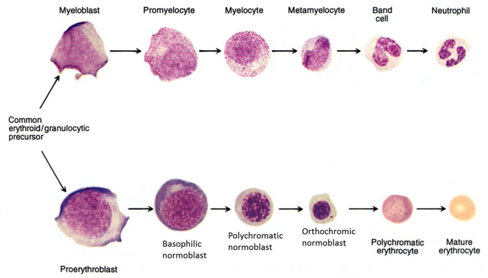
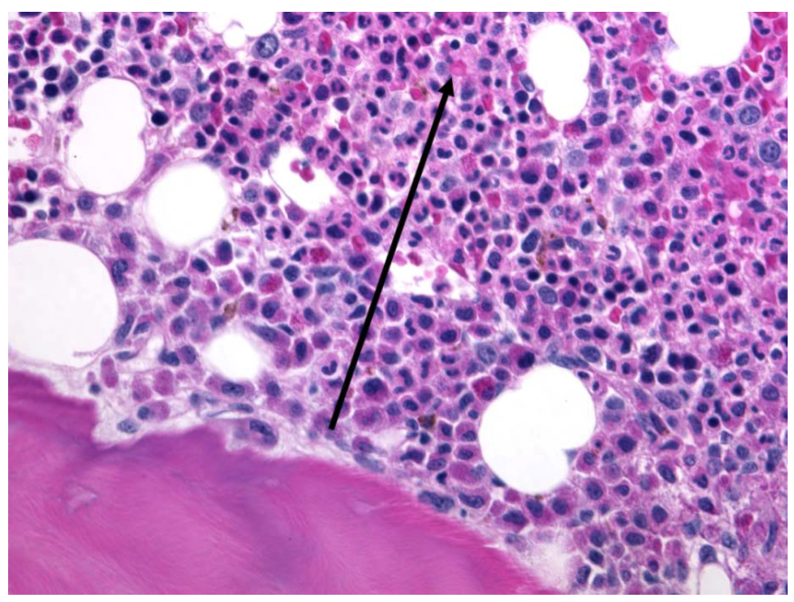
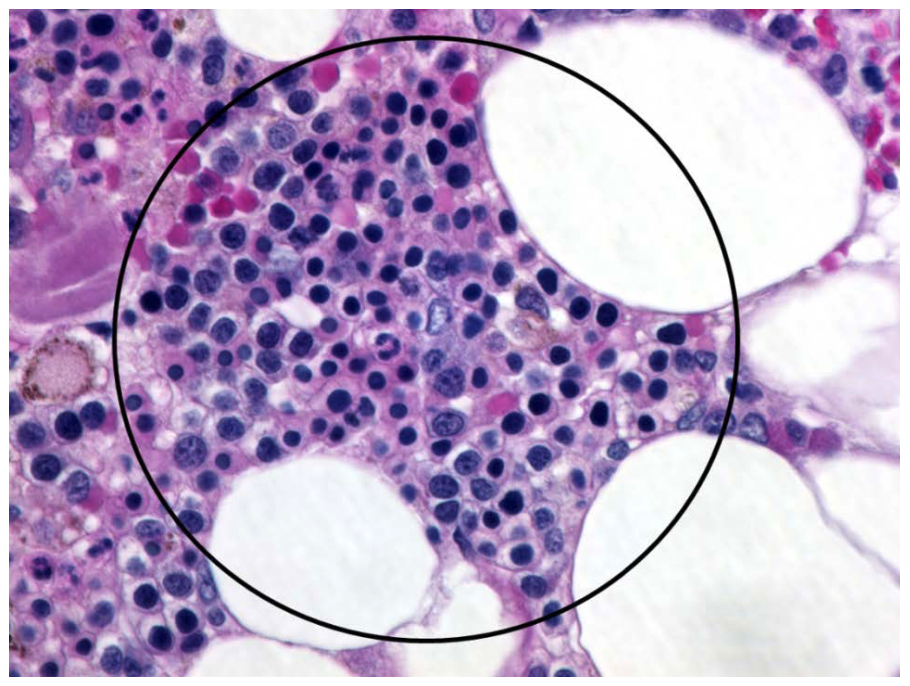
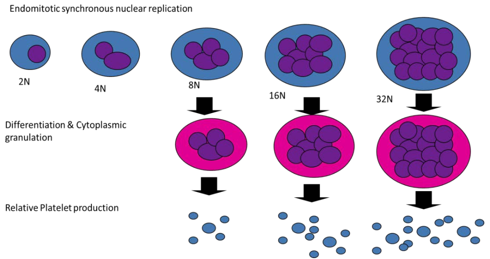
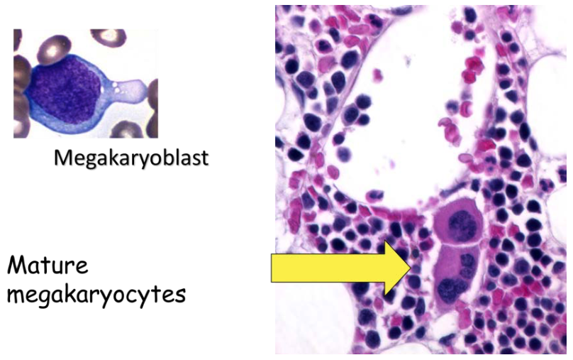

## In your blood, you have:

- RBC
- WBC
- Platelet
- Plasma

RBCs carry oxygen.

WBCs have 2 types:

- Neutrohils
- Lymphocytes

Neutrohils fight bacteria.
Lymphocytes fight virus.

Platelets aggregate and stop bleeding.

Plasma is a soup of many proteins like antibodies, clotting factors, and more.

## All these cells come from 1 cell type: HSC

HCSs can copy itself and turn into one of these specialized blood cell types.

This process of HSCs giving rise to blood cells is called hematopoiesis.

## Depending on your age, different parts of your body is doing hematopoiesis.

When you were a fetus, yolk sac, a structure that is connected to the empryo, does all the hematopoiesis for 1 month.
Then your fetal liver becomes ready, and it starts to do majority of hematopoiesis.
Spleen, thymus, and lymphnodes also become ready and start hematopoiesis.
Finally, as your fetal skeletons come into shape, these bones start to do hematopoiesis too.

After the birth, your bones do nearly all hematopoiesis.
The surface of bone is hard.
But the inside of bone is filled with bone marrow, which has HCSs, mesenchymal stem cells, adipocytes, and their derivative cells.
This is where hematopoiesis takes place.
Depending on your age, different bones do hematopoiesis.
When you were young, all bones do it together.
As you age, the bone marrows lose hematopoiesis cells and gains fat cells.
This process happens more in the peripheral bones, and will creep proximally as you age.
So as a result, the proximal bones do most of the hematopoiesis in adults.
This may be because the peripheral bones need to focus on supporting the body structure.

Ideally, you probably want big bones to make blood because they are big.
Or, the big bones used up their hematopoiesis power.
But in any event, big bones, liver, and all the things that used to do hematopoiesis will remember how to do it.
When your body needs a lot of hematopoiesis, these structure put their hematopoiesis hat on and start making blood cells.

Finally, hematopoiesis is a dynamic process and adapts to your physiological demand.

## Let's talk about how specific cell types mature.

### HCSs become myeloblasts, which become granulocytes.

Granulocytes are WBCs and they have granules.
There are 3 granulocytes:

- Basophil
- Neutrohil
- Eosinophil

With the common staining, basophil appears blue, neutrophil neutral color (or no color), and eosinophil pink.
I like to think of neutrophil as the neutral party between basophil and eosinophil.

Granulocyte making starts near the cortex (harder park) of the bone.
1 myeloblast cell changes in its structure and turn into a granulocyte.
The myeloblast becomes smaller, its chromatin condenses, and the cell gets many granules containing chemicals can damage pathogens.

As this process takes place, the changing myeloblast moves away from the cortex and closer to the center of the marrow.

This transition from the cortex to the medulla is interesting.
Maybe, the chemicals are too toxic to our own cells and that's why we make these toxic granules near the cortex where there is less cells.
Or maybe, this maturation needs some minerals that are more abundunt in the hard bone.

### RBCs lose nucleus during their maturation.

RBCs develop around a macrophage.
The aggregation of RBCs around a central macrophage is the erythroid island.

This makes sense because macrophages may be cleaning up the expelled nucleus or doing RBC quality control.
In liver and spleen, macrophages eat deformed RBCs.
In this island, they may be doing the same quality control for the budding RBCs.

### Platelets are fragments of big multi-nucleated cell.

Megakaryocyte give birth to platelets.
Megakaryocyte live along the sinusoids, which is one of the exit door of the bone marrow.
Megakaryocyte devide only its genome, resulting in having 4, 8, 16, or 32 sets of chromosomes within a single cell, a process called endomitosis.

Megakaryocyte gets bigger during endomitosis.
Its cytoplasm protrudes into the sinusoids.
When the growth ends, it fragments itself into platelets which exit the bone marrow via sinusoids.

### Lymphocytes are cooler WBCs and there are many ways of being cool.

Lymphocytes do a lot of things and they have diverse shapes and functions.
But in general, they are small and round.

### Myeloblasts that made granulocytes also make monocytes.

Monocytes are professional antigen presenting cells.
Monocytes become macrophages and stimulate lymphocytes in an immune reaction.
Monocytes and macrophages connect the innate immune system and the adaptive immune system.
They are everywhere, in many ways.
