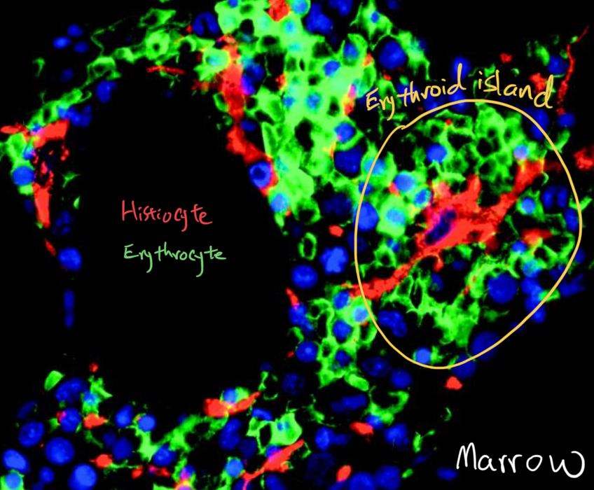
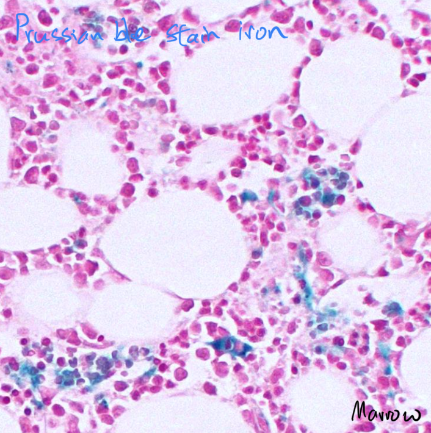
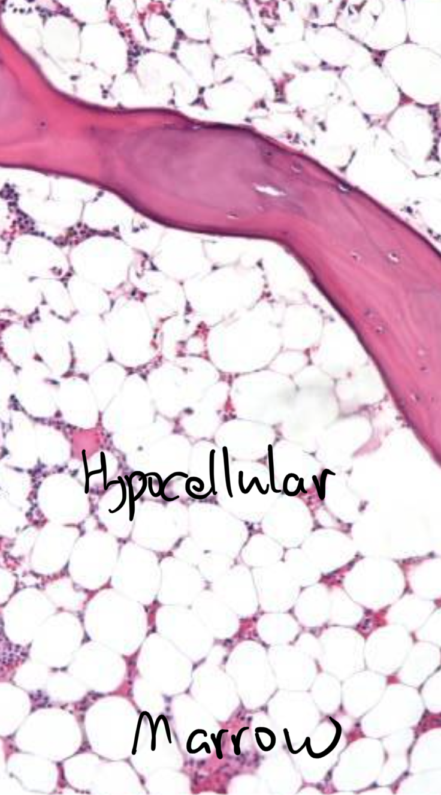
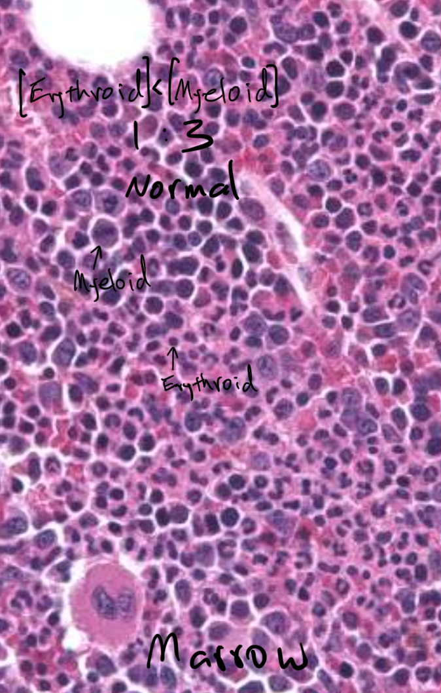
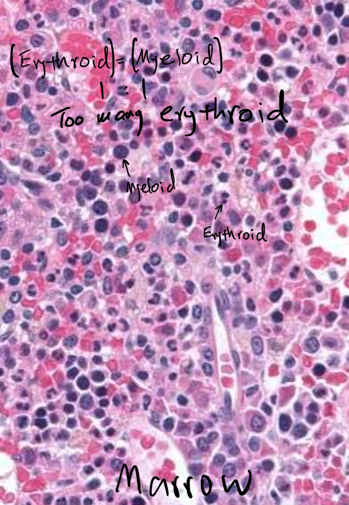
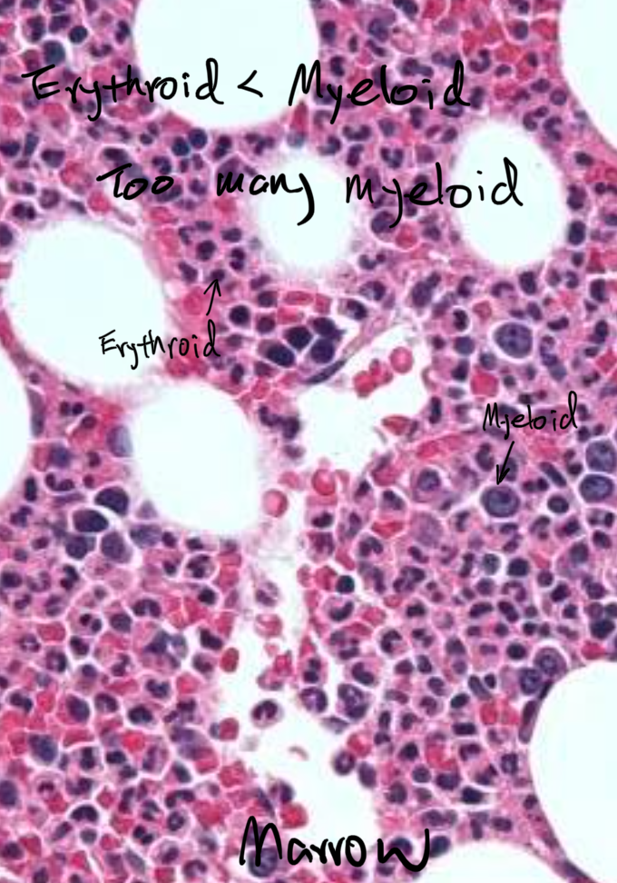
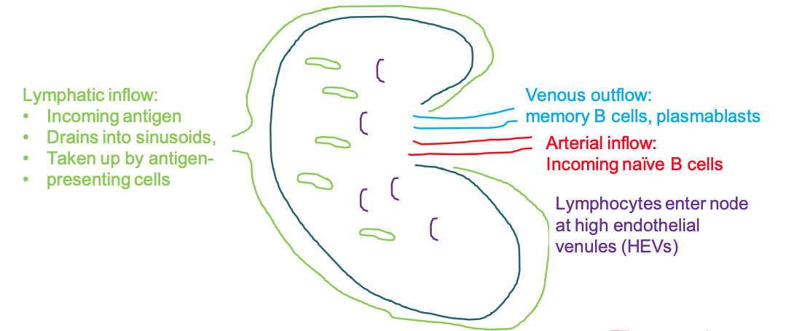
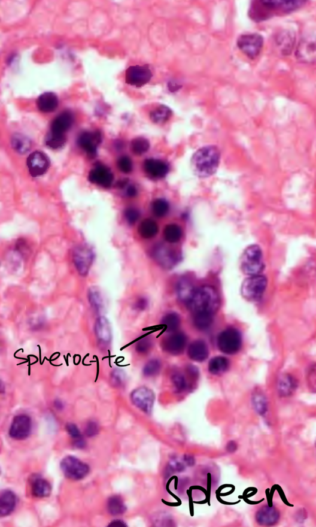

## There are many types of cells in the marrow:

- Bone cells (osteoblasts, osteoclasts, ...)
- Stromal cells (adipocytes, endotheliaal cells, ...)
- Resident mature hematopoietic cells (macrophages, lymphocytes, mast cells, ...)

The marrow makes all the blood cells.
So if you suspect a blood problem in a patient, you can either aspirate or biopsy the marrow.

The aspirate is fast to evaluate.
It preserves the cell cytology.

The biopsy is slow to prepare.
The preparation process damages the cell cytology.
It is better for looking at the structures and any fibrosis.
You can also further stain a biopsy to look at specific things like irons.

## Inside the marrow, hematopoiesis takes palce.

The hematopoiesis makes 4 lineages:

- Erythroid
- Thromboid
- Myeloid
- Lymphoid
  

The marrow makes the mature form of all lineages except the lymphoid.

The immature lymphoid cells are small and filled with dispersed chromatin.
They must complete the maturation process in spleen lymph node, or thymus, depending on the specific lymphoid cell type.

## RBCs mature in a cluster near sinusoid, surrounding a histiocyte, which is a form of macrophage.

The histiocyte eats bad RBC precursors and expelled nuclei, quality-controling the process.

In the maturation process, a big RBC precursor cell condenses its nucleus and size.
Iron activates hemoglobinization.
The maturing cell expells nucleus and becomes reticulocyte.

A reticulocyte matures into a RBC in 4 days, 3 days staying in the marrow and 1 day traveling in the circulation.
The travel shapes the circular reticulocyte into a biconcave RBC.

## Myeloid cells start the maturation near a bone and moves from it as they mature.

There also is a capillary where myoloid cells grow.

A myeloid precursor cell first gains in size and then recondenses into a smaller cell.
This cell then gains furhter condenses nucleus and gains granules.
Finally, the nucleus splits into 5 or less pieces and the cell becomes a mature granulocyte.

There are 3 granulocytes:

- Basophil
- Neurophil
- Eosinophi

They differ in their granule content and neutrophils are general, able to phagocytosis, and common.

## Platelets are fragments of big multiploid cell called megakaryocyte.

Megakaryocytes mature near a sinusoid.

They through mitosis without cytokinesis, resulting in cells with 2n, 4n, 8n, 16n, and 32n genomes.
The cytoplasm won't divide but expand and project into sinusoid.
At one of these ploidity, megakaryocyte stop the expansion and start to fragment into platelet.
Platelets bud into sinusoid and into the venous system.

## Marrow composition varies.

Infants have marrows in most of their bones.
Their marrows are 80-100% hematopoietic cells and rest fat cells.
As the infants grow, more fat cells replace the hematopoietic cells in the marrows.
Peripheral bones lose most hematopoietic cells, leaving only the central bones with hematopoietic marrows.
Children's hematopoietic marrows are mostly in the central bones.
60-80% of the marrows are hematopoietic cells.
Adult marrows have even less hematopoietic cells, from 40-70%.
Elderly marrows have only about 20-30% hematopoietic cells left.

This is a biopsy of a hypocellualr marrow.

This is a biopsy of a normocellular marrow.

This is a biopsy of a hypercellular marrow.

The hematopoietic cells usually have more myoloid cells than erythroid cells.
Myeloid to erythroid ratio is 3 to 1.
Myeloid cells are bigger than erythroid cells.
This is a marrow biopsy of a normal marrow, with 3 to 1 myoloid to erythroid ratio.

This is a marrow biopsy of a erythroid dominant marrow.

This is a marrow biopsy of a myoloid dominant marrow.

## Here is a case.

Patient is a 25 woman presenting with fatigue.
Labs are notable for: MCV 80, Hgb 9, Hct 27, and RDW 17.
Bone marrow aspiration shows erythroid maturation:

Bone marrow biopsy shows normocellularity with erythroid hyperplasia.

The findings indicates ineffective erythropoiesis.
The differential diagnoses are: myelodysplasia, thalassemia, iron deficiency, megaloblastic anemia, autoimmune hemolysis, oxidative hemolysis, and other conditions that interfere with erythropoiesis.

Iron staining of the marrow biopsy is negative, indicating iron deficiency.

The patient has an iron deficient anemia.

## Lymphnode

The marrow makes small and dispersed chromatin filled immature B cells, called naive B cells.
The naive B cells travel to lymphnodes and spleen to mature.
A lymphnode has 2 input and 1 output flows.
Lymphatic inflow brings in antigens, which are taken up by lymphnodes professional antigen presenting cells called follicular dendridic cells.
Arterial inflow brings in the naive B cells.
Each naive B cell has a unique membrane protein.
If an follicular dendridic cell presents the antigen that matches with a naive B cell's membrane protein, then the dendridic cell activates the naive B cell and the B cell gets to matures.
Mature B cells and naive B cells exit the lymphnode via venous outflow.

Lymphnode contains follicles, which are near the lymphatic sinusoids.
The antigens from the sinusoids can easily get to the follicle.
A follicle has in its center naive B cells and around them mature center B cells.
When a naive B cell finds its antigen, the B cell starts to mature.
The mature B cells help grow the naive ones.
The rest of the lymphnode is filled with helper T cells.
The helper T cells also help grow the naive B cells too.
A naive B cell can become a mature B cell, which can furhter mature to become plasma cell.
Plasma cells secrete their membrane receptors as antibodies.
Finally, there are macrophages in the germinal center to eat the naive B cells that failed to mature.

There are many follicles in a lymph node.
When there is infection, inflammation, autoimmune, and other systemic condition, various antigens come into the lymphnode through the lymphatic and arterial inflows.
These antigens can activate naive B cells in multiple follicles leading to nonspecific lymphnode stimulation.

The non-follicular parts of a lymphnode is filled with helper T cells, dendridic cells, and vessels.
This region can bulk up (hyperplasia) when there is viral infection and other systemic insults.

So an enlarged lymphnode (lymphadenopathy) can be from immune activation with growing follicles and or non-follicular regions.

## Spleen

Spleen has mostly red regions and some white ones.
The red pulp has splenic cords and histiocytes.
They filter and recycle the RBCs.
The white part has B cell follicles, like the ones in a lymph nodes.
B cells mature within a follicle.

Usually, an arteriole becomes a capillary, which becomes a venule.
But in the spleen, arteriole has an open end.
Things in the arteriole spills out of the end.

There is a lot of T cells surrounding arterioles.
This is called periarteriolar lymphoid sheath.
These T cells get the first bite on the things coming out of the arterioles.
I wonder why the T cells access the stuff first.

The things that spill out of the open ends then must flow through the red pulp to get to the venule.
These red pulp has splenic cords which make filters of size 2um.
RBCs, which are 7um in size, can usually squeeze through the slits.
But RBCs that lost their flexibility, or bad RBCs, are trapped and eaten by macrophages.

Surrounding the red pulp are the white follicles filled with naive and mature B cells.
This is called splenic marginal zone.
These follicles are in contact all kinds of things in the flowing media.
Some of the things can be antigens, which can stigger naive B cell maturation in the follicles.

## Immune thrombocytopenic purpura

This is an autoimmune disorder.
Your own B cells make antibodies against platelet proteins.
The antibodies bound to platelets are taken up by the macrophages, mostly in the spleen.

The splenic B follicles are busy and expanded because plasma cells are making the anti-platelet antibodies.

The red pulp is also busy and expanded because a lot of the antibody-platelet complex are being trapped and processed.
However, there is less redness and more whiteness because the macrophages in the region have taken up incread of RBCs platelet complexes.

Overal, spleen is busy making antibodies and clearing antibody complexes.

## Autoimmune hemolytic anemia

More RBCs trapped in the red pulp.
There are also granulocytes, plasma cells, and hemosiderin in the red pulp.

## Sickle cell (hemoglobin S) anemia

Sicke RBCs are trapped in the red pulp.

The red pulp expand, infarct, and get fibrosis.

## Hereditary spherocytosis

The red pulp is filled with spherocytes and expand.

Spleen starts to participate in hematopoiesis.
And erythroid colonies emerge in their sinusoids.

## Wiskott Aldrich syndrome

T cells surrounding the arteriole, the periarteriolar lymphoid sheath, is gone.

B cells surrounding the red pulp, the splenic marginal zone, is gone.

