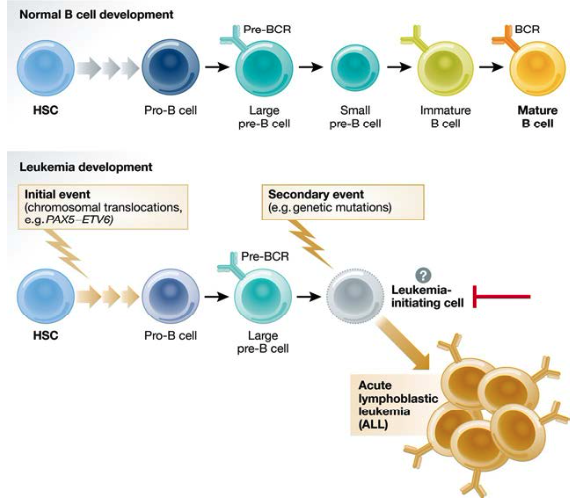
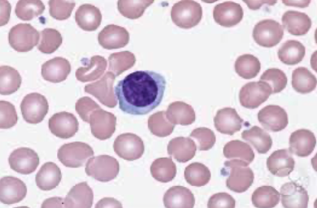
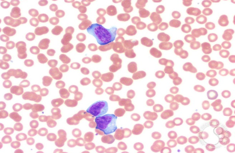
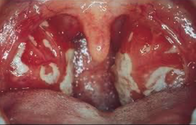
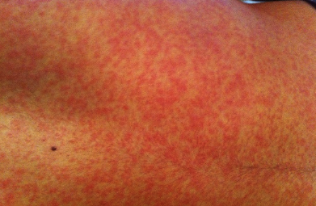
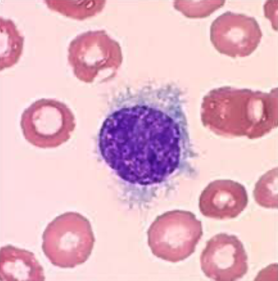
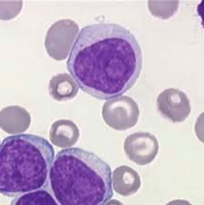
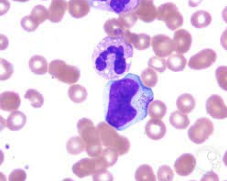
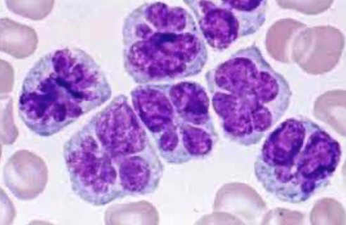

## Leukemia is the cancer of developing lymphocytes and granulocytes.

When a premature lymphocyte (B or T) meeses up its differentiation and becomes a cancer cell, then the cancer cell is called leukemia cell.

## Leukemia lymphocytes look different.

Compared to a healthy lymphocyte, a leukemia lymphocyte has more accessible chromatin and more cytoplasm.
Perhaps these cells are making more stuff.

## In a normal process like infection, your body also makes more lymphocytes.

Specific infection results in lymphocytosis.
EBV infects B cells.
The body responds by making more T cells that can eliminate the infected B cells.
This expansion of a specific T cell population in response to an infection is called infectious mononucleosis.

A patient infected by EBV presents with:

- Sore throat
- Fever
- Posterior lymphoadenopathy
- Hepatosplenomegaly
- Rash

Monospot test is positive for EBV infected patients.

## Acute lymphoblastic leukemia (ALL) is the most common childhood cancer.

ALL is the cancer of immature lymphocytes.

1 in 2000 kids get this.
60% of ALL patients are under 20.

Treatment is chemotherapy, CNS prophylaxis, immunotherapy, and or marrow transplant.

Blinatumumab is an antibody against cancer cell.
This antibody can also bind to T cell.
The antibody brings together a cancer cell and a T cell so the T cell can eliminate the cancer cell.

Inotuzumab Ozogamicin is also an antibody against cancer cell.
This antibody carries toxins that can penetrate into the bound cancer cell and damage it.

Chimetic antigen receptor T cell is an engineered T cell that recognizes and eliminates cancer cells.
A patient's own T cell is manipulated to be able to react to the cancer cell.

## Philadelphia chromosome is a specific mutation assocaited with leukemia.

This mutation fuses BCR and ABL genes in a B cell.
This fusion results in BCR promotor, which is more active, controlling ABL gene, which is an oncogene.
As a result, the B cells with this mutaion make more oncogene.

Luckily, there is BCR-ABL inhibitors like imatinib and dasatinib, which are effective against B cell leukemias with this mutation.

## Chronic lymphocytic leukemia (CLL) is the most common adult leukemia.

CLL is the cancer of mature lymphocytes.

Averate onset is 70.
Most patients are asymptomatic at diagnosis.
Symptoms can be mild, in which patients die from other typical causes.
Symptoms can also be severe, in which the patients die from the CLL in few years.

## There are many types of chronic lymphoproliferative disorders.

- Hairy cell leukemia (BRAF mutation, hairy cell, cytopenia with splenomegaly, good prognosis)

- Prolymphocytic leukemia (T cell origin is aggressive, B cell origin is from CLL, splenomegaly)

- Large granular lymphoproliferative disorders (T or NK cell origin, big cytoplasm with granules [T cells have granules], only neutropenia [T cells deplete the resources for making granules])

- Adult T cell leukemia-lymphoma (HTLV-1 infection, cloverleaf nuclei, endemic in Japan and Carribean, aggressive, hepatosplenomegaly, lymphoadenopathy)

