## The most common (57%) white blood cell cancer is lymphoma.

Leukemia is the 2nd (29%).
Myeloma is the 3rd (14%).

## Lymphoma is the cancer of lymphoid tissue.

Lymphoid tissues are in lymphnodes, spleen, gastrointestinal Peyer's patch, and many places.
But lymphoma can also involve the marrow.

## Lymphoma staging depends on where the cancer cells are and symptoms.

Stage 1 is 1 lymphnode.
Stage 2 is lymphnodes on one side of the diaphragm.
Stage 3 is lymphnodes on both sides of diaphragm.
Stage 4 is lymphnodes and other organ.

Staging can furhter specify the context with a letter.
Letter A indicates lack of systemic symptoms.
Letter B indicates fever, night sweats, or weight loss.
Letter E indicates extralymphatic site (same as stage 4)
Letter S indicates splenic disease.

For example, stage 2S indicates lymphoma in lymphnodes on 1 side of the diaphragm and splenic disease.

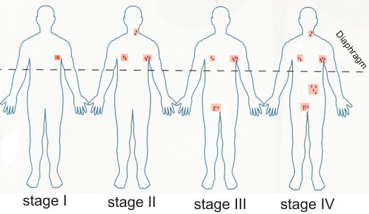

## Lymphomas are classified into 2 groups: Hodgkin and Non-Hodgkin.

Hodgkin lymphoma is a specific B cell lymphoma.
Non-Hodgkin is all other lymphoma, including B and T cell lymphomas.

## Treatment types and prognosis are different depending on lymphoma class.

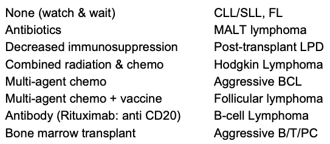

Prognosis ranking is: Hodgkin lymphoma > Non-hodgkin lymphomas = Leukemia > Myeloma.

## 85% of lymphomas originate from B cell lineage 15% T cell.

There are many cell types in the B cell lineage.

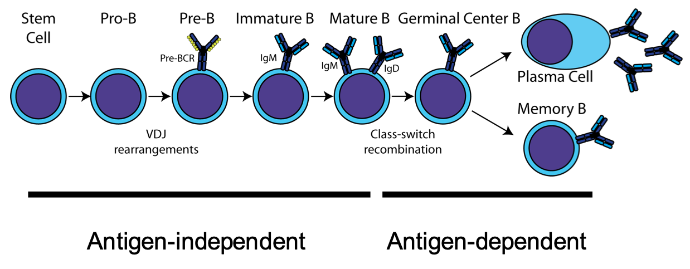

Each cell type expresses specific protein.
PAX is a B cell lineage transcription factor.
TDT adds random nucleotides during V(D)J recombination to make an antigen receptor.
CD20 shows up when a B cell is able to make an antigen receptor.
BCL is a membrane protein that prevents the expressing cell to be killed or apoptosis.
CD138 is plasma cell protein.

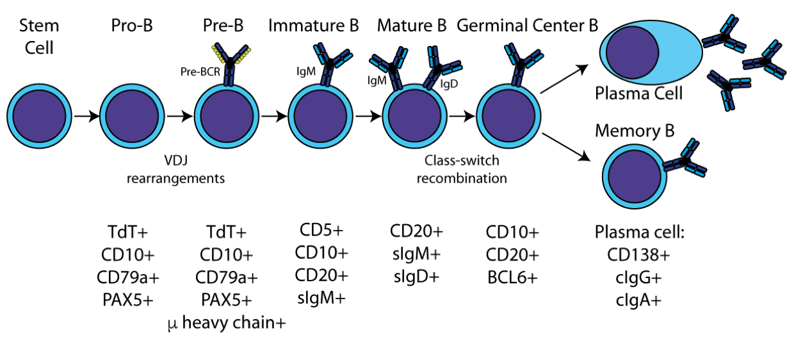

B cells lymphomas can arise from any intermediate cell type in the B cell maturation.

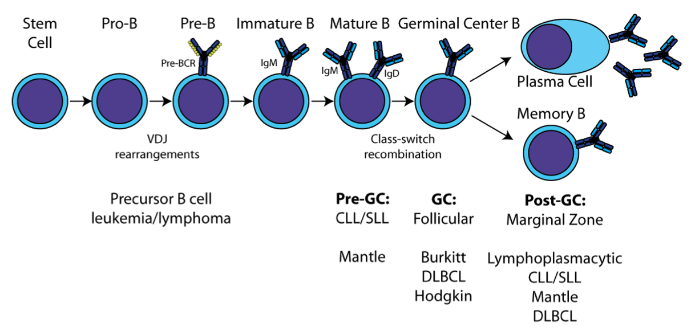

Similarly, there are various cell types in the T cell lineage.
A T cell lymphoma can originate from any of the intermediate cell types.

Typically, more immature cell types become cancers in children, diagnosed as acute leukemias.
And more mature cell types become cancers in adults, diagnosed as lymphomas.

## Follicular lymphoma is common.

When there is infection, an antigen presenting cell brings a piece of the pathogen to a near lymphnode.
The presenting cell transfers the antigen to a lymph node resident antigen presenting cell, who then displays the antigen to the B cells in the lymphnode.
The B cells are clustered in follicles.
If there is a B cell whose receptor can bind well to the antigen complex, then this B cell proliferates and its follicle expands.

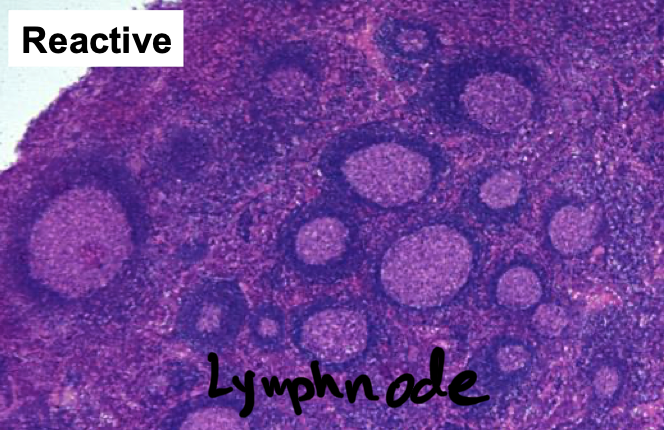

The B cells in the activating follicle have polarity.
The follicle also has macrophages that eat by products in the process.

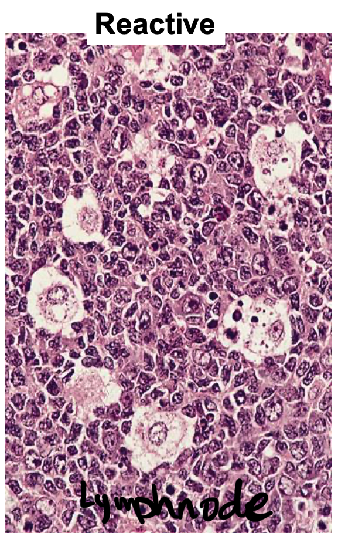

When there is a follicular lymphoma, however, follicles proliferate in the absence of an antigen presentation.
This neoplastic activation happens without mantle zone, polarization, and macrophages needed for regulation.

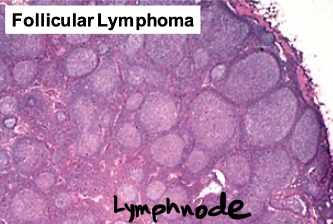

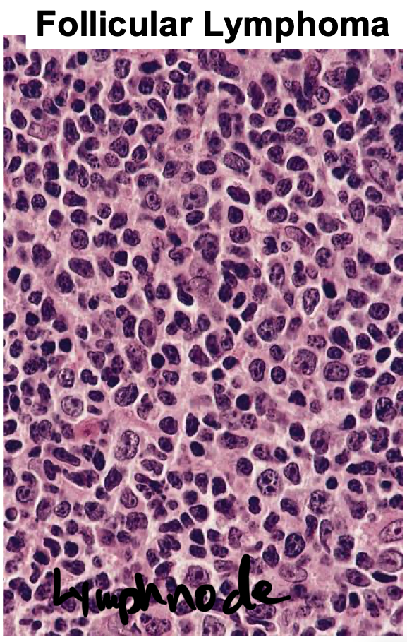

Cancer B cells often have a fusion of chromosome 14 and 18.
This fusion puts the BCL gene (on chromosome 18), which is anti-apoptotis, under the control of B cell receptor gene (on chromosome 14).
Normal naive B cells in the follicles lack BCL protein and die.
But naive B cells with the fusion make as many BCL proteins as their receptor proteins, and they evade apoptosis and become follicular lymphoma.

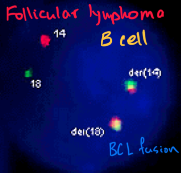

## It is difficult (and not wise) to get rid of a follicular lymphoma.

Some follicular lymphomas regress and some progress become more addressive.
For a typical lymphoma, the cost of treatment out weighs the benefit of cure, so do not treat and only monitor.
Reconsidering treatment if the lymphoma becomes more aggressive.

## Lymphoma can arise outside of lymphatic tissues.

B cells can be in various places.
Diffuse large B cell lymphoma, which is the most common adult lymphoma, can also appear in various places.

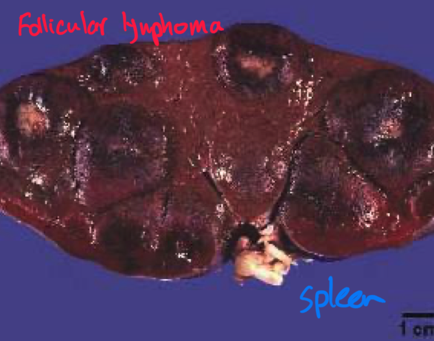

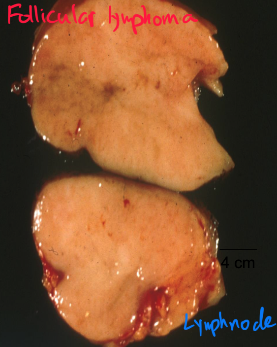

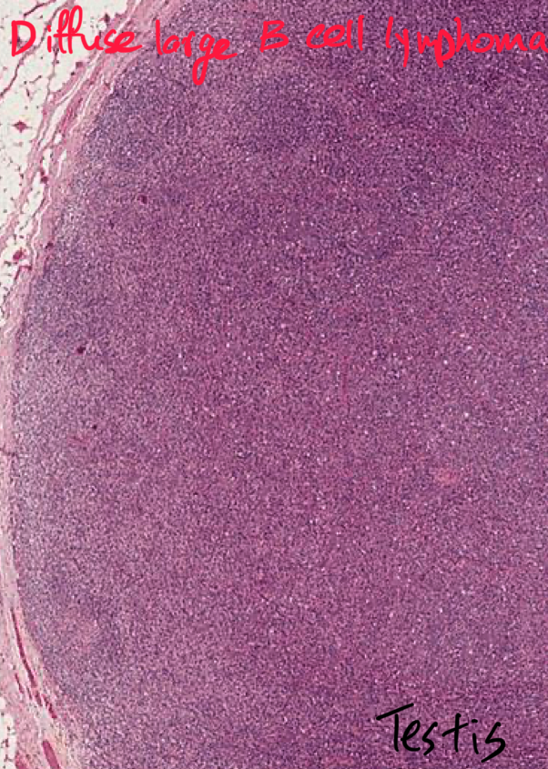

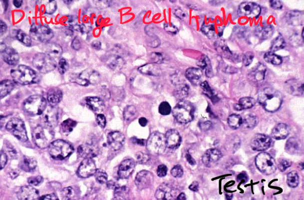

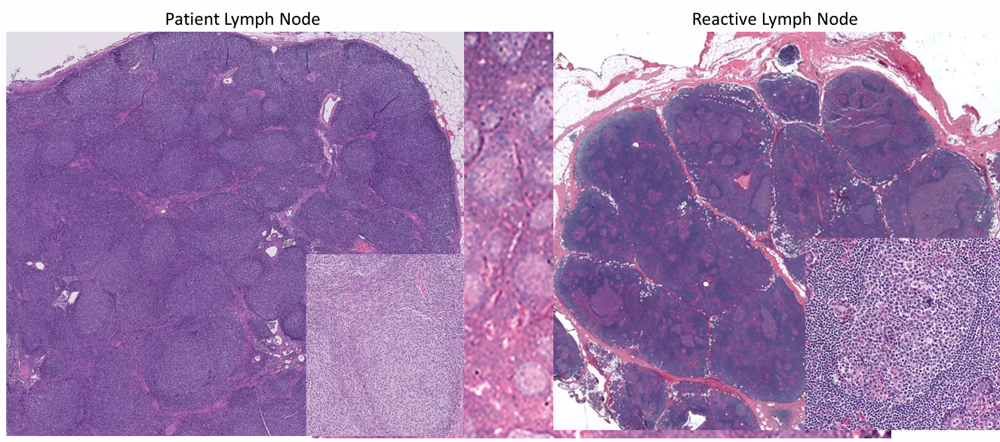

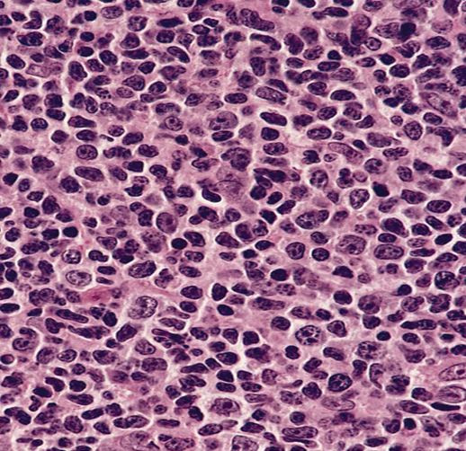

This lymphoma is filled with somewhat mature (CD20+) and bloated B cells.

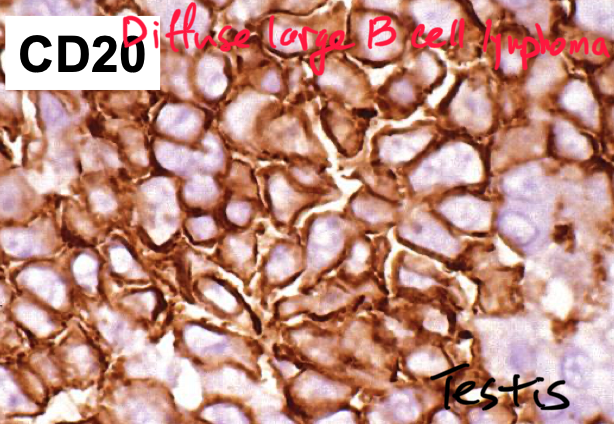

Germinal center as well as peripheral blood B cells express CD20 and can turn into this lymphoma.
The germinal center derived one has better prognosis than the one derived from the peripheral blood.
Perhaps, the peripheral blood one is more invasive.
Overall, diffuse large B cell lymphomas are potentially curable.

## Lymphoma can arise from infection.

EBV infects the B cells in the posterior throat.
This infection often happens in kids.
The body reacts by T cell lymphocytosis (infectious mononucleosis).
And the proliferating T cells are going to clear, but not all, infected B cell.

Meanwhile, the infected B cells become Burkitt lymphoma-leukemia.
These Burkitt B cells grow rapidly become masses near the head and neck.

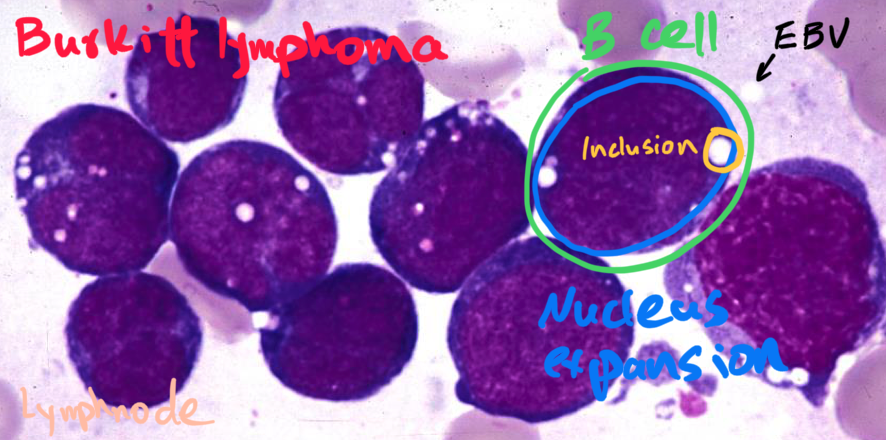

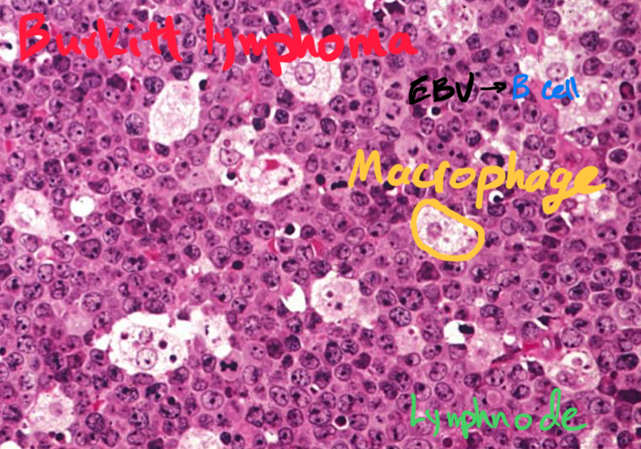

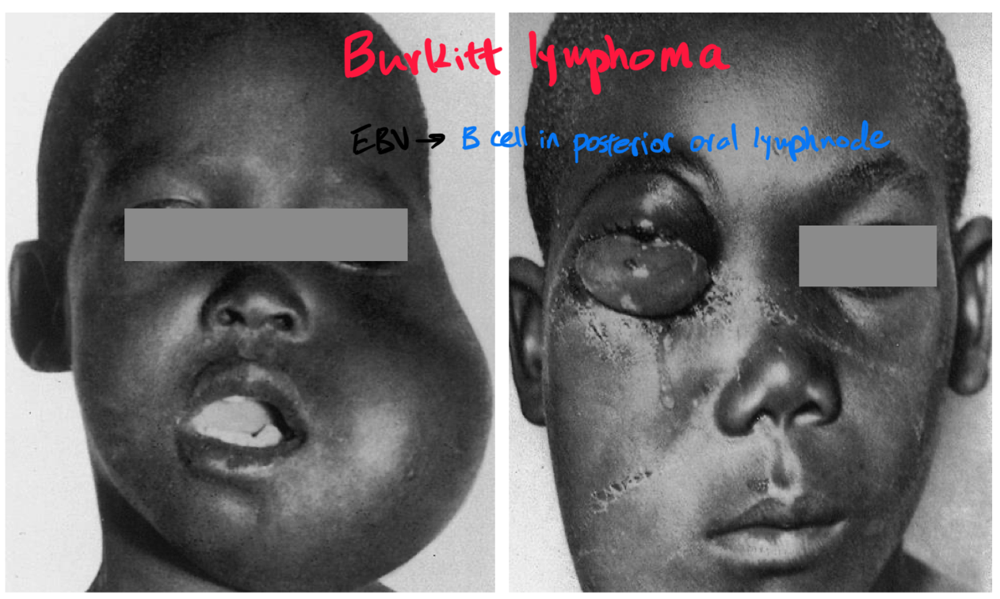

This is a EBV triggered Burkitt lymphoma.
It is a endemic lymphoma associated with aras where malaria is also common.

There is also sporadic Burkitt lymphoma not associated with these areas.
EBV is found in only 30% of the sporadic ones.
Sporadic ones often happen in people with immunodeficiency.
So maybe there is another EBV like pathogen that is causing the sporadic Burkitt lymphoma.

## T and NK cell lymphoma are called anaplastic large cell lymphoma.

They are rare, heterogeneous, and, like diffuse large B cell lymphoma, present extranodally.

They express CD30.
They often also express ALK fused with NPM (chromosome 2 and 5 fusion).
Expression of ALK is associated with better prognosis.

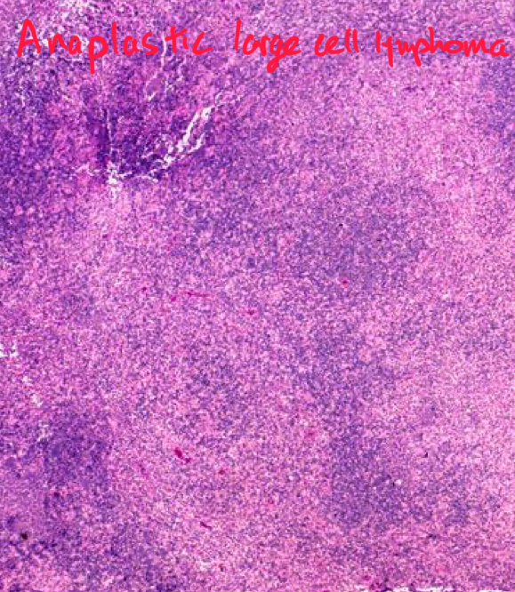

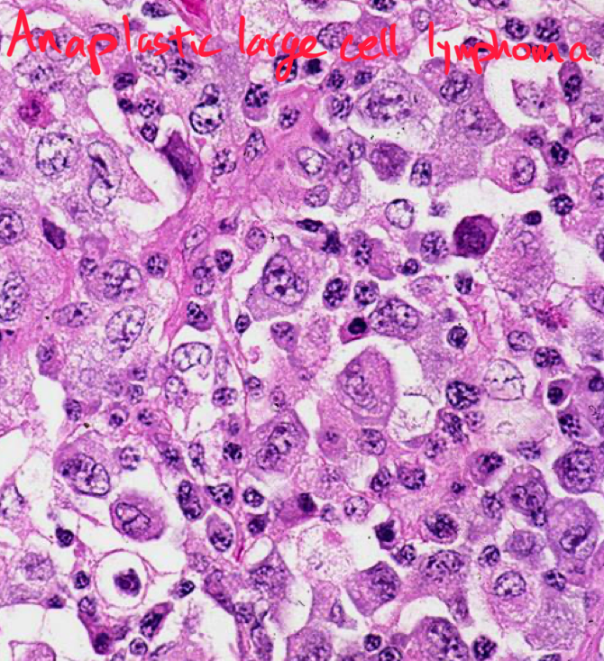

## Faster a lymphoma kills, better the prognosis.

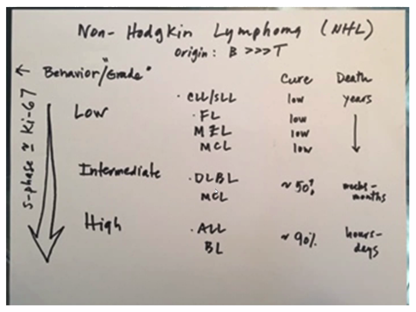

## Hodgkin lymphoma is discovered long time ago.

It is a B cell lymphoma.
But the Hodgkin cells express proteins of B and T cells, like CD30 and CD15.
Compared to other lymphomas, Hodgkin's lymphoma is more proliferative and sclerosing resulting in bigger affected lymphnodes.

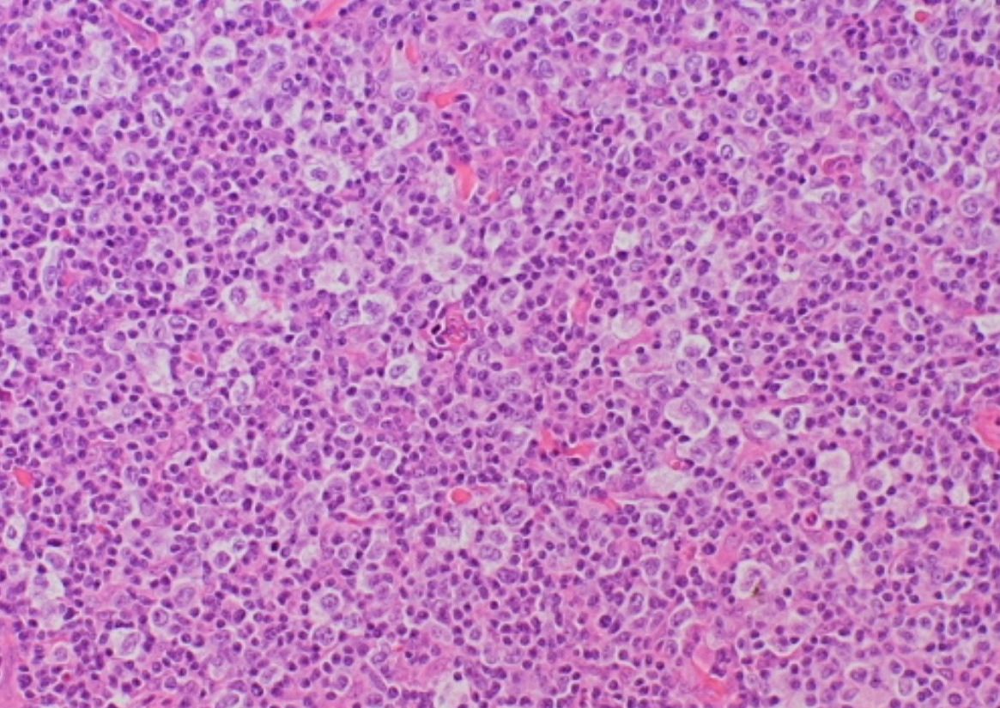

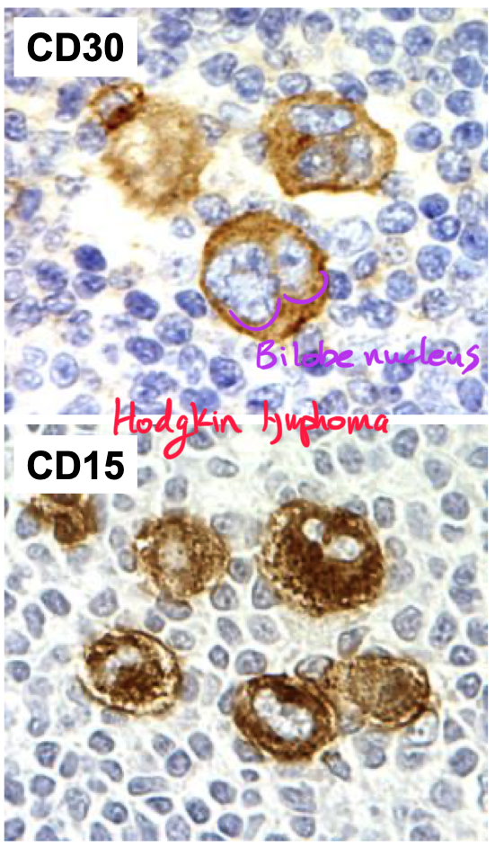

They hide among normal cells of lymphoid tissues.
They are giant and have bilobed nucleus.

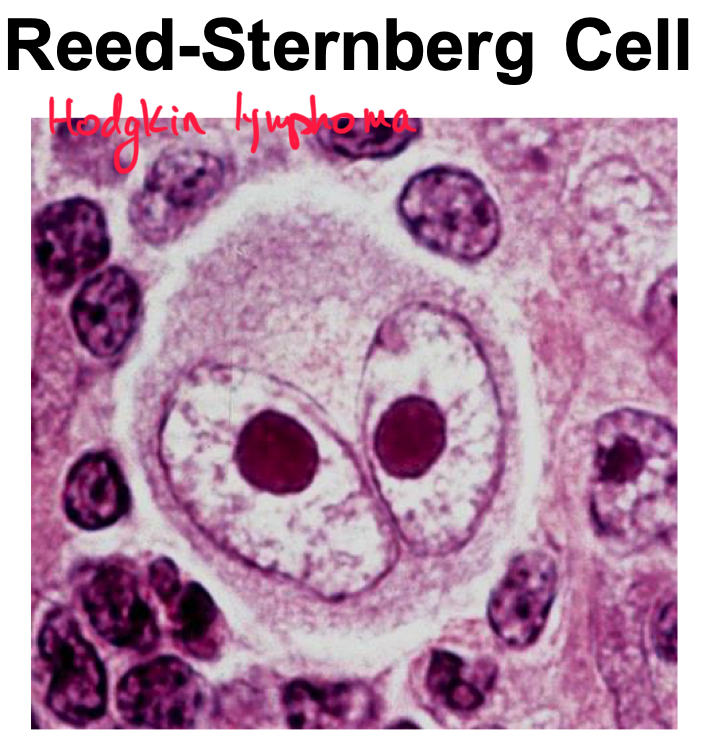

Hodgkin lymphoma was the first cancer cured with radiation.

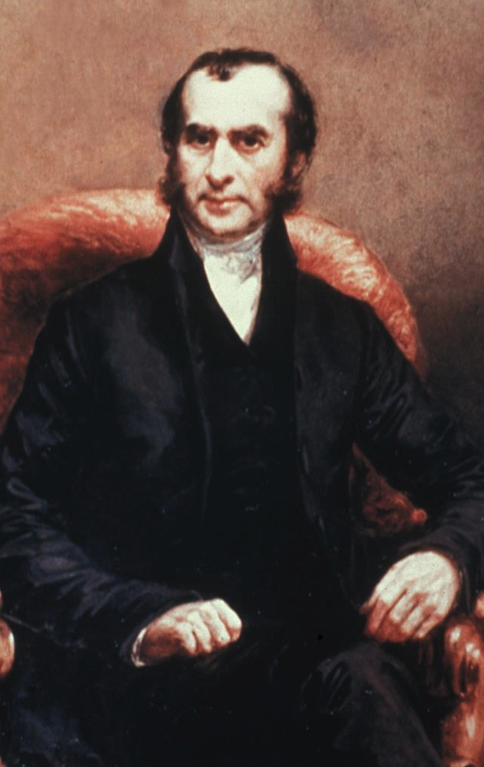

## Lymphocytosis can be absolute or relative.

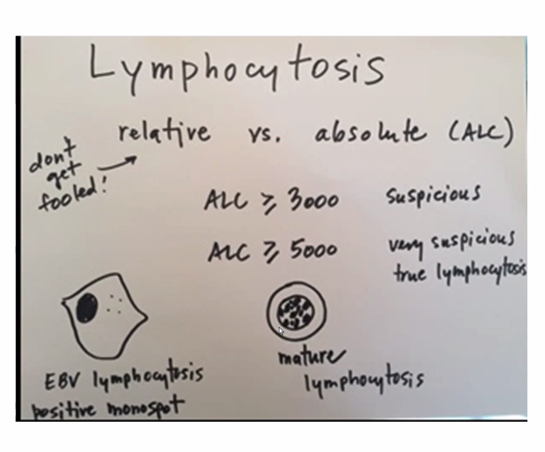
