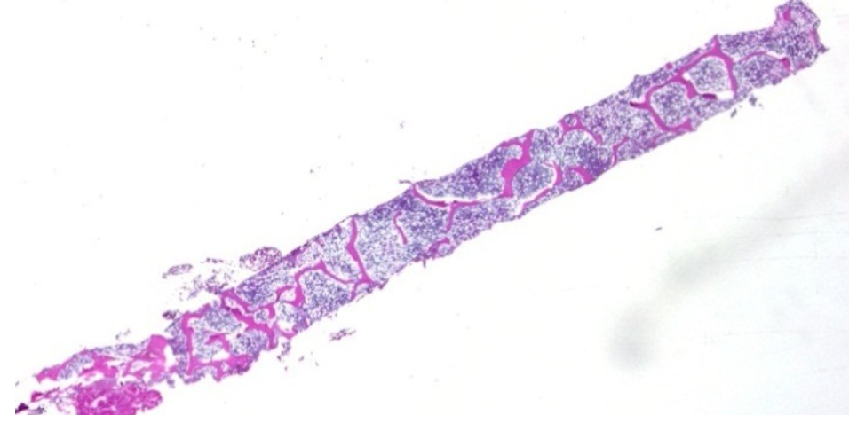
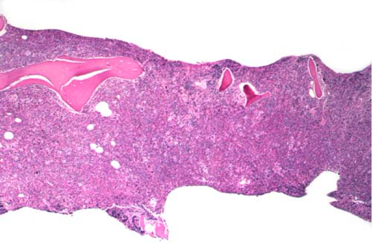

You should examine a patient's marrow when there is any of:

- peripheral blood problem
- blood cancer
- fever of unknown origin
- disease that needs marrow monitoring

You can either aspirate or biopsy the marrow.
Do this with a big needle at the posterior superior iliac spine.

Aspiration is good for counting cell types.

Biopsy is good for looking at the structure, which contains information about bone, fibrosis, necrosis, masses, and cellularity.

This is a bone marrow biopsy.

Drugs, inherited syndromes, autoimmunity, aging, infections, anorexia nervosa, and radiation can result in hypocellular bone marrow, where adipocytes replaced a lot of the hematopoietic cells.

This is a biopsy of hypocellular bone marrow.

Neoplasia and increased demand for hematopoiesis results in hypercellular bone marrow.
Bleeding and RBC problems leads erythroid hyperplasia.
Infection leads to myoloid hyperplasia.
And clotting problem leads to megakaryocytis hyperplasia.

This is a biopsy of hypercellular bone marrow.

