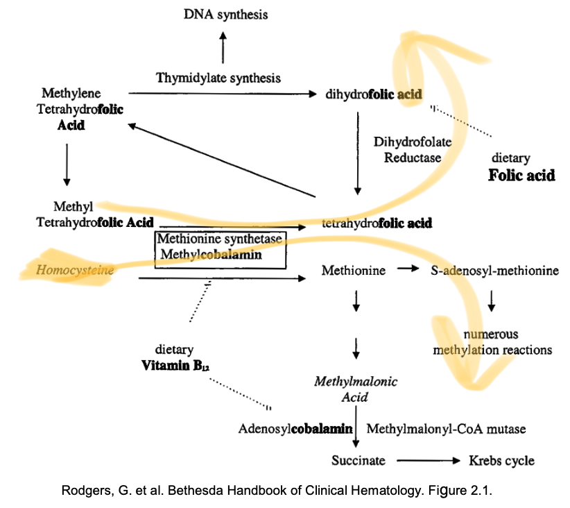

## There are several types of anemia.

Each has problem somewhere in the life cycle of RBC.

## So let's understand the RBC life.

Hematopoietic tissues (marrow in adult and liver and other tisseus in fetus and newborn) make RBC.
Fe++ and Fe+++ (irons) activate this making of RBC.
Specifically, before RBC loses its nucleus, iron inerts into the hemoglobin forming heme.
No iron, no RBC making.

## Iron is the key in the RBC, now let's understand the iron life.

Iron comes from the food.
You body absorbs iron in the duodenum and proximal jejunum.
Most dietary iron exists in the more oxidized ferric form, Fe+++.
And the other exist in ferous form, Fe++.
Some of these ferous irons are already bound to heme.
Red meat has a lot of this heme-bound Fe++.

We don't know exactly how, but the intestinal cells absort these irons with different pathway.
And the pathway that absorbs the Fe++ is more efficient.
After the cells take up the irons, the cells transport them from the apical surface, shuttle it to the basal surface, and the iron transporter there called ferroportin dump them out of the cell into the circulation.

Irons in the circulation travel bound to transferrins, which are made in the liver.

To take up the circulating ferritin-bound irons, the erythroblasts (RBC precursors) use transferrin receptors to capture the transferrins and take up the irons.
The irons activate the erythroblasts to mature into RBCs.

This paradigm of using liver derived transporter and their receptors to shuttle molecule is common.
Lipids rely on the liver proteins to travel and the tissues that need the lipids bind to the carrier to take up the lipids.

Finally, when there is a lot of iron already in the circulation, ferritins can be full.
Then, the intestinal cells, instead of dumping the iron into the circulation, stores them as ferritin within the intestinal cells.
So your intestinal cells are your iron banks also.

## How the marrow makes RBCs depend on the iron availability.

If you deplete iron and force RBC production, then the resulting RBCs are small.

If you take up a lot of iron, the marrow starts to make a lot of reticulocytes which will then mature into RBCs.
This proliferation rerults in RBCs with various sizes (x-axis).
Think of it as RBC renaissance.

Finally, if you stimulate the RBC production, there will be a lot of RBCs.
As the number of RBCs incresae, the liver makes less ferritin.
This may be because there is less need to transport iron to the marrow and make RBCs.

## In total, there is about 5g of iron in our bodies.

3g is in the RBCs and their precursors in the marrows.
1g is stored as ferritin in the intestinal cells and hemosiderin.
0.5g is in myoglobin in the muscle's
0.007g is being actively carried by transferrin.
0.002g is lost per day as dead skins and by mense in women.

## As the iron level drops, the body taps into the iron bank ferritin and increases the transferrin production to scavenge irons.

As the iron level continues to drop, the ferritin continues to rise, but the amount of circulating iron drops.
With little iron, the marrow makes smaller and deformed RBCs.
Finally, these crappy RBCs won't be able to carry enough O2 and the body develops anemia.

## Iron level can drop from various causes.

Diet low in iron can cause it.

Women's health things can do it too.
Pregnancy requires a lot of RBC making, depleting the existing iron level.
Breast feeding also requires a lot of iron.
Menstural blood loss depletes RBC and thus iron too.

Conditions of chronic blood loss can consume iron.
Blood donation depletes RBC and thus iron.
GI neoplasm and parasite lead to bleeding and iron spilling.

Disease that decrease the iron absorption causes drop in iron too.
Celiac disease mess up the absorption of many things including iron.
Helicobacter pylori and autoimmune gastritis messes up absorption too.
Finally, iron refractory iron deficiency anemia drops iron as well.

## Patients with anemia due to absolute iron deficiency presents with:

- Pica, which is a caraving for non-food substances like ice
- Brittle ridged nails
- Atrophic tongue
  
- Angular stomatitis
  

## Diagnose anemia by measuring blood and looking the the peripheral blood smear.

Measure iron directly.
Measure transferrin and its saturation.
Liver increases transferrin production when there is low perfusion.
As a result of decreased iron and increased transferrin, the transferrin saturation drops.

Measure hemoglobin to assess how much hemoglobin is there.
Measure MCV to see how big a RBC is.
Small MCV indicates iron deficiency and big MCV indicates a non-iron cause of anemia.
Measure RDW, which is the width of the RBC size distribution.
High RDW indicates marrow activity to make more cells.
Measure reticulocytes also to see if marrow is trying to make more RBCs.
In rare cases, you can biopsy the marrow and stain macrophage to see if there is enough iron in the marrow.

Note that WBC measure the amount of cells floating in the blood.
Good amount of WBCs are not floating but sticking to blood vessels and such.
And smoking and glucocorticoid use can increase the number of sticking WBCs.
So watch out.

Finally, peripheral smear can tell you if the RBCs are normal, small and deformed, or big.

When there is iron deficiency, the RBCs are small and deformed.

When there is enough iron but problem in other elements of the iron circulation, like liver and marrow, the RBCs can be big.
This is macrocytic anemia.

Hypothyroidism and chronic alcohol ingestion can also lead to macrocytic anemia.

When kidneys fail, RBCs deform if there is dehydration.
RBC production slows if EPO signaling is messed up.

Remember that older patients presenting with anemia may have gastric problems so you must evaluate their gastrointestinal tract.

## Treat by giving ferous iron, which should drive up the reticulocyte count in few days.

## Even when there is plenty of iron, anemia can happen from inflammation.

When there is inflammation, liver makes a lot of hepcidin, which is a molecule that disables ferroportin, which is the membrane protein that moves iron across intestinal cells and macrophages.

As a result, hepcidin blocks iron from released by the intestinal cells, which absort iron from diet as well as store extra iron as ferritin.
Furthermore, hepcidin blocks macrophages from recycling iron from RBCs.
All together, inflammation clogs the iron cycle in the body.

Like hepcidin, activated macrophages also prevent cells from releasing iron.
In addition, activated macrophages release cytokins that suppress kidneys from making EPO and marrow hematopoiesis.
So, in an inflammatory state, iron circulation clogs and hematopoiesis slows, resulting in anemia.

## Inflammatory anemia lab values reflect poor iron absorption and circulation:

- Low serun iron
- A bit increased ferritin (cells can't release the irons stored as ferritin)
- Lowe transferrin (inflammation messes up liver function)
- Normal or microcytis peripheral smear
  

## Diagnose inflammatory anemia by diagnosing inflammation.

- Look for inflammatory diseases in a patient
- Measure ESR and CRP
- Measure low marrow activity and thus low reticulocyte count
- Measure

## A patint can have both iron deficient and inflammatory anemia.

## The lab values can tell if anemia is due to iron deficiency or inflammation.

Serum iron level is low in both.
There is not enough iron intake or too much iron use in the iron deficient anemia while there is not enough iron circulation in the inflammatory anemia.
Transferrin level is high in iron deficiency one because the liver is trying harder to scavenge iron through the body.
Transferrin is a bit lower in the inflammatory anemia because the body is too busy with inflammation.
Inflammation in general messes up a lot of liver functions.
Transferrin saturation is lower in iron deficient anemia because there is more transferrin and less iron.
The saturation is also lower in the inflammatory anemia because hepcidin blocks cells from passing irons to transferrin.
Lastly, the amount of transferrin receptors also go up in the iron deficient anemia to receive the limited irons in the body.
But the amount of receptors won't change in inflammatory anemia.

## Even with good iron and no inflammation, there can be anemia due to deficiency in folate or vitamin B12.

To make RBCs, marrow makes a lot of reticulocytes, each with its own genome.
So there is a high demand for folate, which catalyzes nucleotide biochemistry.
Low folate leads to less DNA synthesis and thus poor RBC production.

## Diagnose folate deficinecy by:

- Low folate
- High homocysteine (which can also be due to B12 deficiency)

## Folate deficiency is rare - always rule out B12 deficiency.

B12 also catalyzes reactions for DNA synthesis as well as methylation.

The RBCs are big when there is not enough folate or B12 because the marrow supplements not being able to make more cells with making big cells.
This is called megaloblastic anemia.

In addition, B12 is crucial neural health.
So low B12 can lead to poor RBC production and anemia but also (with or without anemia) lead to neural problems.

## B12 deficiency results from no-meat diet, absent intrinsic factor, Crohn's disese, ileal resection, or other B12 absorption problems.

Diagnose B12 deficiency by:

- Neurologic exam, which may show ataxia, spasticity, loss of positional and vibrational sense (but intact touch sense), tingling, and memory problem
- Peripheral smear with macrocytic RBCs and hypersegmented neutrophils
- Low B12 level (B12 level is falsely normal 1/3 of the time so measure methylmalonic acid)
- High methylmalonic acid and homocysteine levels (elevated homocysteine level alone can be due to folate deficiency)
- Antibody to intrinsic factor (this is called pernicious anemia which results in poor B12 absorption).

## Treat B12 deficiency by giving B12.

By the way this is the lady who got the Novel prize for solving the structure of vitamin B12, which is also known as cobalamin.

## Notes

Rule of 8:
When hemoglobin drops below 8, with normal marrow response, reticulocyte rises above 8, indicating absolute reticulocyte to be 150K.

Compre the size of RBC in a smear with lymphocyte, which is about 10um.

Muscle and liver also make ferritin, and low ferritin always indicates iron deficient anemia.

Anemia can result in systolic ejection murmur.

Anemia from AKI can lead to RAAS activation and hypertension.
Rule out obstruction, do urianalysis, and be quick: time is nephron.
