## There are many B cell populations.

All cells of a population make the same antibody.
When young cells of a population encounters antigen that this population's antibody can bind, this young cell proliferates, growing the population.
In the process of making the B cells, the body gets rid of any baby B cells whose antibody binds to any self antigen.
Only the foreign things can trigger a population growth.
Some population has only 1 cell, the young cell, because this cell has never met the antigen its antibody can bind.

## Each antibody has 2 heavy chains and 2 light chains.

The heavy chain can be type M, G, A, E, and D.
Type M is rare (seen during acute infections) and exists as heptamer so it's considered the biggest.

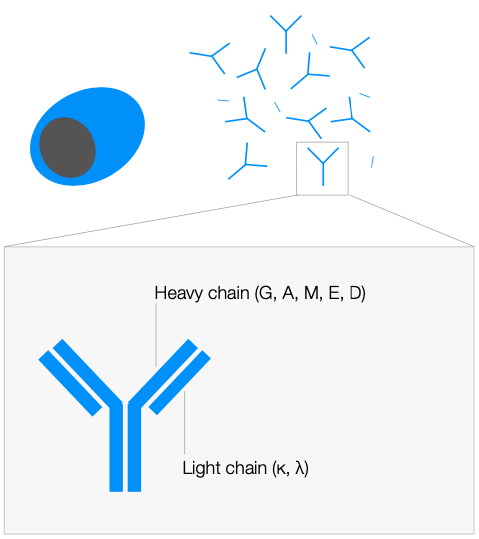

## B cells become plasma cells.

Plasma cell is the final form of the B cell lineage.
B cells make antibodies and extend them from their membrane.
Plasma cells make antibodies and secrete them.
Plasma cells are antibody factories.
So they have a lot of Golgi apparatus, which is the protein packaging center of a cell.

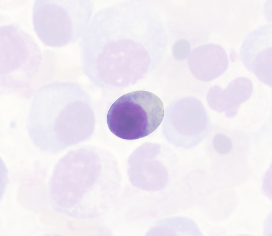

Each trigggered B cell population has plasma cells.

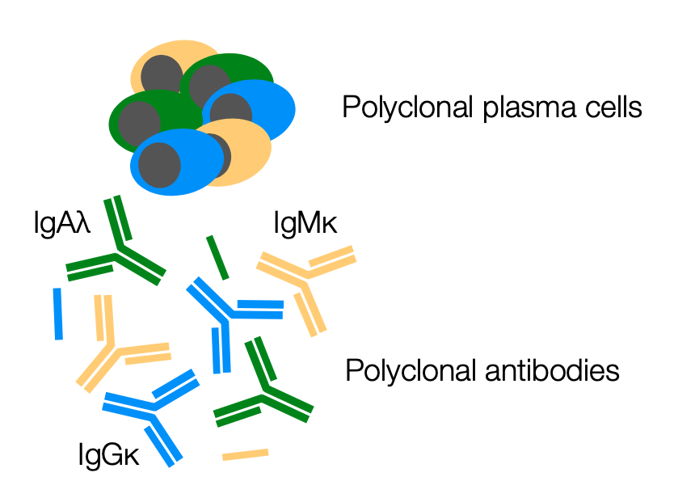

## When a cell of a population becomes cancer, this cell continuously proliferates.

Any B cell in the B cell lineage can become cancer, and expand this population.

### If the cancer cell originated from a B cell, it is Non-Hodgikins lymphoma.

### If the cencer cell originated from a B cell that is differentiating into a plasma cell, then it is lymphoplasmacytic lymphoma.

These cancer cells are like young plasma and make IgM, which is large.
This is why lymphoplasmacytic lymphoma is also called Waldenstrom macroglobulinemia, where macroglobulinemia refers to a lot of IgMs.
Like other lymphomas, Waldenstrom macroglobulinemia results in:

- Splenomegaly
- Anemia
- Constitutional symptoms:
  - Fever
  - Night sweat
  - Chill
  - Weight loss

### If the cancer cell originated from a plasma cell, which produces IgG, IgA, or any light chain, it is plasma cell dyscrasias.

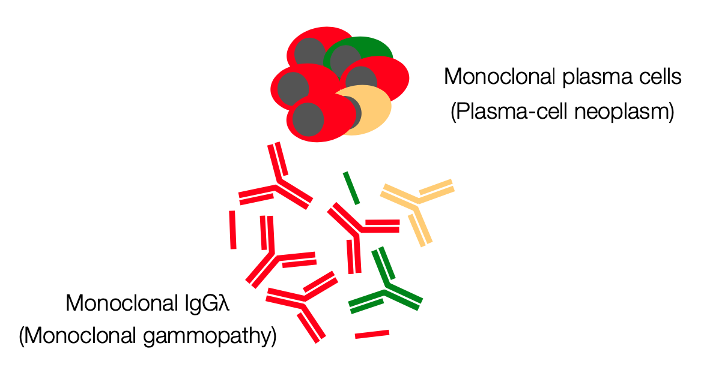

The cancer plasma cells can aggregate in the bones and be solitary plasmacytoma of bone.
Plasmacytoma means plasma cell mass (become multiple myeloma).
The cancer plasma cells can aggregate outside of the bones and be solitary extramedullary plasmacytoma (behave like lymphoma)
The cancer plasma calls can aggregate in the blood and be plasma cell leukemia (behave like acute lymphocystic leukemia).

If plasma cell cancers occupy less than 10% of the marrow, it is monoclonal gammopathy of undetermined significance.
It results in no CRAB symptoms:

- Ca++ high
- Renal dysfunction
- Anemia
- Bone lesions

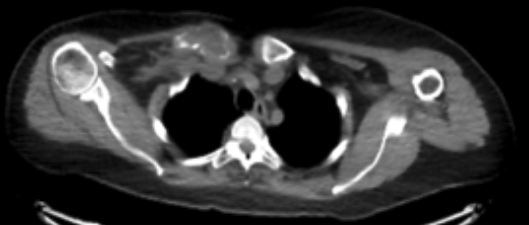

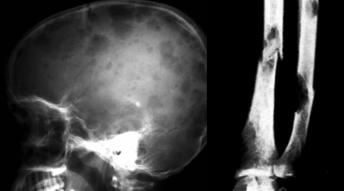

Monoclonal gammopathy of undetermined significance progresses to myeloma when the plasma cell cancers occupy 10% of the marrow.

Smoldering multiple myeloma has no CRAB symptom.
Overt multiple myeloma does.

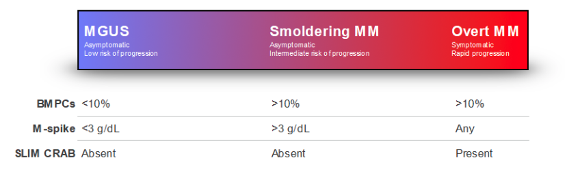

## Cancer plasma cells can end up making toxic antibodies.

Having any amount of toxic antibody is bad.

They can bind to the RBCs and cause hemolytic anemia called agglutinin disease.

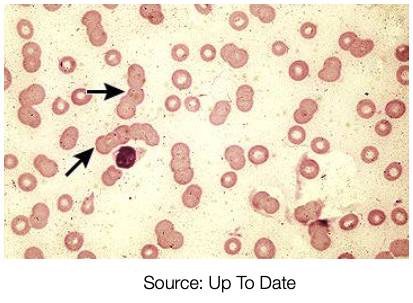

They can bind to the platelets and cause secondary idiopathic thrombobytopenia purpura.
(Technically, it's not idiopathic anymore.)

They can bind to the myelin and cause anti-myelin IgM neuropathy.

Their light chains can burden kidneys and cause myeoloma kidney.

They can deposit and damage organs (often kidneys and heart), causing immunoglobulin deposition disease.
When depositing, they can misfold and aggregate, causing light chain amyloidosis.
Cold temperature precipitates them and drive the deposit, causing type 1 and 2 cryoglobulinemia.

In unknown ways associated with IgM, they can cause urticarial vasculitis, constitutional symptoms, bad bone lesions, resulting in Schnitzler syndrome.
IL1 inhibitors are effective in treating this.

In unknown ways associated with lambda light chain and VEGF, they can cause neuropathy, resulting in POEMS syndrome.
POEMS stands for:

- Polyneuropathy
- Organomegaly
- Endocrinopathies
- Monoclonal gammopathy
- Skin changes

## Summary

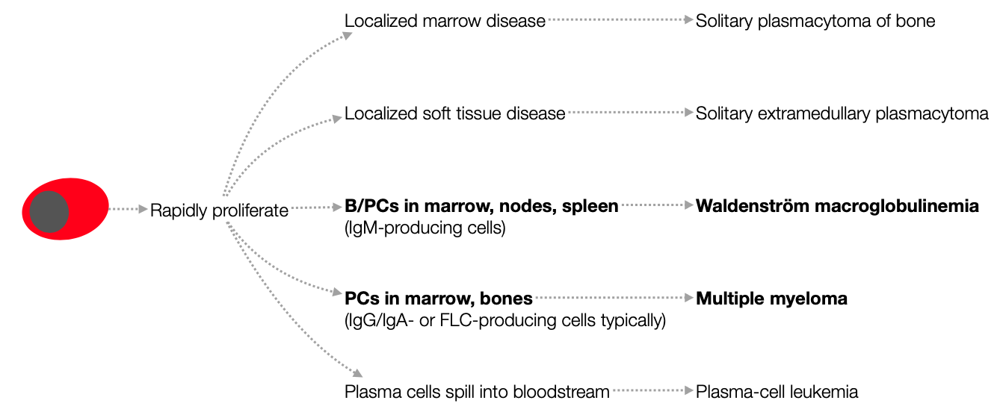

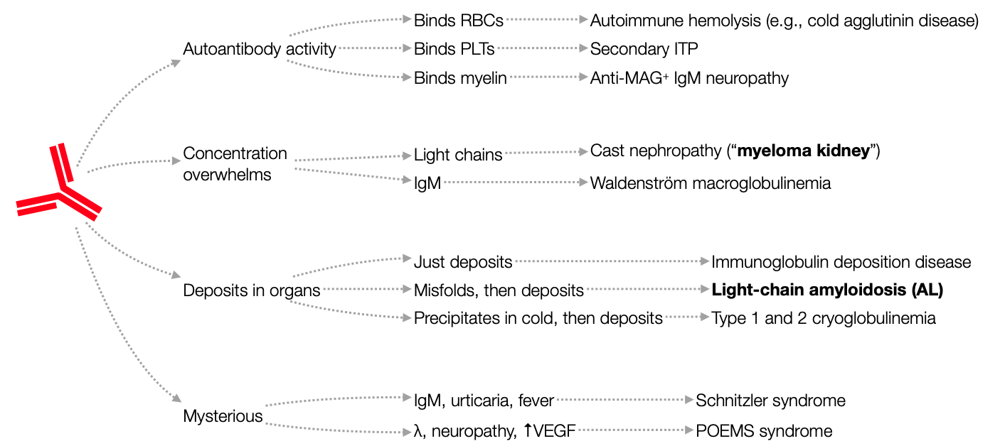

## Multiple myeloma and Waldenstrom macroglobulinemia are problems of both too many cells and toxic antibodies.

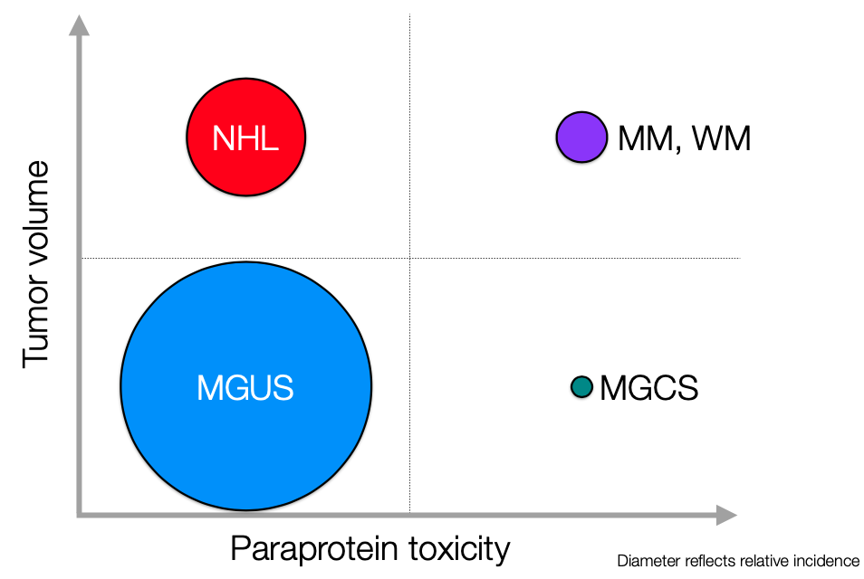

## Diagnose by quantifying globulins.

Blood - RBC = Plasma

Plasma - Albumin = Globulins

Normal globulins are diverse and have little IgM.

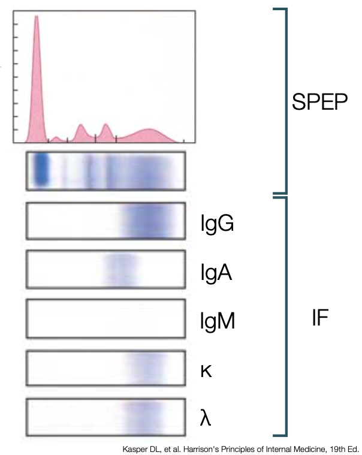

Gammopathy results in antibody of 1 population dominating and too many lambda chains.

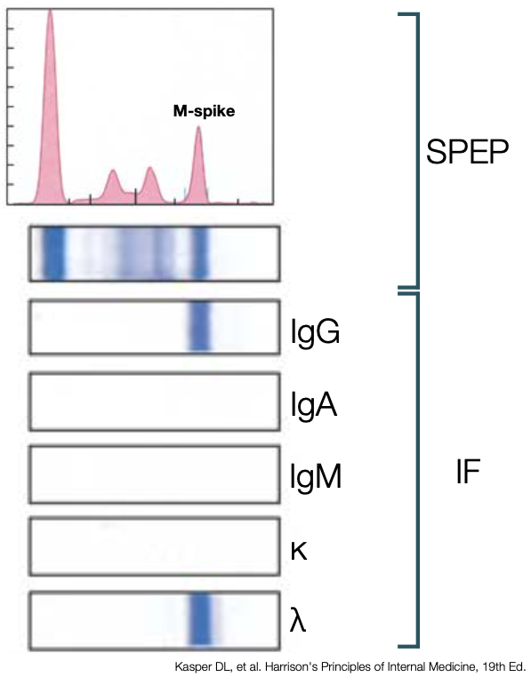

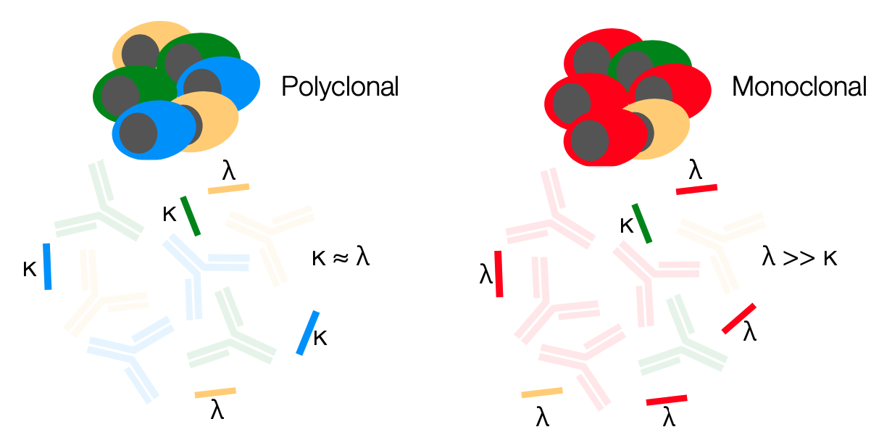

## Prognosis is bad.
