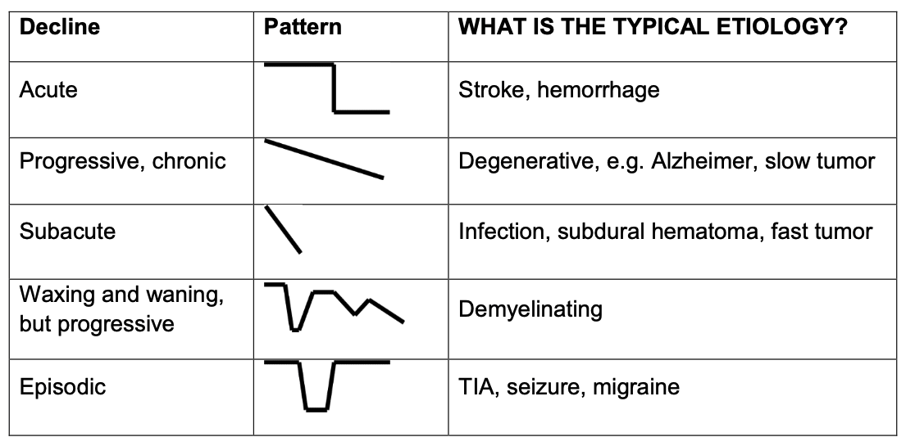
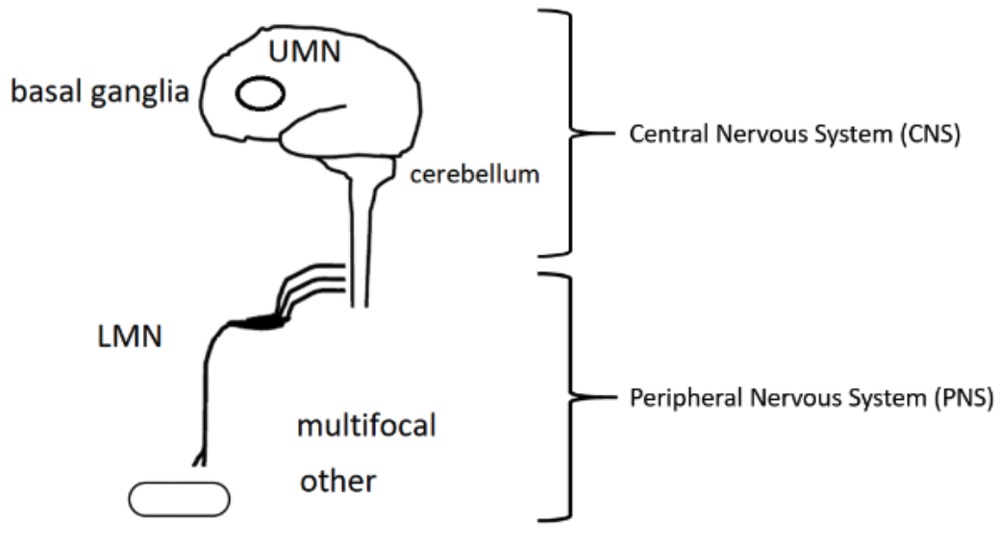
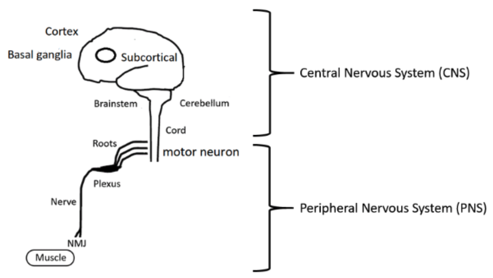
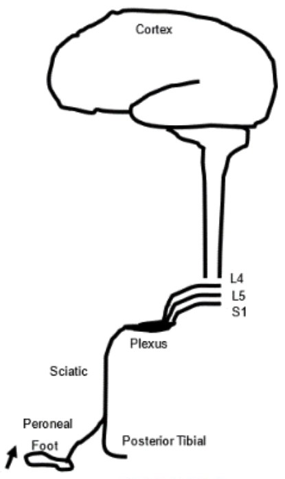
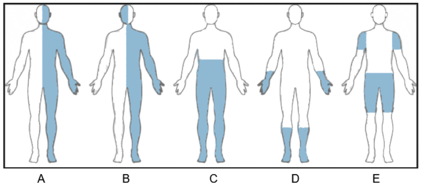

## When diagnosing a neurological disease, there are three steps:

1. Identify timing
2. Idenitfy location
3. List a differential diagnosis

Only after doing these three, consider ordering any diagnosic test.

## Let's talk about timing.

If the sings and symptoms are acute (going on for about a day), think of:

- Stroke
- Hemorrhage
- Trauma

If aute and followed by spotaneous recovery (going on episodically), think of:

- Transient ischemic attack
- Seizure
- Migraine

If subacute (~weeks or ~months), think of:

- Infection
- Subdural hematoma
- Fast growing tumor

If subacute and fluctuating, think of inflammatory diseases like:

- Multiple sclerosis

If chronic (~months or ~years), think of degenerative diseases like:

- Alzheimer's
- Parkinson's
- Slow growing tumor

Here is the summary of timing.

## Let's talk about location.

From just examining the patient, localize where the problem is or where the lesion is.

First, localize the lesion on the y-axis of the nervous system, which spans from the top (CNS) to the bottom (PNS).

Then, localize on the x-axis, which spans the y-axis coordinate from the superficial to the deep, containing various neural tissues.

If the location does not explain all the signs and symptoms, then consider multifocal etiologies.

## Localize using associated signs and symptoms.

CNS problem can result in:

- Cognitive problems
- Cortical signs
- Paralysis
- Babinski sign
- Clonus
- Spasticity
- Hyperreflexia

Upper motor neuron problem, which is often the lesion in the descending corticospinal tracts, can result in:

- Pyramidal pattern motor deficits
- Spasticity
- Hyperreflexia

Basal ganglia problem can result in:

- Extrapyramidal pattern motor deficits
- Only contralateral motor deficits
- Hypo- or hyperkinetic
- Rigidity
- Bradykinesia

Cerebellar problem can result in:

- Ataxia
- Wide-based gait
- Inability to tandem walk
- Intention tremor

Lower motor neuron (PNS) problem results in:

- Floppy tone
- Hypo- or areflexia
- Atrophy
- Sensory and or motor deficit following a nerve distribution
- Fasciculation

Many As (aphasia, anopsia, agnosia, apraxia, amnesia, and altered mental status) are cortical signs.

Many Ds (diplopsia, dysphagia, dysequilibrium, dyscoordination, and dysconjugate gaze) are extrapyramidal signs.

## Localize over the full neural pathway.

For example, a patient with right foot drop can have a lesion in:

- Foot muscle
- Neuromuscular junction
- Peroneal nerve
- Sciatic nerve
- Lumbosacral plexus
- L4-S1 roots
- Spinal cord
- Subcortical fibers
- Motor cortex of leg area

## Localize using anatomical groups.

<ol type="A">
  <li>Lesion in cerebral cortex (above the point of decussasion) affects head and ipsilateral body, because the signal from the cerebral cortex cannot cross to the other side.</li>
  <li>Lesion in the brain stem (at the point of decussation) affects the contralateral body and the ipsilateral head, because the signals from the cerebral cortex and cranial nerves, which innervate head, cannot cross.</li>
  <li>Lesion in the spinal cord affects the body below the lesion.</li>
  <li>Lesion in the peripheral nerves spread from distal to proximal.</li>
  <li>Lesion in the pathways innervating skeletal muscles spread proximal to distal.</li>
</ol>

## Here are some common sings and symptoms and the localization.

(Sings and symptoms @ Lesion location)

Weakness, spasticity, hyperreflexia, clonus, and Babinski sign @ Upper motor neuron (corticospinal tract)

Weakness, atrophy, fasciculation, hyporeflexia, areflexia @ Lower motor neuron

Loss of sensation, symmetric distal stocking glove paresthesia, bilateral foot weakness, hyporeflexia @ Peripheral neuropathy (sensorimotor)

All symptoms below the neck, loss of positional and vibrational sense on right, decreased pain and temperature sense on left, weakness on right @ Spinal cord (right hemicord)

Weakness and decreased sense on right face and left body @ Brainstem (right pons, where CN5 is)

Left cranial nerve 3 palsy and right hemiparesis @ Brainstem (midbrain, where CN3 is)

Wide based gait, unable to tandem walk, dyscoordination in limbs @ Cerebellum

Numbness in little finger and half of ring finder @ Peripheral neuropathy (ulnar nerve)

Pure motor weakness, atrophy and fasciculation of the hand muscle with hyperreflexia, spasticity, no sensory involvement @ Upper motor neuron and lower motor neuron (anterior horm cells)

Symmetric proximal weakness, normal reflex, no sensory deficit @ Muscle

Aphasia, right hemiparesis @ Left cerebral cortex

Pure motor symptoms, fatigueble weakness with preserved reflexs @ Neuromuscular junction

Bradykinesia, rigidity, rest tremor @ Basal ganglia (extrapyramidal)

Left face, arm, body, leg hemiparesis @ Right cerebral cortex

## Let's talk about differential diagnosis.

Use "I MIND THE VIP" to recall all disease categories to consider:

- **I**nfectious
- **M**etabolic or toxic
- **I**atrogenic
- **N**eoplastic
- **D**egenerative
- **T**raumatic
- **H**ereditary
- **E**pileptic
- **V**ascular
- **I**nflammatory (think of demyelinating)
- **P**sychiatric

## Only after timing, lozalizing, and differential diagnosic, order any diagnosic test.

 

---

 

Areflexia : No reflex

Ataxia : Loss of full control of body movements

Babinski sign : Reflex that extends of the toe upon pushing the sole

Bradykinesia : Slow movement

CNS : Central nervous system

Clonus : Repeating and non-stopping reflex

Contralateral : Opposite side

Cortical sign : Signs associated with problem in the cerebral cortex

Decussasion : Crossing to contralateral side

Extrapyramidal pattern motor deficit : Involuntary motor problem in the hypothesized CNS pathways involcing the basal ganglia

Fasciculation : Repeated contractions or twitches

Hyperreflexia : Increased reflex

Intention tremor : Tremor that happens when trying to do something

Ipsilateral : Same side

Paresthesia : Abnormal pins-and-needle-like sensation

PNS : Peripheral nervous system

Pyramidal pattern motor deficit : Voluntary motor problem in the precise path from the coretex to muscle

Spasticity : Velocity dependent increase in the resistance to a passive motion

Tandem walk : Walk where the toes of the back foot touch the heel of the front foot at each step
