## Brain is more specialized than other organs.

Its regions have specialized functions and symptoms.

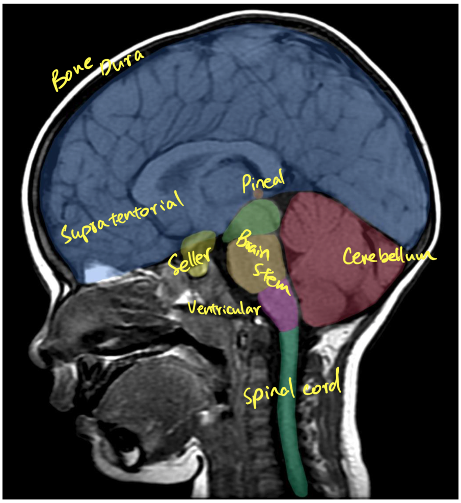

## Mass effect is more serious in the brain because it is confined.

Mass effect compromises first CSF, then blood, and then the parenchyma.

## Immunostain and see.

Use anti-:

- Cytokeratin for epithelial intermediate filament
- GFAP for glial intermediate filament
- Myelin basic protein for myelin
- Neurofilament for neuron
- Snaptophysin for synaptic vescicle

## Grey matter has more neuron bodies.

(White matter has more neuron axons.)

Neurons are bigger than glia.
Neuron bodies are filled with rough endoplasmic reticulum.

Neurons have many shapes.

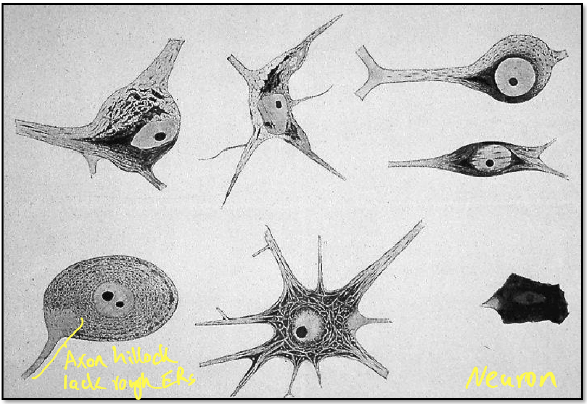

Silver impregnation is a staining technique that fills neurons with silver.

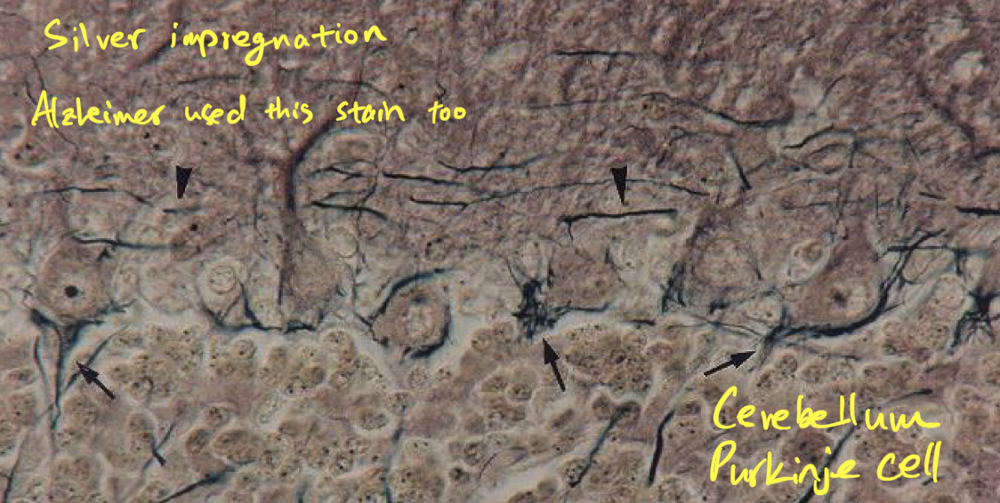

Anti-neurofilament stain can also outline the neurons.

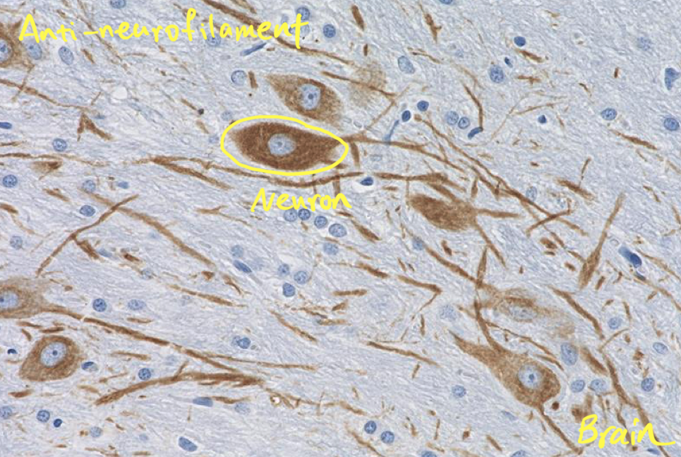

Anti-synaptophysin stain highlights synaptic vescicles.

Electronmicroscopy captures synaptic vescicles too.

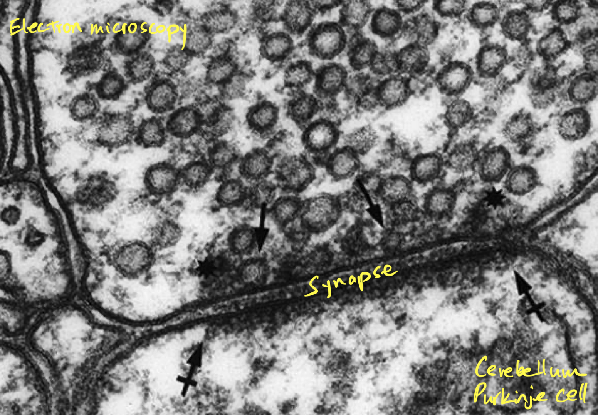

Neurons are sensitive to hypoxia.
Not immediately after an ischemic injury but 6 hours after, neuron bodies become eosinophilic and die.

Neurons are quiescent by default.
But in response to a damage, neurons start to make more proteins.
In this production mode, the tightly packed rough endoplasmic reticula move aside and make more space for cytoplasm.
More space is good for more proteins.
This cytosol reorganization is called chromatolysis.

Dead neurons in fetus take in or is filled with various minerals.
These nuerons look like they are impregnated with the classic Silver stain.

Dead neurons are eaten by macrophages of the brain, microglia.

Neurons can accumulate things.

Throughout the normal aging, lipofuscin accumulate in many cell types including neuron.

Neuro melanin, which is not even close to skin melanin, accumulate in special neuron in the substantia nigra.

Lipids also accumulate in neurons.

But too much lipid in neuron results in meganeurite and is bad.

In neurodegenerative diseases, neural intracellular things break and tangle.

Viruses can get into neurons and make viral compartments.

## Axons are long.

When they are damaged, their neuron continue to send things toward the axon.
These things can accumulate at the damaged site and result in spheroid there.

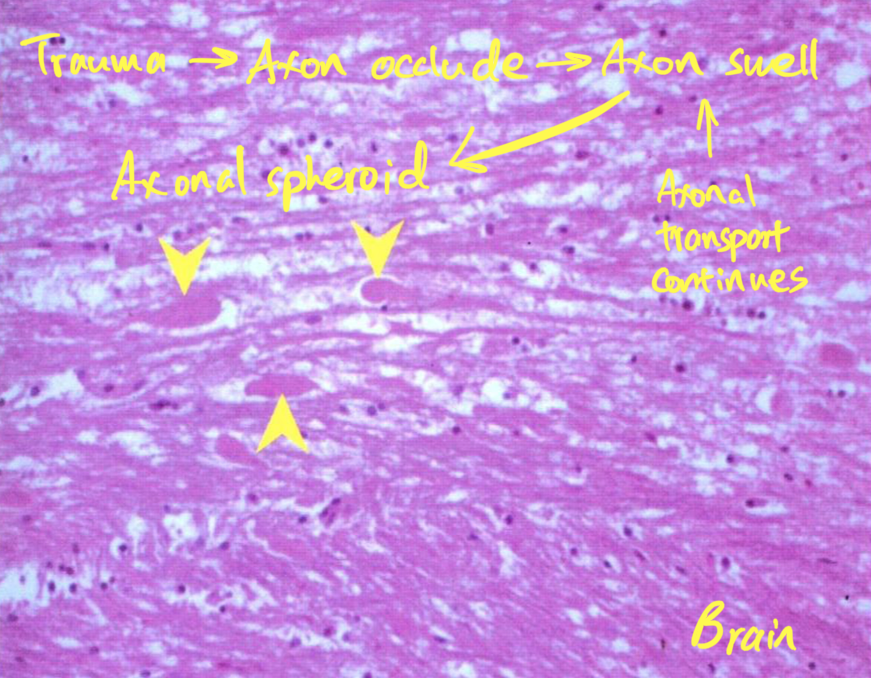

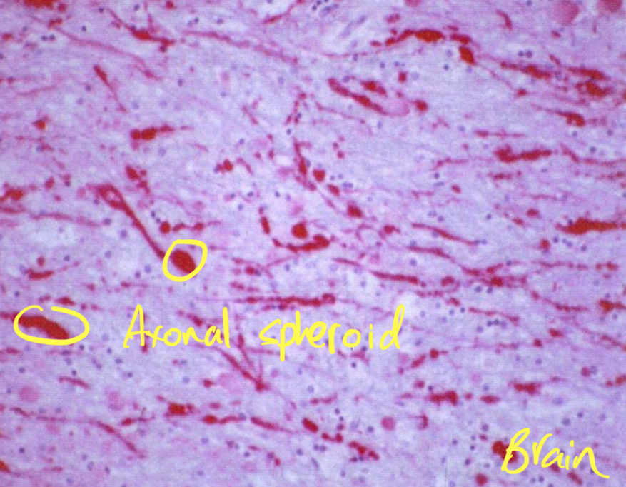

Neurons respond to axon damage by making more things.
To make more things their rough endoplasmic reticula move aside and make more space for cytoplasm.

Myelin covers axons.
Myelin can degenerate.

Myelinated axons make up the white tract.
So a lot of damage in myelin can result in big white matter tract degeneration.

## Glia is the most abundant cell type in the brain, making up 20-50% of the volume.

## Astrocytes can be protoplasmic (grey) or fibrillar (white) and do various things.

- Fill extra-neural space
- Guide neural migration
- Angiogenesis
- Nurish
- Clear neurotrasmitter
- Make up the blood brain barrier

Astrocytes look like star.

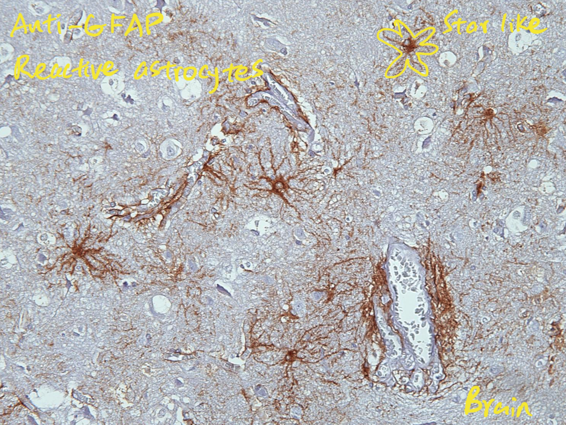

Astrocytes cover the endothelia and patch together the blood brain barrier.
Only the actively transported things and lipids can cross the blood brain barrier.

Like neurons, astrocytes can change form and respond to stress.

One of the response forms is genistocytic astrocytes.

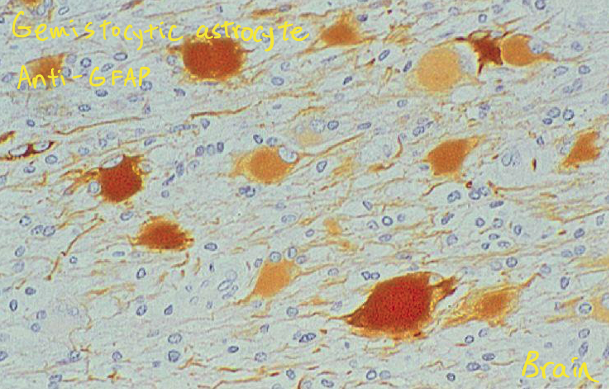

Not related to Alzheimer's disease, there is a astrocyte form called Alzheimer type 2 astrocyte.
This form has orphan nucleus.

Astrocytes can take up glycoproteins too.

Astrocytes guide neural migration and shape the tissue.

Neoplasm of astrocyte is astrocytoma.

## Oligodendrocytes wrap axons with myelin sheath.

Loss of oligodendrocyte and autoimmunity against myelin lead to loss of myelin and white matter.

Neoplasm of oligodendrocyte is oligodendrocytoma.

## Ependymal cells are ciliated and make the choroid plexus.

They make CSF.

Neoplasm of ependyma is ependymoma.

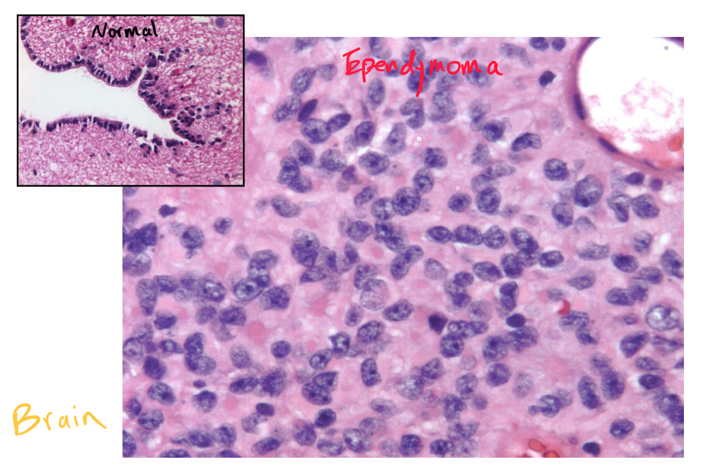

## Microglia are CNS macrophages.

Lile neurons and astrocytes, they are quiet by default and respond to stress.

Quiet ones are hard to see.

Active ones look cool.

Microglia can team up and eat a neuron, which is much biger than a glia.

Many microglia must come together to clear neurons infected with viruses.
Like macrophages forming giant cells, microglia form nodules.

Brian is a lipid rich environemnt.
Microglia also take up the lipids.

## Selective damage

Different parts of the brain are susceptible to different types of stress.

Hypoxia damages temporal lobe hippocampus.

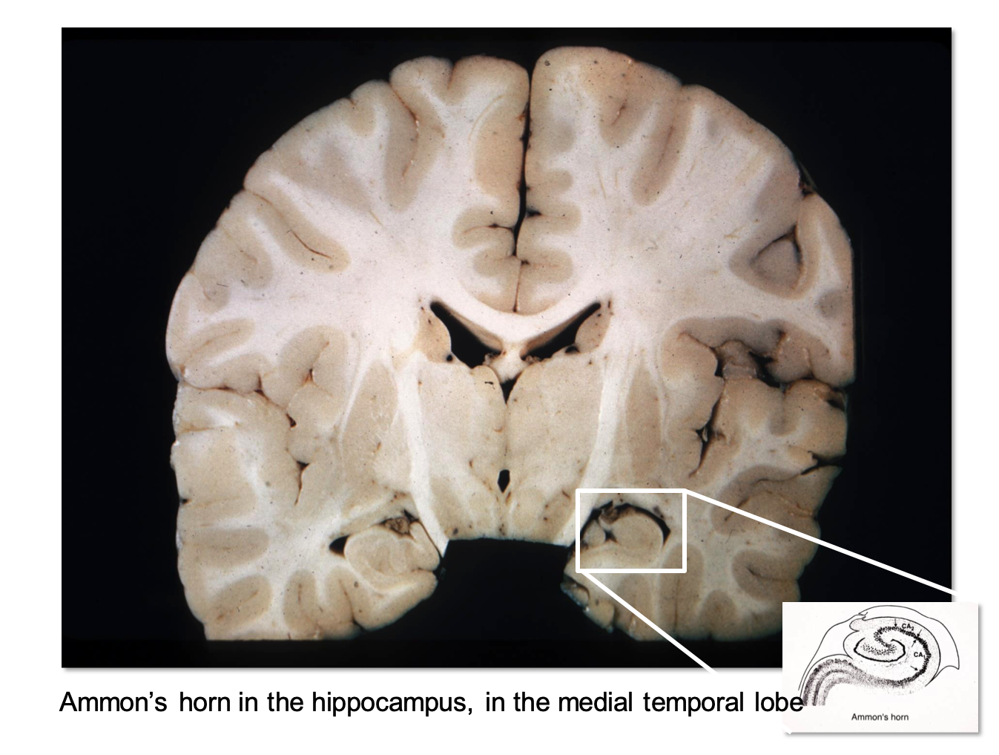

Alcohol damages caudate, putamen, and cerebellum.

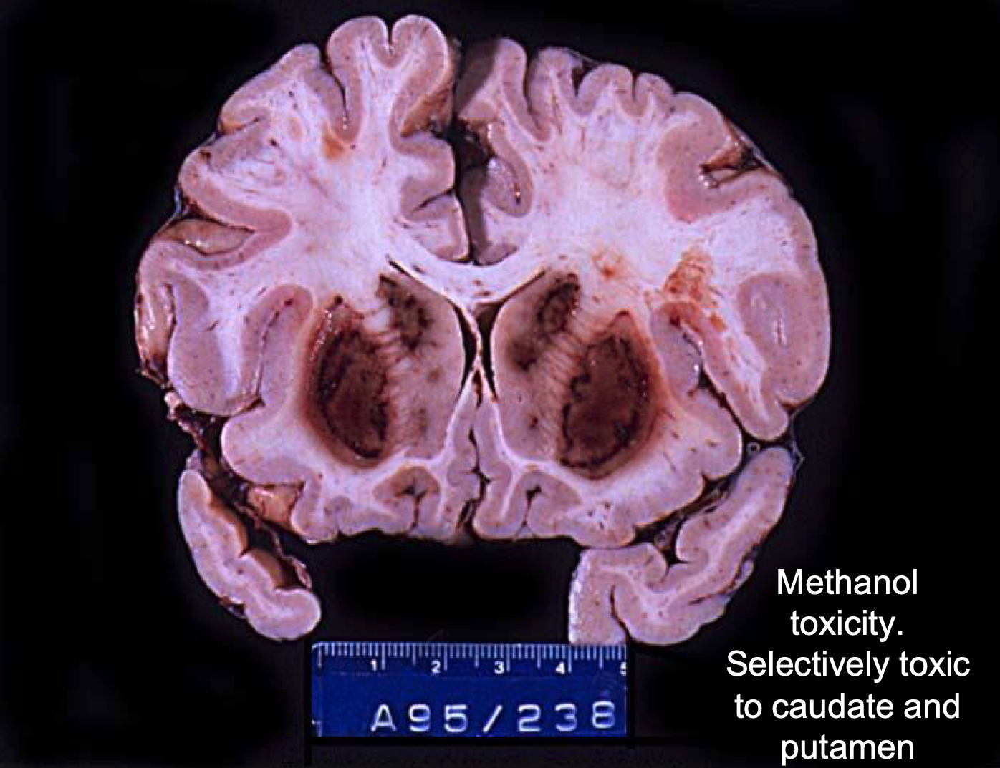

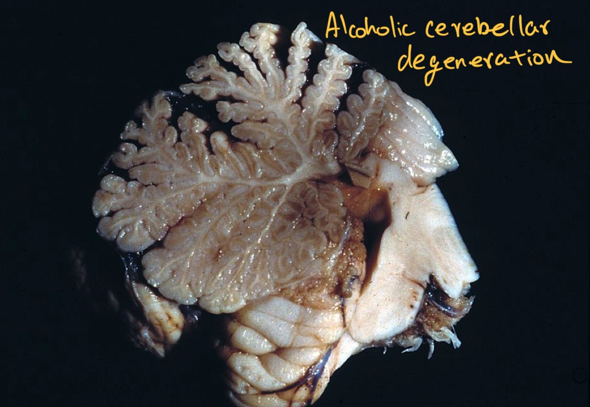

Radiation damages white matter.

Substantia nigra has selective vulnerability too.

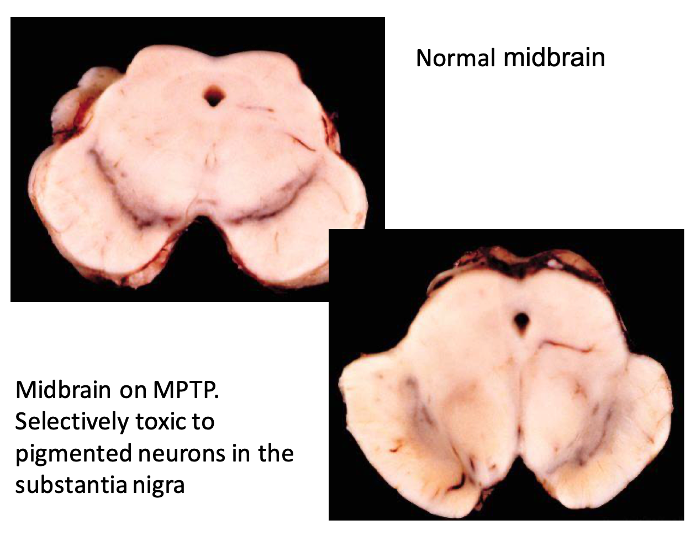

## Progressive multifocal leukoencephalopathy

JC virus infects oligodendrocytes and disrupt myelination.

As a result, a brain infected with JC virus has multi focal white matter damage.

