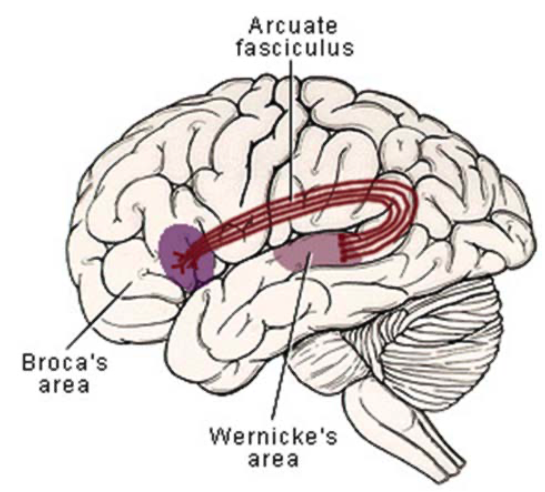

## Aphasia and dysarthria

The problem of speech production is called aphasia.
This is not the same as dysarthria.

Neuromuscular problems or brain problems that mess up movement of faces result in dysarthria.
Cerebral cortex problems that mess up speech processing results in aphasia.

## There are three types of aphasia:

- Broca's
- Wernicke's
- Conduction

### Broca's aphagia

Lesion in the lateral-inferior frontal cortex results in Broca's aphasia.
A patient with this aphasia speaks effortfuly and sparsely.
Because the lesion is close to the primary motor tracts, a patient will often have contralateral hemiparesis.

### Wernicke's aphagia

Lesion in the supramarginal gyrus of the posterior temporal lobe results in Wernicke's aphasia.
A patint with this speaks fluently but ginnerish.
Because the lesion is close to the optic radiations, a patient will often have visual field cut.

### Naming things

In both Broca's and Wernicke's aphasias, a patient will also have difficulty finding words and naming things.

### Repeating things

Repeating words is often difficult for either aphasia.
However, if there is Broca's aphasia but preserved word repetition, then this is called transcortical motor aphasia.
Similarly, if there is Wernicke's aphasias but preserved word repetition, then this is called transcortical sensory aphasia.

### Conduction aphagia

Rarer lesion in the arcuate fasciculus, which is the pathway connecting the Broca's and Wernicke's areas, results in conduction aphasia.
A patient with this aphasia cannot repeat words.

### Aphagia math

Broca's = Transcortical Motor Aphasia + Conduction Aphage

Wernicke's = Transcortical Sensory Aphasia + Conduction Aphage

Speech areas:

 

---

 
