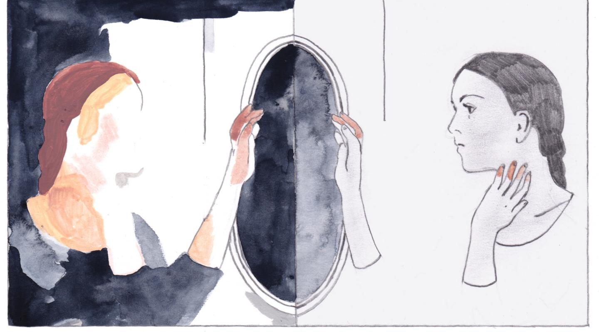

## Pediatric eating disorders are more common than type 2 diabetes.

They are underdiagnosed by primary care physicians.
Early intervention has better prognosis.

Pica is an eatind disorder of eating non-food.

Rumination disorder is disliking food in mouth or swallowing.

Avoidant/restrictive food intake disorder is picky eating.
It is not about weight gain or body image.

Anorexia nervosa is the eating disorder of weight loss.
People with anorexia nervosa have body image concerns.
They eat less and exercise more.
Their growth curve drops.
Onset is teenage.
The life time prevalence is 2%.
The mortality rate is 6%, the highest in any psychiatric illness.
There are restricting type and bullimia type.

Bullimia nervosa is the eating disorder of normal weight.
People with bullimia nervosa have body image concerns.
They binge eat and purge (throw up).
Onset is later teen.
The life time prevalence is 3%.

Binge eating disorder is also an eating disorder of normal or elevated weight.
Binge eating disorder is associated with low socioeconomic status.
They lose control and binge eat.
They often have body image concerns.
Unlike bullima nervosa, however, they do not compensate after eating.

Other eating disorders are:

- Atypical anorexia nervosa (less weight loss)
- Bulimia nervosa of low frequency or duration
- Binge eating disorder of low frequency or duration
- Purging disorder (no binge-eating)
- Night eating syndrome

Eating disorders that do not meet the criteria for a specific one are all classified as "eating disorders not otherwise specified".

All eating disorders have higher prevalence in females.

Blacks with eating disorder is under diagnosed and under served.

## Many things can cause eating disorders.

Relatives of eating disorder patients have 12 times more risk of getting it.

## People with any weight can have eating disorder.

Adolescence is common for developing an eating disorder.
Suspect eating disorder in people with any of the following:

- Growth stunning
- Pubertal delay
- Eating restriction
- Eating abnormality
- Recurrent vomiting
- Excessive exercise
- Body image concern
- Trouble gaining weight
- Diabetes

## Eating disordes can harm the cardiovascular system.

Heart can become smaller and or deform.
33% of hospitalized anorexia nervosa patients have mitral valve prolapse and pericardial effusion.
Dysfunctions in heart can result in systolic dysfunctions and cause:

- Bradycardia
- Hypotension
- Arrhythmia

Eating disorders can also lead to volume depletion and autonomic dysfunctions.
Patients can present with:

- Hadache
- Syncope
- Exercise intolerance

Most of these cardiovascular consequences can be reversed.

## Eating disordes can damage the gastrointestinal system.

Vomiting damages the esophagus.
Binge eating dilates and may the gastric walls.
Eating too much stresses pancreas.
Delayed gastric emplying, constipation, and superior mesenteric artery syndrome can happen too.

## Eating disorders disturb the electrolytes.

Voming can decrease the intake of potassium, phosphate, and other elements.
So hypokalemia and hypophosphatemia are common.

Vomiting also depletes the chloride, which is secreted from the stomach.
So hypochloremic metabolic alkalosis can develop.
People who over consume laxatives can develop hyperchloremic metabolic acidosis.

## Eating disorders unbalance the endocrine system.

Patients with anorexia nervosa have supressed hypothalamus.
This results in decrease in gonadotropin and sex hormones.
Because eating disorders onset in teenage years, a patient can present with puberty regression and abnormal menstrual cycle.
Supressed hypothalamus also lowers the thyroid hormones.
Finally, poor nutrition can lead to metabolic abnormalities and resulting in reduced bone density.

## Eating disorders result in dehydration, which damage the kidneys.

Pyuria and less commonly proteinuria and hematuria are commong.
Kidneys of patients with anorexia nervosa may not be able to concentrate or dilute urine.
This results in high urine volume and inaccurate specific gravity.

## Eating disorders result in malnutrition and marrow hypoplasia.

Leukopenia and anemia are more common than thrombocytopenia.
Low intake of iron and B12 can cause anemia.
Patients with malnutrition often have a low sedimentation rate.

## Malnutrition can reduce brain tissue volume.

Persistent gray-white matter deficits and cerebrospinal fluid levels elevations are common.

## Eating disorders often present with or cause additional psychiatric disorders.

## Treat eating disorders in 3 steps:

1. Weight gain (care givers conrol the diet)
2. Phychological support (reduce blame and transfer the control to the patient)
3. Prevent relapse

Family based therapy has the largest evidence base of any treatment.

Psychiatric care provider can consult to both the caregivers and the patient.

Pharmacologic agents are often used in patients with eating disorders, but there are few studies demonstrating efficacy.

