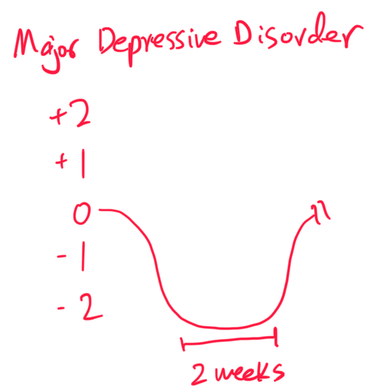
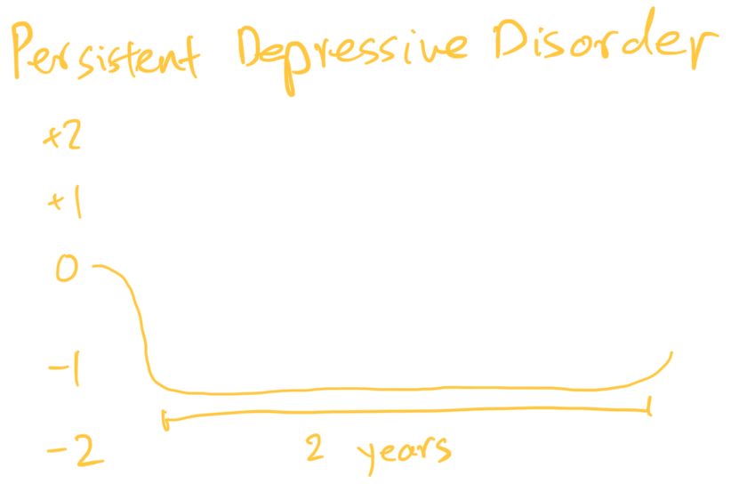
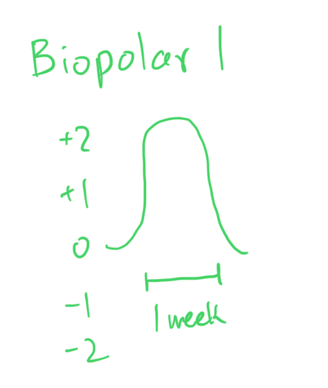
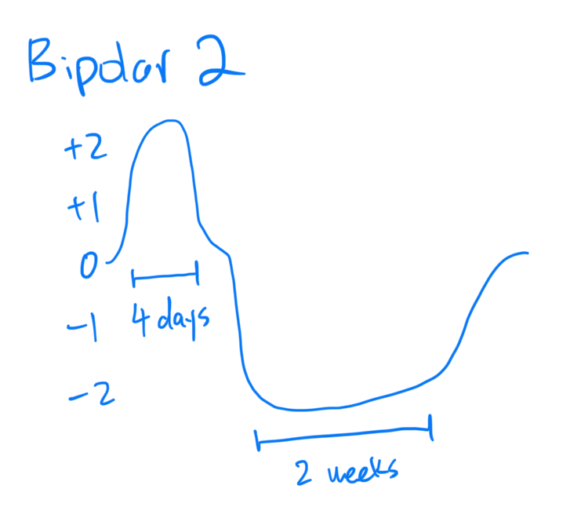
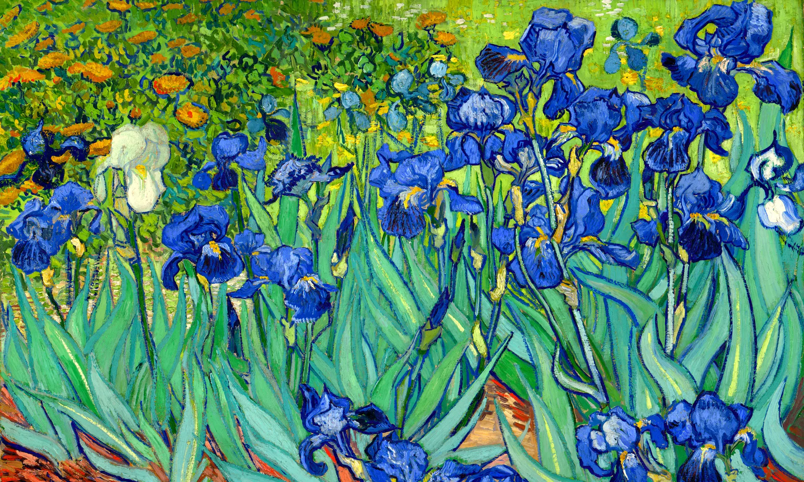

## Emotion, mood, and temperment are different.

They differ in time.
Emotion is a mental state can last from seconds to minutes to maybe a bit longer.
It it a short state.
Mood is longer.
Mood is a mental state that lasts from days, weeks, and a month or so.
Finally temperment is much longer.
It describes a mental state over year or life.
Temperment is more like personality, which doesn't change too much.

## Let's focus on mood.

There are 5 levels of mood from low to high.
I'm going score these levels for easily understanding.
+2. Mania
+1. Hypomania
+0. Enthymia
-1. Dysthymia
-2. Depression

Mood disorders are classified by which levels show up in a patient.

## Major depressive disorder is the most common mood disorder.

A patient has this if 5 or more of the following, including a required one, is true for 2 or more weeks and there is functional imparement:

- **I**nterests low (required)
- **M**ood low (required)
- **S**leep low or high
- **G**uitiness high
- **E**nergy low
- **C**oncentration low
- **A**ppetite low or high
- **P**sychomotor low or high
- **S**uicide passive or active

When screening a patient, it is efficient to ask for the 2 required ones.
If either of them is present, then ask for the rest of them.
If none of them is present then you can't diagnose this.

Finally, some culture use different language or medicine to describe the major depressive disorder phenotype.

## Persistent depressive disorder is another mood disorder.

The old name for this condition is dysthymia, which means not in enthymia for a long time.
If a patient ha 2 of the following for 2 or more years, you can give this diagnosis:

- **C**oncentration low
- **H**opelessness high
- **A**ppetite low or high
- **F**atigue high
- **E**steem low
- **S**leep low or high
  

## Premenstral dysphoric disorder is technically the 3rd mood disorders.

This describes the mood changes specific to women in luteal phase of a menstrual cycle.

## These 3 mood disorders can be further described with 3 adjectives.

1. Melancholic (when a patient stays in a lower state)
2. Atypical (when a patient's level fluctuates intensely)
3. Psychotic (when a patient deterioates to psychosis)

## Mood disorders are under diagnosed by primary care doctors.

We are learning about mood disorders because patients with these conditions that do not get treated have higher rate of suicide.
If we can identify someone with any of these and can help the patient, then we increase the chance of that patient's survival.
Finally, females are twice likely to have a mood disorder than males.

## Bipolar disorders are also mood disorders.

To understand bipolar disorder, we should understand mania first.
A manic episode is having 3 or more of the following, or 4 or more of the following if there is irritable mood, for 1 or more week.

- **P**ace high
- **O**utlandish high
- **R**acing thoughts
- **J**udgement low
- **D**istractability high
- **G**randioseness high
- **E**nergy high
- **S**leep low

### Bipolar 1 is having had 1 manic episode.

There doesn't have to be low mood for bipolar 1 diagnosis.
0.6% os people have this.
It is a life time diagnosis.

### Bipolar 2 is having had milder manic episode lasting 4 or more days, and there has to be a major despressive episode.

0.8% of people have this.

### Cyclothymia is milder bipolar 2.

These 3 bipolar disorders can be described with 2 adjectives:

- Mixed (having low and high featuers at the same time)
- Repid cycling (4 or more episodes per year)

Bipolar disorders start in teens and early 20s.
Untreated bipolar disorder can lead to social, emotional and financial problems as well as substance abuse and suicide.
Early diagnosis and early treatment offer a good chance for a productive life.
Finally bipolar disorders are associated with high cognitive functions.

## Diagnosing any psychiatric condition requires that condition to be unexplainable by other conditions.

For example, hypothyroidism can result in major depressive disorder, but the diagnosis is hypothyroidism and not a mood disorder.

## There are 2 theories about how these disorders come about.

The first is the catacholamine serotonin hypothesis.
Messed up catacholamine and or serotonin in neural communication is thought to cause the mood disorders.

The second hypothesis is the neural atrophy hypothesis.
Stress, inflammation, and other stimuli lead to neural atrophy.
And atrophied neurons result in the mood disorders.

## Treat mood disorders by neurotropic things.

Exercise, learning something new, and socializing improve mood disorders.
All these activities stimulate the neurons to grow.

