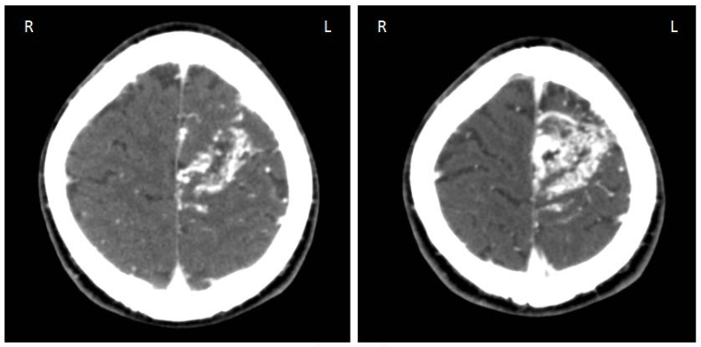

## Epilepsy is the 4th most common neurologic disease.

It can happen in anyone at any age.
Prevelance is higher in low income countries.

10% of people experience at least 1 seizure in their life.

## Seizure is an abnormal and excessive electrical activity in the brain.

The electrical activity starts form the cortical structure and spreads.
Seizures last for seconds to minutes and have clear start and finish.
Infection, substance use, and various things can trigger a provoked seizure.
By eliminating the triggers, provoked seizure can be prevented.
Spontaneous seizure, without a trigger, is unprovoked seizure.

## Epilepsy is disease of having unprovoked seizures.

Epilepsy is defined as either:

- 2 or more unprovoked seizure happening 24 or more hours apart
- 1 unprovoked seizure and high probability of more seizures

1% of people have epilepsy.
Its onset in high in children and older people.

## Status epilepticus is when a seizure goes on for 5 or more minutes.

This is an emergency can can result in permanent damage or death.

## Seizure classification matters because it changes evaluation, treatment, and prognosis.

## Focal onset seizure starts in 1 cortical area.

Depending on where the source is, presentation can vary:

- Aura
- Autonomic symptoms
- Clonus (motor area)
- Jacksonian march (motor area)
- Paresthesias (sensory area)
- Aphagia (Broca's or Wernicke's areas)
- Automatism (limbic area)
- Deja vu (limbic area)

Focal seizure becomes a generalized seizure.
Majority of focal seizures are focal impaired awareness seizures.

## Generalized seizures have tonic and clonic phases.

A patient presents with:

- Loss of consciousness
- Tongue biting
- Incontinence
- Amnesia

Absence seizure or petit mal is a generalized seizure of staring and spacing out.
Elementary school aged kids get this and they outgrow the seizure.
Ethosuximide is the narrowest spectrum anti-seizure drug that can treat only absence seizure.
Myoclonus seizure is a generalized seizure associated with increase in tone.
Atonic seizure is a generalized seizure associated with decrease in tone.

## Many types of problems can lead to seizure.

- Metabolic
- Oxygen
- Vascular (cerebral arteriovenous malformation)

- Endocrine
- Structural
- Toxic
- Uremic
- Psychogenic
- Infectious
- Developmental
- Degenerative

## In adults, mesial temporal sclerosis is the most common cause of seizure.

Mesial temporal sclerosis is gliosis in the hippocampus, specifically CA-1.
CA-1 is also associated with dimentia and Alzheimer's disease.

Patient with this cause present with:

- Deja vu
- Aura
- Unilateral hand automatism ipsilateral to the mesial temporal focus (not known why)
- Eye deviation contralateral to the seizure origin (more pull)
- Aphasia if left hemisphere origin
- History of childhood febrile seizures

Inferior mesial temporal lobectomy is a treatment option.

## Manage a seizure-like event quickly.

Stay calm.
Activat 911.

Secure airwary, breathing, cardiovascular status.
Turn the patient to the side if there is chance of airway occlusion.

Administer glucose.

For a likely seizure lasting for 3 minutes or status epilepticus, consider administering 2-4mg lorazepam.

Once the patient is stable, look for any signs of injury.
Tongue bite suggests seizure.
Head trauma and point tenderness suggest brain hemorrhage.

Exam neural functions.
Not remembering the event suggests seizure.

Take history of events before, during, and after the seizure-like event.
Focal symptoms suggest the origin of seizure.

Syncope due to hypoperfusion technically results in a brief tonic-clonic seizure known as convulsive syncope.

Seizure and epilepsy are clinically diagnosed from a good history from the patient and reliable witness.

Rule out other conditions with electroencephalogram.
But normal electroencephalogram does not rule out seizure.

Depression is a comorbidity of epilepsy.

## There are many seizure mimics.

30% of people evaluated for seizure do not have epilepsy.

