## Break down the exam into blocks:

- Mental status
- Cranial nerve
- Motor
- Reflex
- Sensory
- Cerebellar
- Gait

Some bad-ass neurologists perform the exam just by hearing patients talk and watching them walk.
(But I belive being systemic is better).

## Test Mental satus.

Test alertness by observing the patient.

Test attention by having the patient say the months of the year backwards.

Test orientation by having the patient say his or her full name, location, and site.

Test memory by giving the patient three items and have him or her recall them immediately (recent memory test) and few minutes later (delayed recall test). Also have the patient talk about personal verifiable history (remote memory test).

Test language by listening to the patient, paying attention to: paraphasic error, neologism, comprehension, naming, repeating, reading, and writing.

[Learn more about speech deficits](../Speech Deficits).

If you suspect any cognitive problem, then do Mini-Mental Status Exam. Score below 24 suggests dementia.

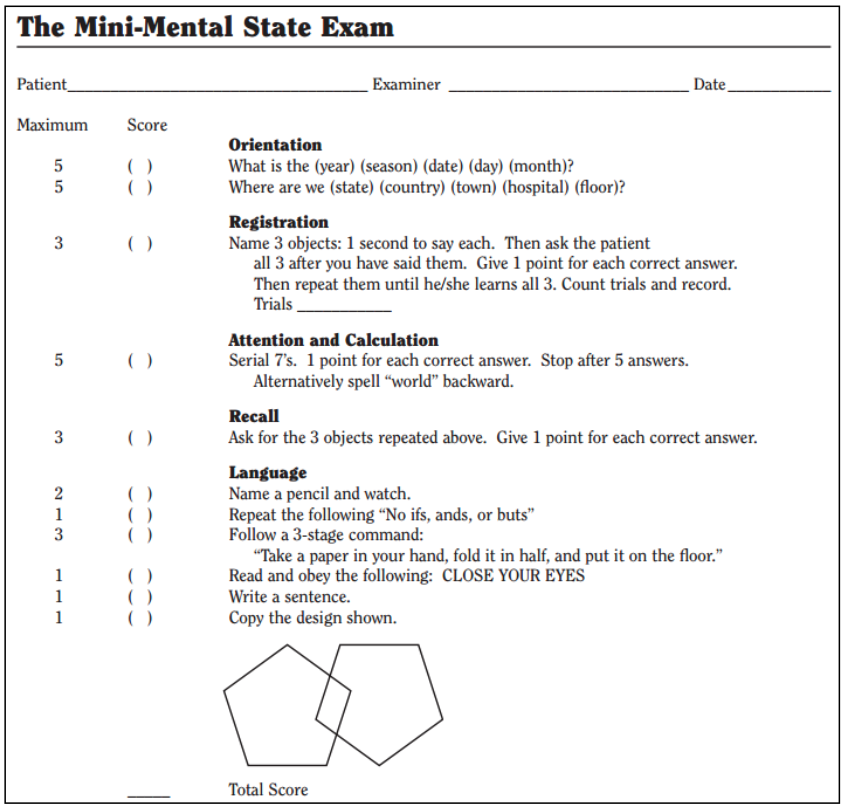

## Test cranial nerve.

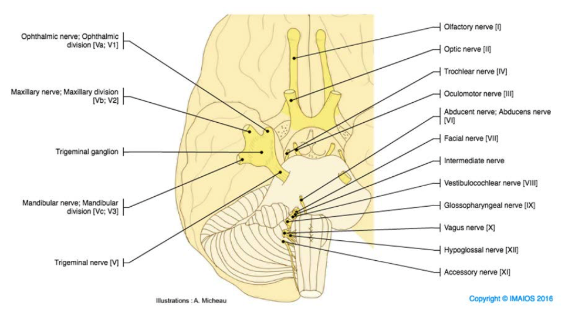

CN1 and CN2 are not peripheral cranial nerves.
They are outgrowths of the brain.

If there is problem in CN3 to CN7, then the localization can be:

- Brainstem nuclei
- CN pathway
- Increased intracranial pressure

Test CN1 by having the patient, with eyes closed, smell something and identify it

Test CN2 acuity by having the patient, one eye at a time, read the letter in an acuity card.
It's okay to use eyeglasses.

Test CN2 visual field by having the patient, one eye at a time, look into your eyes and tell the number of fingers you show in the periphery of your visual field.
Use one, two, or five fingers.
Make sure the patient looks only at your eyes.

If there is visual field deficit, localize the lesion on the visual field pathways.

The light bouncing off of the things in the left visual field hits the right letina of both eyes.
Conversely, the light from the things in the right visual field hits the left retina of both eyes.
So, each eye has 2 (left and right) retina areas, one medial and one lateral.
The lateral retina pathway sends the signal to the occipital lobe of the same side.
The medial retina pathway crosses at the optic chiasm and sends the signal to the occipital lobe of the opposite side.

Just as the medial and lateral retina areas use different pathways to get to the occipital lobe, the superior and inferior retina areas also use different pathways.
The light from the lower visual field hits the superior retina area of both eyes.
These superior retina areas send the signal to the parietal lobe, which relays the signal to the occipital lobe.
The light from the upper visual field hits the inferior retina area of both eyes.
These inferior retina areas send the signal to the Meyer's loop in the posterior temporal lobe, which relays the signal to the occipital lobe.

Here are the pathways (without showing the superior retina pathway which goes through the parieral lobe) and some common lesions.
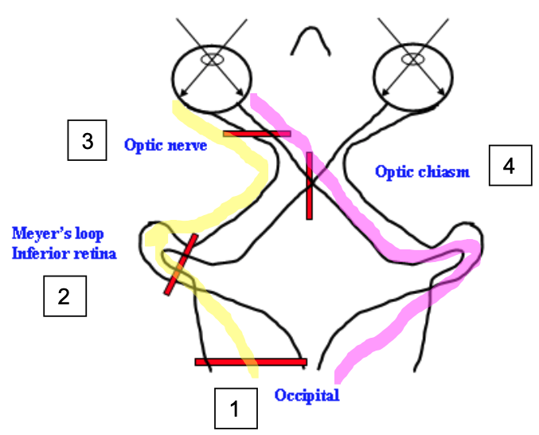

Here are some field loss examples.

Both right fields are bad.
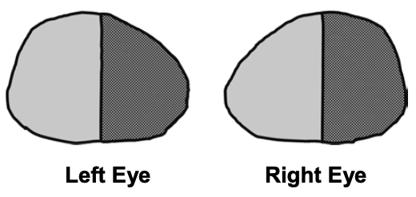
The left eye problem can be in its: left retina, left retina pathway that says on the same side, and or left occipital lobe.
The right eye problem can be in its: left retina, left retina pathway that corssed the optic chiasm, and or left occipital lobe.
Since both must be true, the lesion is in the intersection of them, which is the left occipital lobe.

Both right upper fields are bad.
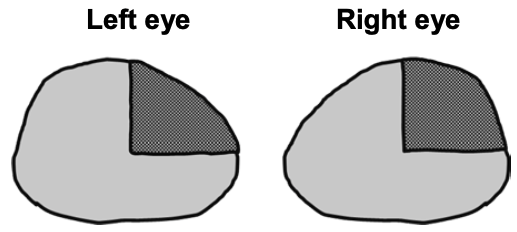
Same as the previous example, right fields deficit localize to left occipital lobe.
But here only the right upper fields are bad.
Since the light from the upper fields hit the lower retina, which send the signal through the Meyer's loop to the left occipital lobe, the lesion must be in the left Meyer's loop.

In general, more complete the sided field loss is, closer the lesion to the occipital cortex.

Left eye fields are bad.
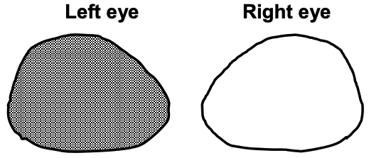
The lesion must be messing up the pathways (lateral and medial) from the left retina.
So it must be in the left optic nerve.

Both lateral fields are bad.
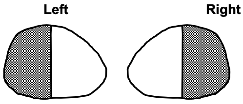
Since light from the lateral fields hit the medial retinas (of both eyes), which send the signal that travel across the optic chiasm to the opposite occipital lobe, the lesion must be in the optic chiasm.

Look at CN2 optic disc with funduscope.
It should be close to the nose, have a sharp circular border, and contain consistent blood vessels.
Blurry border suggests papilledema.
Irregular blood vessels suggest hemorrhage.

Test CN2 and CN3 pupillary response, which is a parasympathetic autonomic nervous system response.
CN2 carries signal into the brain.
CN3 sends constricting signal to both eyes.

Just like other cranial nerves (excpet CN1), there are two CN3 nuclei called Edinger-Westphal nuclei, one on each side of the brainstem.
One eye's CN2 sends signal to both sides of the brain through one pathway that stays on the same side and aother pathway that crosses to the other side via optic chiasm.
So, either eye can activate both of the CN3 nuclei.
A CN3 nucleus outputs two CN3s, one constricting each pupil.
So, any light in either eye can constrict both pupils.

By default, as you are reading this, some light is coming into your eyes resulting in some constriction.

If pupillary response is deficit in both eyes, then the brainstem (where both CN3 nuclei live) may have a lesion.
If deficit in one eye, then the CN3 of that side has the lesion.

For each eye, shine light on it once to verify this eye's pupillary constricton and another time to verify the other eye's constriction.
This is a binary test of dilation and constriction.

To test (beyond binary) the magnitude of the pupillary response, flash light between pupils every two seconds.
If a pupil dilates when the light switches to it, then this eye has problem in the eye itself or the optic nerve.
This is called afferent pupillary defect.
It happens when the normal eye successfully activates the CN3, resulting in bilateral pupillary constriction, but the defective eye fails to send enough signal needed for constriction of equal magnitude.
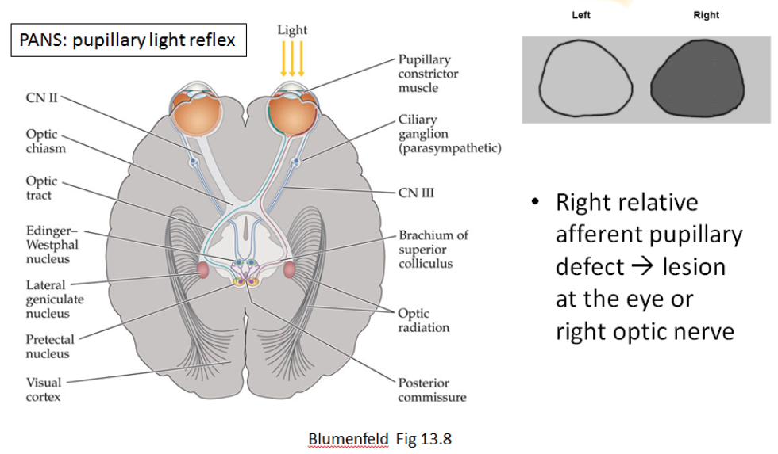

Pupil constricts also when there is pupillary accomodation.
Test this by place a finger infront of a patient's eye and have the patient look at it for a while.
Pupil should constrict during this focus.
Then, have the patient look at something far behind you.
This unfocuss should dilate the pupils.

CN3 parasympathetic branch constricts pupils but CN3 sympathetic brnach can dilate them.
CN3 sympathetic branch descends the spinal cord down to the thoracic vertebra 1 and 2, exit to sympathetic chain, and ascends back up to the neck along the internal carotid artery.
And this fight-or-flight branch dilates pupil, elevate eyelid, controls sweat glands of the neck and face.

Patients with Horner's syndrome has defects in CN3 sympathetic branch.
So they suffer from a collection of neurological defects inlcuding ptosis, miosis, and anhidrosis.

Test CN3, CN4, and CN6 by testing extraocular muscles.
Defect in eye movement results in diplopia.

CN3 innervates all the muscles except superior oblique, which is innervated by CN4, and lateral rectus, which is innervated by CN6.
Superior oblique intorts the eyes.
It is used for looking at the mouth.
Lateral rectus abducts the eyes.
It is used to look at outer horizontal sides.
This makes sense evolutionarily.
We come from fish.
Fish have eyes on both sides of their body, so they cannot look at their mouth and do not need to look at outer horizontal sides.
As we evolved to become a land animal, we probably needed to look at our mouth to see what we were about to eat.
And this may be the advent of lateral rectus and abducens nerve (CN6).
Then as we evolved more and our eyes moved to the front of the face, narrowing the horizontal visual field, we needed to look laterally to stop any potential threats.
And this may be the advent of superior oblique and trochlear nerve (CN4).

Between 4 and 6 is 5, which detects sensation on the face.
This makes sense evolutionarily too because we acquired face (or head) some time between fish and front-eyed animal.

Anyways, have the patient look at your finger and chase it as you move it drawing a huge H symbol.
Patient looks side, side-up, side-down, and repeat for the other side.

Although CN6 innervates directly only the lateral rectus, it also synapses with CN3 nucleus and controls medial rectus.
Just as Edinger-Westphal nucleus of one side sends CN3s (bifurcating near the nucleus) to both eyes, nucleus of CN6 sends CN6s to both eyes.
But for the pathway that goes to the contralateral eye, CN6 travels on the medial longitudinal fasciculus and synapses with CN3 nucleus, which directly innervates the medial rectus.
Overall, CN6 controls the ipsilateral eye directly and contralateral eye via CN3, ending up controling the eye movements to the sides.

So, if a patient cannot moving both eyes to the right, then the right CN6 nucleus is defective.
Conversely, if a patient cannot move move both eyes to the left, then the left CN6 nucleus is defective.

If on the other hand, only the left eye fails to move to the right (medially), then the medial CN6-CN3 relay pathways is defective.
And the lesion may be on the medial longitudinal fasciculus.

In summary, a patient with CN3 defect may present with ptosis and eye movement limited to intort.

A patient with CN4 defect presents with inability to intort.

A patient with CN6 defect presents with inability abduct.

CN5 splits into three branches, each innervating a facial area.
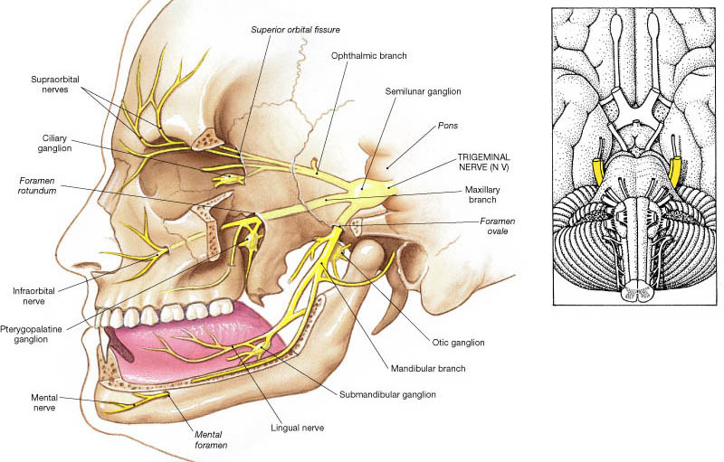
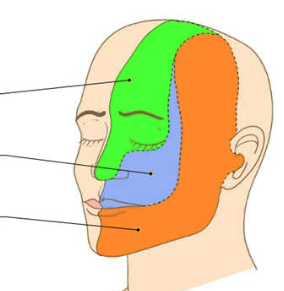

Sensory signal from the facial receptor travels on CN5 to the trigeminal ganglion.
The signal then descends down the spinal tract of CN5 to the spinal nucleus of CN5 (medulla).
Then, the signal decussates and ascends via spinothalamic tract to the VPM (thalamus) and finally to the sensory cortex.

A patient with CN5 defect have problem sensing the facial stimulus.
Test CN5 by touching a patient's facaial areas.

Patient with trigeminal neuralgia suffers shock-like facial pain, debilitating enough to cause suicide.

Finally, brain does not feel pain, and the perception of headache is actually caused by a problem in cranial fossas and vascular structures, which send pain signal to the brain through CN5.

CN5 feels the face.
CN7 moves the face.
There are two pathsways in CN7, one innervating the upper face and the other lower face.
The lower face is innervated similarly to the innervation of body, which is controlled by the contralateral motor cortex.
The upper face is more special.
It is innervated by the motor cortex of both sides.
Both motor cortexs send motor neuron to each upper face.
The neuron from the contralateral cortex decussates at pons.

So, a patient presenting with sudden onset left facial drooling, no problem moving eyebrows, and left mouth weakness has problem innervating only the left lower face and thus has a lesion in the CN7 contralateral upper motor neuron.

On the other hand, a patient presenting with drooping of the left face and inability to raise and tightly close the left eye brows may present with a lesion in the CN7 ipsilateral lower motor neuron.
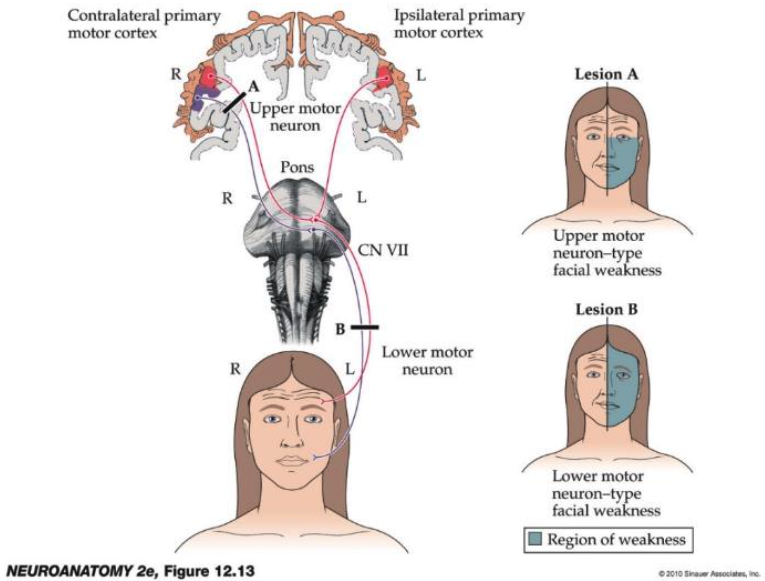

A branch of CN7 senses the taste from the anterior 2/3 of the tongue.
Another branch of CN7 innervates stapedius muscle.
So the second patient with a lesion in CN7 lower motor neuron may also present decreased taste and perception of hearing loud noise.

Finally, the upper motor neuron lesion results in acute onset while the lower motor neuron subacute.
For example, idiopathic Bell's palsy damages the CN7 ipsilateral lower motor neuron and results in subacute signs and symptoms.
Subacute onset is a hallmark of inflammatory etiology.
In fact, steroids and anti-virals can treat this Bell's palsy.

## Test motor functions.

Focal atrophy, fasciculation, hyporeflexia, and decreased tone suggest lower motor neuron lesion, which can be in any of:

- Anterior horm cell
- Nerve root
- Plexus
- Nerve
- Neuromuscular junction
- Muscle

Less lower motor neuron innervation, more atrophy.
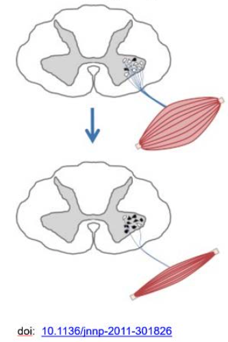

Spasticity, stronger flexion in upper limb, and stronger extension in lower limb (pyramidal pattern of motor deficit) suggest upper motor neuron lesion , which can be in any of:

- Corticospinal tract
- Corticobulbar tract

Pyramidal pattern makes evolutionary sense.
Without proper input from the cerebral cortex, the body still maintains to bring something close to the mouth (or bring the hand head the head to protect it) while extending the legs to stay standing.
Pyramid is stable.
And the body is trying to be stable during this emergency situation resulting from the upper motor neuron problem.

Rigidity, hypo- or hyperkinetic movement, and bradykinesia suggests extrapyramidal (basal ganglia) lesion, which affects only the contralateral side.

## Test reflexes.

- Biceps
- Brachioradialis
- Triceps
- Patellar
- Achilles

Patient with upper motor neuron problem (stroke, dimentia, ...) can present with:

- Hyperreflexia
- Clonus
- Babinski sign
- Primitive reflexes (snout, grasp)

Babinski sign is a primitive reflex that extends the big toe upen sole stimulation.
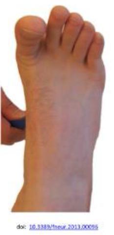

Snout reflex protrudes the tongue to taste the thing that touches the lip.
Hand and foot grasp reflex make the hand and foot hold the thing that touches them.
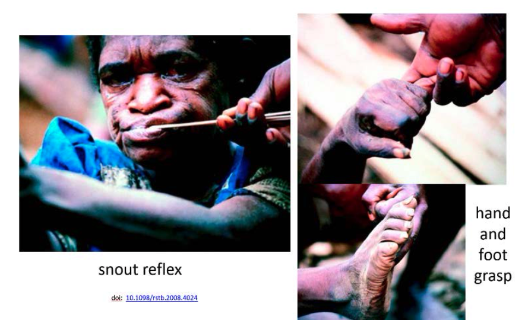

## Test sensory functions.

If you suspect cortical sensory deficit, test for graphesthesia and stereognosis.
Patient with a cortical sensory lesion cannot perceive the writing on the skin or cannot identify an object solely by touch.

Test touch, vibration, and proprioception.

The primary sensory tract carrries light touch, vibration, and proprioception sensation.
It ascends ipsilaterally through the dorsal columns.
Fibers from the upper limb ascends more laterally compared to the fibers from the lower limb.
The upper limb fibers synapse on cuneate fasciculus and the lower limb fibers gracile fasciculus.
The fibers decussate in the medulla, go to the contralateral VPL (thalamus), and finally reach the primary sensory cortex.
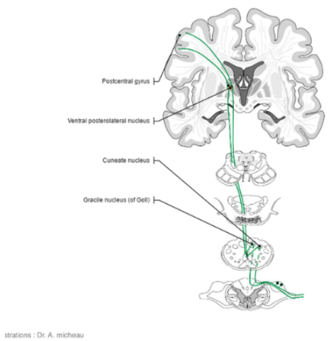

The spinothalamic tract carries pain and temperature sensation.
The peripheral afferent fibers enter the spinal cord at the dorsal root ganglia, synapse, then cross the ventral commissure.
Some motor reflex may be activated at this level.
Then, the fibers ascend and synapse also on the VPL (thalamus) and finally to the somatosensory cortex.
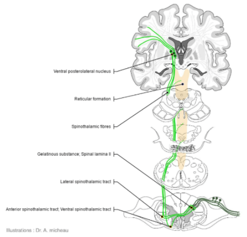

## Test cerebellar functions.

Lateral cerebellum coordinates limb movements.
Cerebellar fibers decussates twice so a lateral cerebellar lesion results in ipsilateral limb coordination deficit.
Test coordination by having the patient rub a heel to opposite shin.
Test rapidly alternating movements by having the patient alternatively flip the dorsum and palm of one hand on top of the other.

Medial cerebellum coordinates balance.
Test balance by having a patient stand straight and tandem walk.
A patient with medial cerebellar lesion or alcohol intoxication presents with wide gait and imbalance.

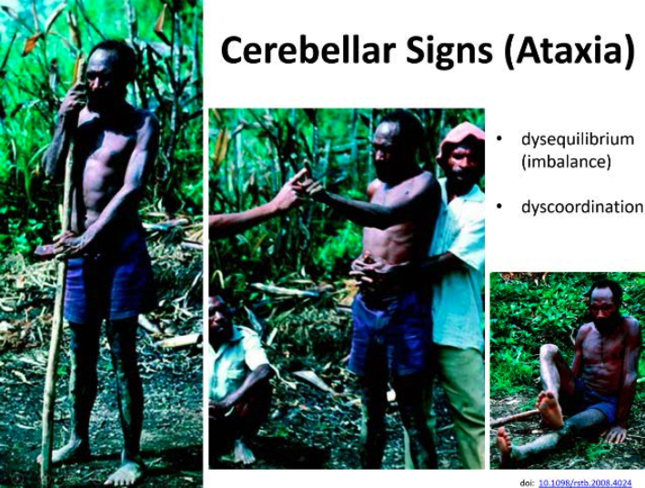

## Test gait.

Look for:

- Cerebellar ataxia
- Parkinsonian gait (reduced arm swing, rest tremor)
- Marionette gait (upper motor neuron deficit)
- Hemiparetic gait (upper motor neuron deficit)
- High steppage gait (to avoid foot drop caused by lower motor neuron deficit)

## Test meningitis.

Meningitis inflames the spinal cord and make it more sensitive.
Stretch the spine to test for pain response.
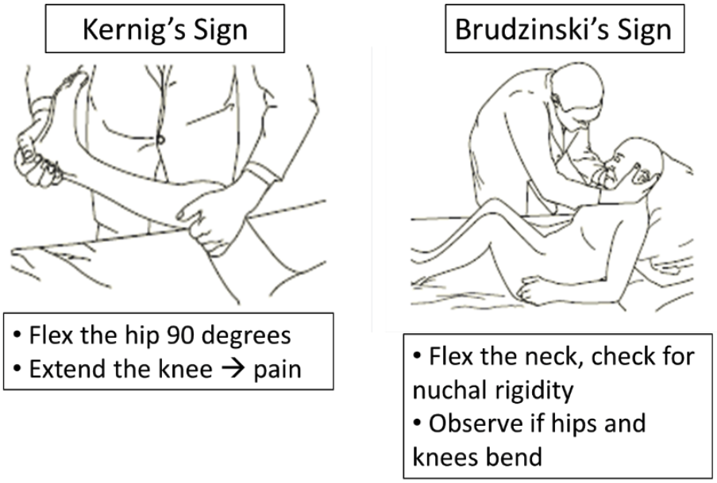

## Look out for higher order cognitive functions.

Test apraxia by having the patient show you how he or she brushes teeth.

Test for adnosia by having the patient, with the eyes closed, point to the side you touch. First, touch one side at a time to verify that the primary sensation is intact. And then touch both sides at the same time. If there is adnosia, the patient will neglect the affected side.

## Think about the anatomical map

If there is a damage in an anatomical region map, then the regions mapped near it can be affected as the primary problem progresses.
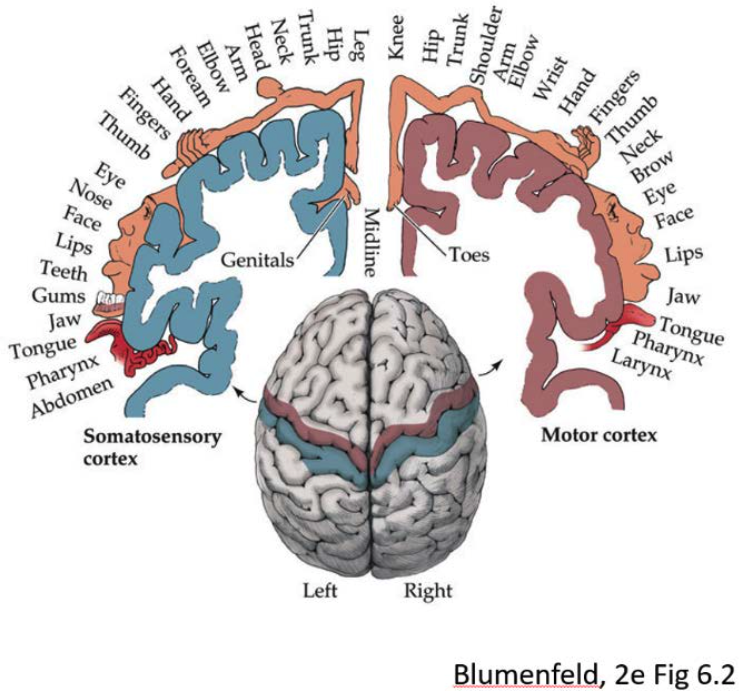

 

---

 

Agnosia : Neglecting one side of the universe

Anhidrosis : Inability to sweat

Apraxia : Inability to follow a motor command not due to primary motor or language deficit

CN : Cranial nerve

Diplopia : Perceiving 2 images when looking at a single object.

Intort: Move in and down

Miosis : Excessive pupil constriction

Neologism : Language error of inventing new words

Paraphasic error : Language error of substituting word or syllable

Ptosis : Upper eye lid drop

VPM : Ventral posteromedial nucleus
If you suspect cortical sensory deficit, test for graphesthesia and stereognosis.
