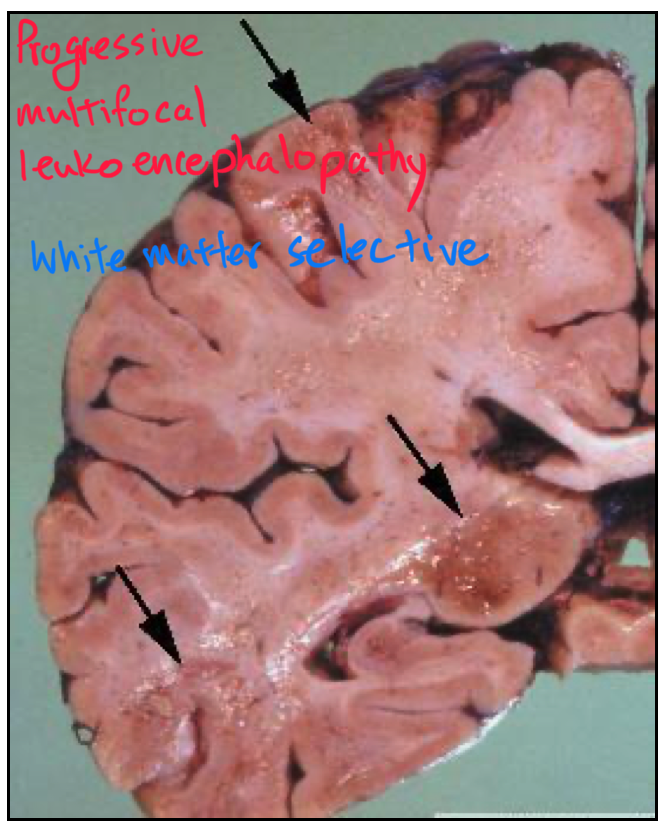

---
cover: cover.jpeg
tags: [Medicine, Neural]
time: 2021-01-20 13:33:27.794087
title: Neuropathology Overview
---

Brain is more specialized than other organs.

Brain regions matter - a lot.

Mass effect compromises CSF, blood, and then the brain volume.

Immunostain and see.
Use anti-:
- Cytokeratin for epithelial intermediate filament
- GFAP for glial intermediate filament
- Myelin basic protein for myelin
- Neurofilament for neuron
- Snaptophysin for synaptic vescicle

## Neuron body

## Neuron axon

## Glia is the most abundant cell type in the br, making up 20-50% of the volume.

Guide neural migration

Nurish

Partition

Angiogenesis

Clear neurotrasmitter

Buffer extracellular space

Astrocytes can be protoplasmic (grey) or fibrillar (white).
Astrocytes make up the blood brain barrier.
Only active transport or lipid can cross the blood brain barrier.

Oligodendrocytes wrap axons.

Ependymal cells make up choroid plexus.

Microglia are immune cells.
They react to injury.
Gliosis is fibrosis in the CNS.

