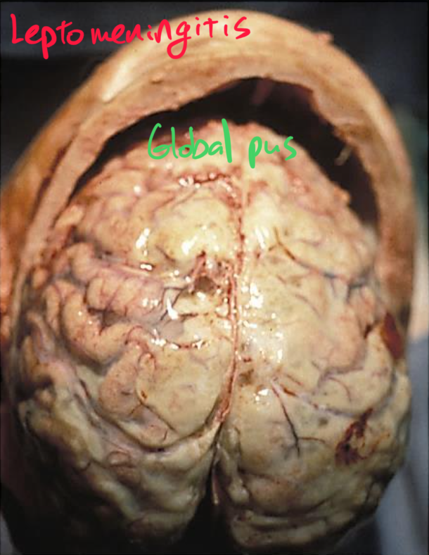
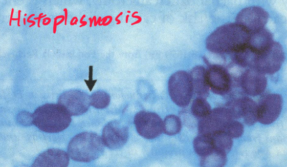
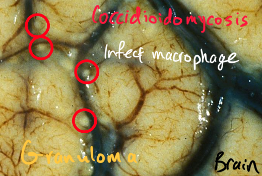

## CNS infection is rare.
But some factors make them more likely.
- Younger than 5 (70% of bacterial meningitis)
- Older than 70 (20% of bacterial meningitis)
- Heart disease
- Pulmonary disease
- Diabetes mellitus
- Sickle cell disease
- Poor nutrition
- Hematologic cancer
- HIV
- Immunosupression
- Endemic area

## Be fast when dealing with a CNS infection.
Diagnose quickly.
If you suspect a CNS infection in a patient, start empirical antibacterial and antiviral treatment before confirming.

## Infections can be at any depth.
From superficial to deep:, they are:
- Epidural
- Subdural
- Subarachnoid
- Intraparenchymal

Dura, arachnoid, and pia matters are all part of meninges.
So an infection of any of these can cause meningitis.

## Infections manifest as meningitis, abscess, or encephalitis.
Any pathogen can cause any of these.

But commonly, bacteria cause meningitis.

Non-viral pathogens cause abscess.

And viruses casue encephalitis.

## Epidura infection is common.

Dura matter is tightly glued to the skull.
So usually, there is no epidural space.
But when there is infection or bleeding, things can detached the dura from the skull and create the epidural space.
The things usually stay confined in one epidural area instead of spreading globally to all epidural areas.

Epidura is well connected with other tissues.
Immediately superficial to epidura is the skin, which covers the entire body.
Skin also has a good blood supply that can hamatologically connect the epidural space to the systemic circulation.
Epidural blood vessels and the CSF also link epidural space with the systemic circulations.
So, pathogens from various tissues can get to epidura easily.
Conversely, an infection in the epidural space can easily spread to other places like heart, bone, muscle, and lung.

Infection of the nose and skull can extend to epidural space.

Infection of skin or bone (often Staphylococci) can extend to the spinal epidura.

## Subdura infection is called empyema and is rare.

Dura matter separates this subdura space from the epidural space, where the CSF is.
So things from a subdural infection are not going to be found in the CSF.
Yet, there may be more immune cells and less glucose in the CSF.

Infection and bleeding usually stay in one area of epidural space, but things can spread easier in subdural space.

Expanding things in the epidural space have easier time pushing deeper into the brain than pushing wide detaching dura matter from the skull.
On the other hand, expanding things in the subdural space can spread widely, without the need to pushing deep into the brain.

## Subarachnoid infection (inflammation) is called leptomeningitis and is rare.

Things in the subarachnoid space diffuse in the space much easier than in the subdural space.
So infection in this space is usually more global and soak into the sulci.

## Acute meningitis is mostly caused by bacteria.
Commonly, diplococci from other part of the body spread to the subarachnoid space hematologically.
Fungi and parasites can also cause this too.

Acute meningitis is difficult to treat and can lead to other problems:
- Hydrocephalus
- Cranial nerve damage
- Infarct
- Endoarteritis
- Focal neurologic deficit

## Viruses cause aseptic meningitis.
Aseptic meningitis is self limited.

## Pathogens can hematologically spread to parenchyma and form abscess.

Commonly, pathogen that cause endocarditis and pneumonia travel via cerebral artery to the brain.
These pathogens often form capsule to evade antibiotics and immune cells.
They grow into abscess and can mimic neoplasm.

## Neurotuberculosis from the lung hematologically travel to the brain or other CNS places and cause wide range of defects.

## Aspergillosis hematologically spreads to the brain and invades blood vessels.

## Cryptococcosis is less immunogenic.

## Histoplasmosis is more common in endemic areas.

## Coccidioidomycosis is chronic infection of giant cells.
The infected giant cells form granulomas. 
The patients need to take anti-fungal for life.

## Naegleria fowleri is the brain eating amoeba.
These parasites live in warm water and get into a brain via nose.

## Toxoplasmosis makes a person more risk taking?

## Neurocysticersosis is more common in endemic areas, where the diet includes more worm sources.

## Viruses cause more diffuse inflammation instead of abscess.

They can cause meningitis as well as encephalitis.

Microglia aggregate around the infection cell and form nodule

Multiple microglia work together and eat an infected neuron, which is much larger than a microglia.

Viral encephalitis causes hemorrhagic necrosis.

Astrocytes react to viral encephalitis too.
They support microglia and help form gliosis.

## Viruses infect specific cell types.

West Nile virus infects spinal cord neurons.

JCV infects the oligodendrocytes, each of which myelinates many axons.
JCV damages white matters and cause progressive multifocal leukoencephalitis.

Rabies virus can travel from peripheral nervous system to the Purkinje neuron.
Rabies virus forms Negri body inclusion.

Zika virus destroys parenchyma.

Herpes virus forms Cowdy type A inclusion in a neuron.

SARS-COV2 is found in the olfactory nerve as well as in the brain.

Viral encephalitis - or any infection without proper treatment - leaves permanent brain damage.

