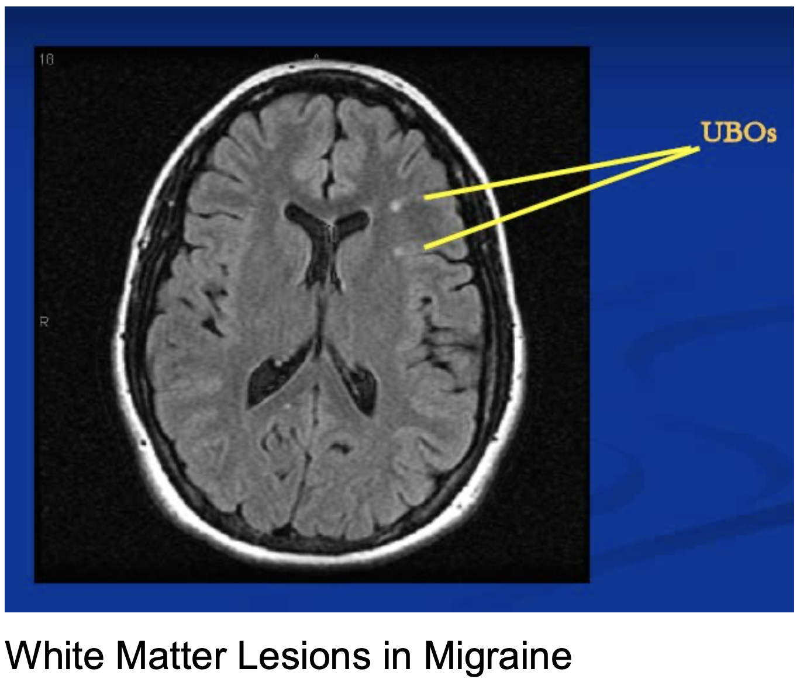
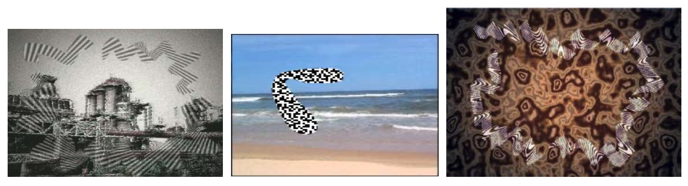
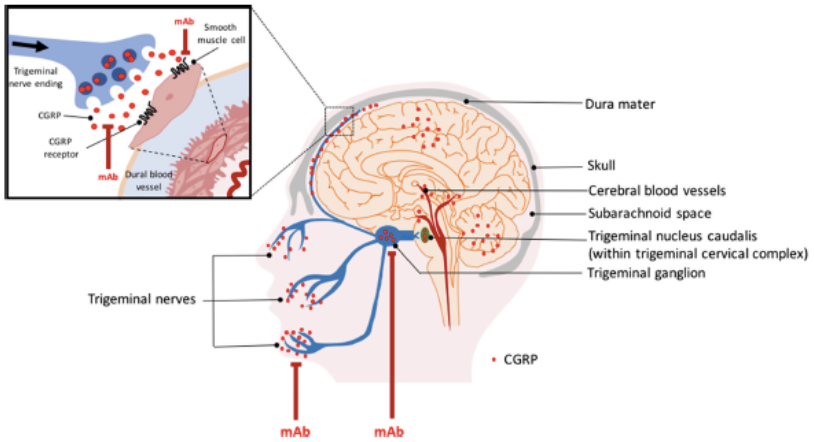
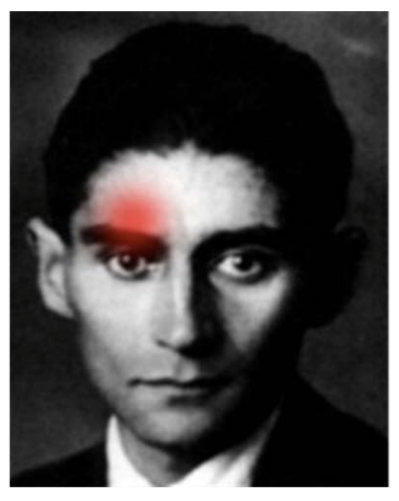

## Primary headache can be caused by:

- Migraine
- Tension-type headache
- Cluster headache
- Trigeminal autonomic cephlgia

## Migraine

Migraine is a disorder of processing senses.
People with migraine often have parents who have had migraine.
There are 3 familial hemiplegic migraines that have associated variants (in CACNA1A, FHM2, and FHM3 accordingly).

Prevelance of migraine in male is 5% and female 17%.
The peak age of getting migraine is 30s.

Patients with migraine often present with:

- Photosensitivity
- Prefering dark and quiet place
- Sensitive scalp
- While matter lesions (unidentified bright objects)
  

Usually, migraine lasts for 1 day and happens 1 to 2 times every month.

### Trigeminothalamic pathway is hot in a migraine.

The trigeminothalamic pathways is the facial version of the spinothalamic pathway.
Just as spinothalamic pathway senses the contralateral pain and temperature, trigeminothalamic pathway senses the contralateral face.
In addition, trigeminothalamic pathway is the sole pathway for sensing the cerebral blood vessels and dura.
Finally, this pathway also converges with the upper cervical afferent nerves that carry the sensation from the back of the head.

When this pathway is hot, it leads to releases of neuropeptides like substance P, calcitonin gene related peptide (CGRP), and neurokinin A.
These molecules inflame various neural structures, sensitizing the sensory structures.
Particular, CGRP mediates the trigeminovascular pain transmission.

### Migraine can present with aura or not.

#### The classic migraine comes with aura.

Aura is a collection of sensations such as flashing lights or zigzag lines.
99% of aura comes with visual disturbance.

Disturbances can be other sensory and language sensations, but not motor weakness.

If there is at least 2 of the following symptoms, then the aura is a basilar aura, which indicates a problem in cranial nerve or posterior circulation:

- Dysarthria
- Vertigo
- Tinnitus
- Hyperacusis
- Diplopia
- Visual Symptoms simultaneously in temporal and nasal fields in both eyes
- Ataxia
- Decreased LOC
- Bilateral paresthesias

Classic aura develops gradually over minutes and is fully reversible within an hour.

#### Migraine can come without aura too.

If a patient suffers at least five headache each lasting (without treatmnent) 4 to 72 hours and presenting with some of the following, then the patient has the migraine without aura:

- Unilateral
- Pulsating
- Moderate to severe pain
- Triggered by routine activity
- Photophobia
- Nausea or vomiting
- Not from other disease

For mignaine without signs of urgency, there is no need for ordering labs and images.

### There are 3 ways to treat migraines.

1. Lifestyle change to prevent the migraine trigger
2. Abortive medications to treat acute migraine
3. Prophylactic medications to prevent migraine.

Abortive medications are:

- Non-steroidal antiinflammatory drugs like ibuprofen
- 5HT agonist like triptans
- CGRP receptor antagonist like Gepants

5HT is serotonin.
Its receptor is a G protein coupled receptor.
5HT inhibits the inflammation the trigeminal nerve, vasodilation, and the pain transmission.
5HT agonist triptans should be used within 90 miinutes of the migraine onset, before inflammation builds up.

Prophylactic medications are:

- Beta blocker (-ol)
- Antidepressant (tricyclic anti-depressants like amitriptyline and selective serotonin reuptake inhibitors)
- Anti-seizure (depakote and topiramate)
- Ca++ channel blocker
- Angiotensin receptor blocker (lisinopril and -tan)
- Neutraceutical
- Botulinum
- Anti-CGRP (antibodies do not cross the blood brain barrier so this works mainly on periphery)
  
- Neuromodulatory devices

## Tension Type Headache

The life time prevelance of tension type headache is 70% in male and 90% in female.
Its usually onsets during adolescence.
The headache presents bilaterally and worsens at night.

## Cluster Headache

The prevalance of cluster headache is 1%.
Unlike tension type headache, it is more common in male.
Its common onset is between 25 and 50.
Unlike tension type headache, the cluster headache always presents unilaterally usually behind an eye.

The headache is deep, stabbing, and explosive.
Usually, patients suffer 1 to 3 attacks lasting between 15 and 180 minutes over few months to a year.
Facial congestion and ipsilateral Horner's syndrome (may be because of CN 7 compression from the congestion) are commonly seen in patients experiencing cluster headache.

Abort cluster headache with 100% O2 through a mask in upright chair or triptans.
Prevent it with prednisone.
