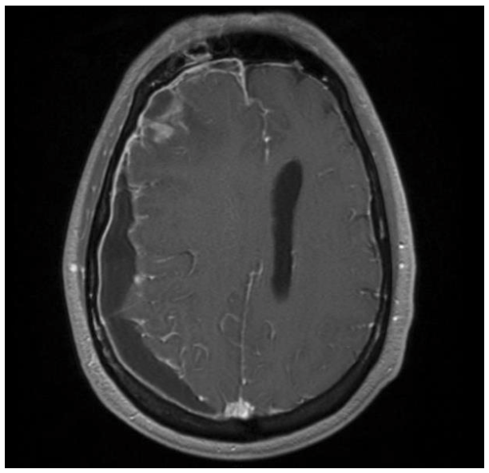
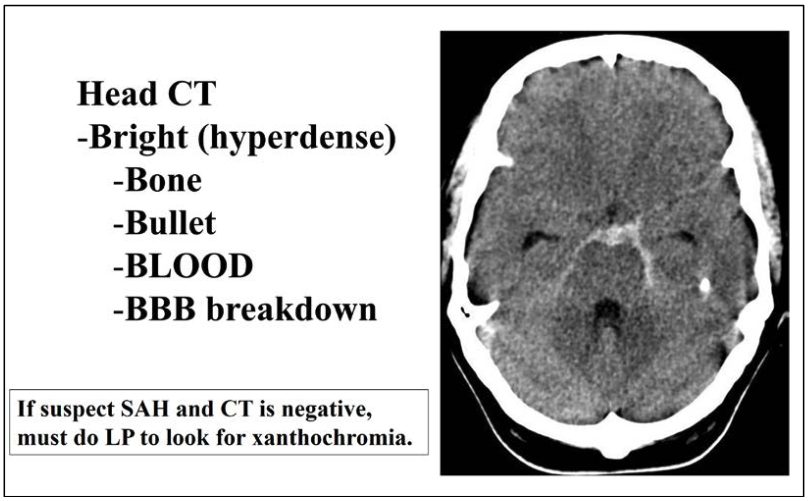

## Secondary headache can be caused by (secondary to):

- Trauma
- Dissection of blood vessel
- Idiopathic intracranial hypertension (typically in childbearing-age women who are obese)
- Intracranial tumor
- Substance overuse or withdraw
- Infection
- Problem in homeostasis
- Problem in facial structure
- Psychiatric

Here are the common aneurysm regions:

## If any of the following is true, then a headache should be considered secondary to something life threatening:

- Systemic symptom
- Neurological symptom
- New onset
- Associated with trauma, toxin, Valsalva, sexual activity, waking up at night due to the headache
- Worsening previous headache

## Here are some scenarios of headache with urgency.

Infection can lead to abscess, meningitis, and encephalitis, causing headache.
Here is a CT image showing right meningoencephalitis and frontal lobe abcess.

Patients with meningitis can present with stiff neck.
And infected areas can bleed and also cause headache.

Pregnancy, post-partum, and contraceptive use can lead to hypercoagulative state.
And this increased coagulation can cause venous sinus thrombosis, pituitary apoplexy, and carotid dissection, causing headache.

Decreased coagulation, which can be from anticoagulant use, is a problem too.
It can lead to intracranial hemorrhage whihc causes headache.

Vascular diseases that stiffen the vessels can lead to dissection of cranial vessels, which casue headache.

Temporal arteritis often in patients over 55 can lead to jaw claudication and headache.

Hypertension can break a deep penetrating artery, typically in basal ganglia, thalamus, cerebellum, and pons, and cause hemorrhage and headache.

Finally, immunocompromised patients are more susceptible to infection and brain tumor, which can also cause headache.

1/3 of patients with subarachnoid hemorrhage die before getting to the ER.
Another 1/3 develop significant morbidity.
And only the last 1/3 have good outcome.

## These are some neurologic symptoms indicating urgency.

Focal neurologic findings indicate headache from mass in the region.

Change in the mental status, syncope, and seizure suggest intracranial hemorrhage, mass, or encephalitis.

Papilledema indicates increased intracranial pressure, which can be from increased intracranial pressure, mass, encephalitis, and meningitis.

Headache that worsens with position or straining.

Cranial nerve 6 deficit.
Cranial nerve 6 has the longest path so it is the most susceptible cranial nerve for an incrase in intracranial pressure.

First or worst headache indicate urgency.

## Here are some timing clues indicating urgency.

Sudden onset that reaches maximum in seconds to minutes indicates many emergencies:

- Sentinel bleed
- Subarachnoid hemorrhage
- Carotid dirrection
- Vertebral dissection
- Hypertensive emergency
- Venous sinus thrombosis
- Intracranial hemorrhage
- Acute ischemic stroke
- Subdural hematoma
- Epidural hematoma
- Pituitary apoplexy
- Colloid cyst of the third ventricle
- Spontaneous intracranial hypotension
- Coital headache
- Exertional headache
- Acute sinusitis
- Benign thunderclap

Rapid onset after exercise, Valsalva, or sexual activity indicates:

- Subarachnoid hemorrhage
- Intracranial hemorrhage
- Carotid dirrection
- Mass

New onset in patients younger than 5 and older than 40 indicate urgency.

## Always [be systematic when working up a neurologic diease](../Approach to the Patient with Neurologic Disease).

## The workup for secondary headache is more important compared to for primary headache.

There is lower threshold for ordering labs and imaging for secondary headache.

There are some labs to consider:

- CBC
- CMP
- ESR
- CRP
- RF
- ANA (for lupus)
- Monospot (for EBV)
- HIV
- TSH (for ergotamine use)

For an acute headache, order head CT because it is fast.
Here is a CT image showing subarachnoid hemorrhage:

For all other headaches, order MRI because it is less harmful to the body, it is high resolution, and there is no rush.
Consider imaging blood vessels using angiography.

After imaging, consider lumber puncture to rule out infection, carcinomatosis, subarachnoid hemorrhage (check for blood and xanthochromia, which is a hemoglobin degredation product), intracranial hyper- and hypotension.
For diagnosing idiopathic intracranial hypertension, the opening pressure must be greater than 250mmH2O.

Also consider measuring blood and urine toxin.

For aneurysm, control blood pressure, identify aneurysm site, and consider surgery.
