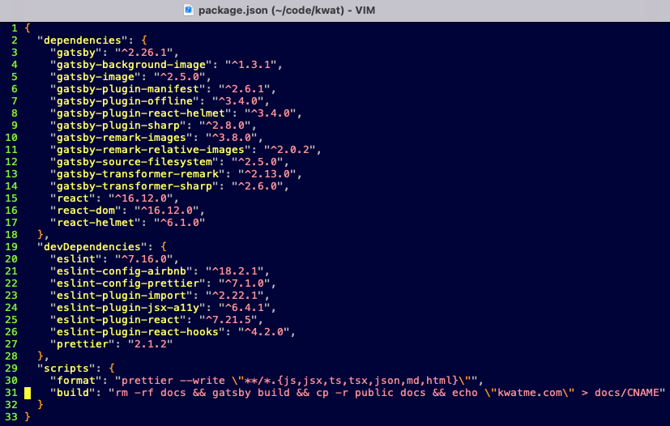

We will accomplish this in a lean way, without installing gh-pages or anything else.

This post uses domain kwatme.com as an example.
So make sure to replace it with your own domain as you follow.

Let's go.

## Step 1: Link Google Domain to GitHub

Go to the target domain's Google Domain page.

Click DNS.

Edit Custom resource records.
Type A links kwatme.com.
Type CNAME links www.kwatme.com.

The final setting looks like this:

Linking takes a few minutes.
Wait a bit.
And confirm the linking with dig:

kwatme.com:

www.kwatme.com:

We're done editing Google Domains.

## Step 2: Set up GitHub Page

Go to the Gatsby website's GitHub repository.

Click Settings.

Scroll down to the GitHub Pages section.

Select master branch and docs/.

Enter kwatme.com, not www.kwatme.com.

Click Save and refresh the page.

The final settings looks like this:

If the repository already has docs/, GitHub creates docs/CNAME, a file with only 1 line kwatme.com, and makes a commit:

Git pull this commit.

Don't worry if there is no docs/ yet; we make it later.

Now.
The target domain is listening to GitHub.
When there is a new commit in the repository, GitHub is going to load the website from docs/ and forward it to the domian, which is specified in both GitHub Pages setting and docs/CNAME.

Next.
We just need to update the repository.

## Step 3 Build Gatsby website

GitHub Pages wants docs/, but Gatsby builds public/.
So, after we build public/, we must: 1) copy public/ to docs/ and 2) create docs/CNAME specifying the domain.
To do all this, write a script in package.json:

From the root of the repository, run this script:

The script outputs public/, docs/, and docs/CNAME.

Git add, commit, and push.
Wait a few mintes.
The website should go live at http://kwatme.com.

## Step 4: Set up HTTP*S*

Wait a few more minutes.
GitHub Pages Enforce HTTPS setting becomes available.
Check it, refresh, and confirm publishing at https://kwatme.com.

## Step 5: Grow the website

Updating the website is simple: 1) edit it; 2) build it with the script; and 3) push it to GitHub.
