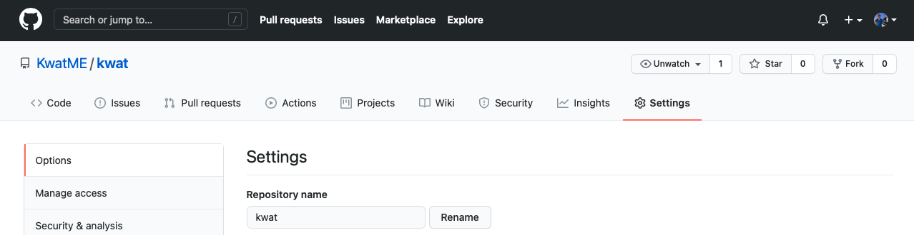
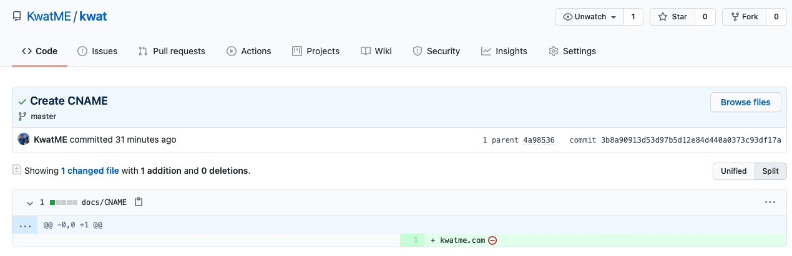

## Step 1: Link Google Domain to GitHub

Go to Google Domain and link kwatme.com and www.kwatme.com.

Wait a few minutes and check if the linking works.

Check kwatme.com.

Check www.kwatme.com.

## Step 2: Set up GitHub Page

Enter kwatme.com, press Save, and refresh.

This adding of the custom domain creates docs/CNAME.

Confirm CNAME to have only 1 line, the GitHub Page custom domain.

## Step 3 Build Gatsby website

By default, gatsby builds into public/. But GitHub Pages needs docs/ and customizing domain needs docs/CNAME.

So make a custom NPM build command that: 1) removes docs/ (if it exists); 2) builds public/; 3) copies public/ to docs/; and 4) makes docs/CNAME.

Run this custom command.

Confirm new public/, docs/, and docs/CNAME.

Git add, commit, and push.

Wait a few mintes. The website should go live at http://kwatme.com.

## Step 4: Set up HTTPS

Wait a few more minutes. GitHub Pages Enforce HTTPS setting should become available.
Check it, refresh, and confirm publishing at httpS://kwatme.com.

## Step 5: Grow the website

The workflow for updating the website is simple: 1) edit it; 2) build it with the custom comman; and 3) push it to GitHub.

Cheers.
