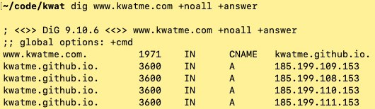
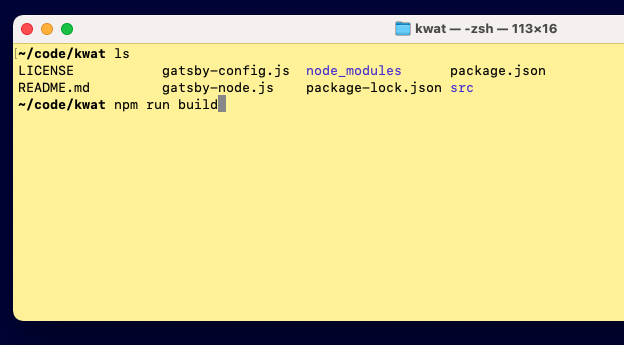
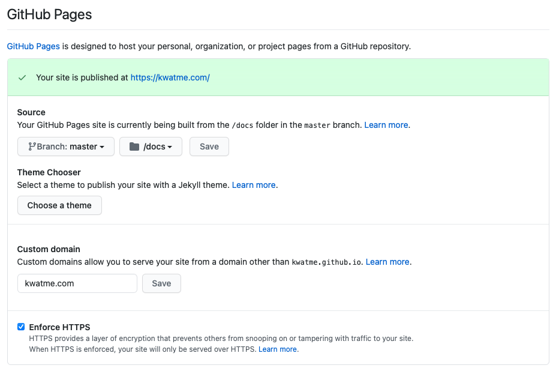

In this post, I'm using my own domain kwatme.com as an example.
So make sure to replace it with your own domain when you are follwoing this post.

Let's go.

## Step 1: Link Google Domain to GitHub

Go to Google Domain of your domain.

Click DNS.

Edit Custom resource records to look like this:

kwatme.com and www.kwatme.com are different.
We need to link both of them to GitHub.
Here, type A is linking kwatme.com and type CNAME is linking www.kwatme.com.

Linking can take a few minutes.
Wait a bit.

Then confirm the linking with dig:

kwatme.com:

www.kwatme.com:

## Step 2: Set up GitHub Page

Go to your website's GitHub repository.

Click Settings.

Scroll down to the GitHub Pages section.

Select master branch and docs/.

Enter kwatme.com (not www.kwatme.com).

Click Save and refresh the page.

Your GitHub Pages settings should look like this:

If you already have docs/ in your repository, GitHub creates docs/CNAME, a file with only 1 line kwatme.com, and makes a commit (if you don't have docs/, don't worry - keep reading):

Git pull this commit.

### Set up is complete.

The domain hosted by Google Domains is listening to GitHub.
GitHub Pages loads the website from docs/ and forwards it to the domian, which is specified in both GitHub Pages setting and docs/CNAME.

## Step 3 Build Gatsby website

GitHub Pages wants docs/, but Gatsby builds public/.
So after we build public/, we need to: 1) copy public/ to docs/ and 2) create docs/CNAME specifying the domain. To do all these, write a script in package.json:

Run this script:

You should see public/, docs/, and docs/CNAME containing the domain:

Git add, commit, and push.
Wait a few mintes.
The website should go live at http://kwatme.com.

## Step 4: Set up HTTP*S*

Wait a few more minutes.
GitHub Pages Enforce HTTPS setting should become available.
Check it, refresh, and confirm publishing at https://kwatme.com.

## Step 5: Grow the website

Updating the website is simple: 1) edit it; 2) build it with the script; and 3) push it to GitHub.
